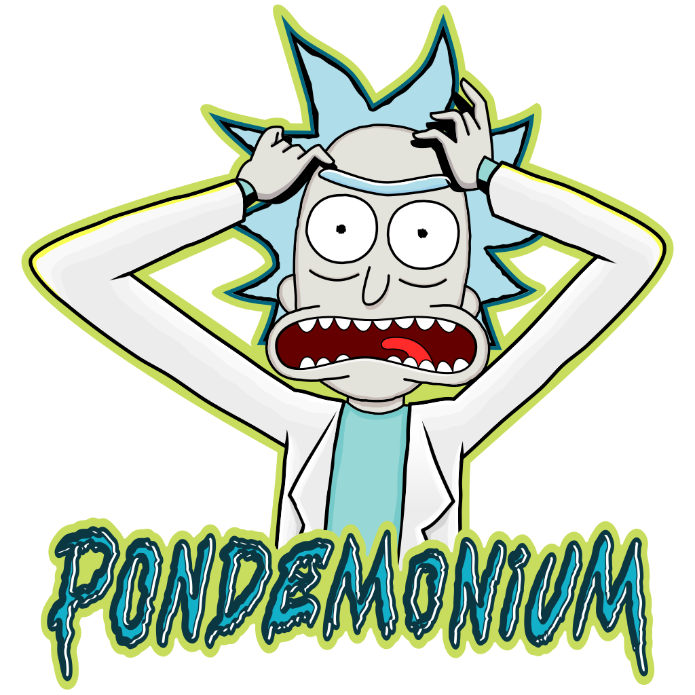

---
hide:
  - toc
  - feedback
---

# Stickers

Our stickers are a symbolic mix of pop and geek culture that invite the user to express themselves with humour.
Right click to Save Image As...

<figure markdown="span">
  { loading=lazy class="nolightbox" width="256" height="256" }
  <figcaption>Rick and Morty - PONDEMONIUM! (Rick)</figcaption>
</figure>

<figure markdown="span">
  { loading=lazy class="nolightbox" width="256" height="256" }
  <figcaption markdown>Puffy :heart: Tux (Sanrio Badtz-Maru)</figcaption>
</figure>

<figure markdown="span">
  { loading=lazy class="nolightbox" width="256" height="256" }
  <figcaption>Gunshow - This is fine (Office Space Milton and Swingline)<figcaption>
</figure>

<figure markdown="span">
  { loading=lazy class="nolightbox" width="256" height="256" }
  <figcaption>King of the Hill - I Sell PON and PON Accessories (Hank Hill)</figcaption>
</figure>

