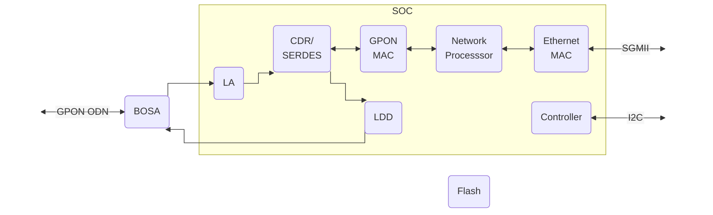

# SPS-34-24T-HP-TDFO

## Specifications

|             |                                                          |                      |
| ----------: | -------------------------------------------------------- | -------------------- |
| __SoC__     | PEB38035 @ 400 MHz - MIPS interAptiv 34Kc                |                      |
| __NOR__     | 16 MB *(128 Mbit)*                                       | S25FL128S            |
| __RAM__     | 64 MB                                                    |                      |
| __BOSA__    | SC/APC - Tx: 1490 nm / Rx: 1310 nm                       |                      |
| __EEPROM__  | :check_mark: G-010S-P :x: MA5671A / GPON-ONU-34-20BI     | 24LC02B              |
| __UART__    | Rx: pin 7 / Tx: pin 2 - 115200-8-1-N                     |                      |
| __IP__      | 192.168.1.10                                             |                      |
| __HTTP(S)__ | :x: *Must be enabled*                                    |                      |
| __SSH__     | :check_mark:                                             | [Shell Credentials]  |

 [Shell credentials]: #shell-credentials

## Architecture

### Lantiq PEB38035

## Default Credentials

### Shell credentials

=== "Alcatel-Lucent G-010S-P"

    | Username | Password       |
    | -------- | -------------- |
    | ONTUSER  | QpZm@4246#5753 |

=== "Huawei MA5671A"

    | Username | Password       |
    | -------- | -------------- |
    | root     | admin123       |

=== "FS.com GPON-ONU-34-20BI"

    | Username | Password       |
    | -------- | -------------- |
    | ONTUSER  | 7sp!lwUBz1     |

## Value-Added Resellers

| Company         | Product Number     |
| --------------- | ------------------ |
| Alcatel-Lucent  | G-010S-P           |
| Hauwei          | MA5671A            |
| [FS.com]        | [GPON-ONU-34-20BI] |

 [FS.com]: https://www.fs.com/
 [GPON-ONU-34-20BI]: https://www.fs.com/products/133619.html
