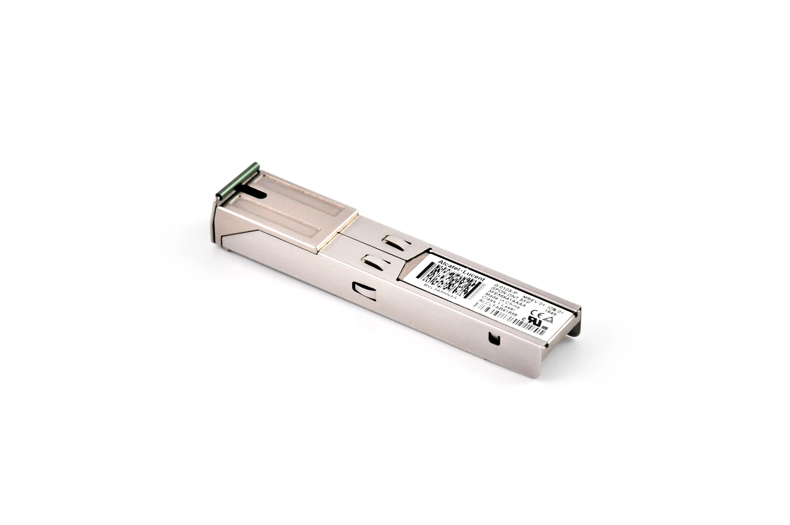
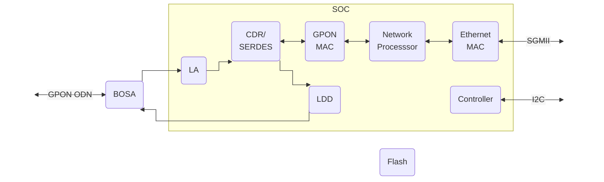

# SPS-34-24T-HP-TDFO



## Specifications

|             |                                                                |                      |
| ----------: | --------------------------------------------------------       | -------------------- |
| __SoC__     | Lantiq FALC ON-S PEB 38035 ET @ 400 MHz - MIPS interAptiv 34Kc |                      |
| __NOR__     | 16 MB *(128 Mbit)*                                             | S25FL128P            |
| __RAM__     | 64 MB                                                          |                      |
| __BOSA__    | SC/APC - Tx: 1490 nm / Rx: 1310 nm                             |                      |
| __EEPROM__  | :check_mark: G-010S-P :x: MA5671A / GPON-ONU-34-20BI           | 24LC02B              |
| __UART__    | Rx: pin 7 / Tx: pin 2 - 115200-8-1-N                           |                      |
| __IP__      | 192.168.1.10                                                   |                      |
| __HTTP(S)__ | :check_mark: G-010S-P                                          |                      |
| __SSH__     | :check_mark:                                                   | [Shell Credentials]  |

 [Shell credentials]: #shell-credentials

## Architecture

### Lantiq FALC ON-S PEB 38035 ET



## System Information

### Boot log

```
--8<-- "docs/gpon/ont/source-photonics/sps-34-24t-hp-tdfo/bootlog"
```

### procfs

=== "/proc/cmdline"


    ```
    --8<-- "docs/gpon/ont/source-photonics/sps-34-24t-hp-tdfo/procfs_cmdline"
    ```

=== "/proc/cpuinfo"


    ```
    --8<-- "docs/gpon/ont/source-photonics/sps-34-24t-hp-tdfo/procfs_cpuinfo"
    ```

=== "/proc/meminfo"


    ```
    --8<-- "docs/gpon/ont/source-photonics/sps-34-24t-hp-tdfo/procfs_meminfo"
    ```

=== "/proc/mtd"


    ```
    --8<-- "docs/gpon/ont/source-photonics/sps-34-24t-hp-tdfo/procfs_mtd"
    ```

### Switch banks

!!! warning "Verify image(s) are valid before committing"

Alternate between images zero (0) and one (1).

=== "OpenWrt shell"

    Switch from image zero (0) to one (1).

    ``` sh
    fw_printenv committed_image # (1)!
    fw_printenv image1_is_valid # (2)!
    fw_setenv committed_image 1
    fw_setenv committed_image 1
    ```

    1. Verify the committed image is zero (0).
    2. Verify image one (1) is valid prior to committing.

    Switch from image one (1) to zero (0).

    ``` sh
    fw_printenv committed_image # (1)!
    fw_printenv image0_is_valid # (2)!
    fw_setenv committed_image 0
    fw_setenv committed_image 0
    ```

    1. Verify the committed image is one (1).
    2. Verify image zero (0) is valid prior to committing.

=== "U-Boot shell"

    Switch from image zero (0) to one (1).

    ``` sh
    env print committed_image # (1)!
    env print image1_is_valid # (2)!
    env set committed_image 1
    env set committed_image 1
    ```

    1. Verify the committed image is zero (0).
    2. Verify image one (1) is valid prior to committing.

    Switch from image one (1) to zero (0).

    ``` sh
    env print committed_image # (1)!
    env print image0_is_valid # (2)!
    env set committed_image 0
    env set committed_image 0
    ```

    1. Verify the committed image is one (1).
    2. Verify image zero (0) is valid prior to committing.


## Default Credentials

### Shell credentials

=== "Alcatel-Lucent G-010S-P"

    | Username | Password       |
    | -------- | -------------- |
    | ONTUSER  | SUGAR2A041     |

=== "Huawei MA5671A"

    | Username | Password       |
    | -------- | -------------- |
    | root     | admin123       |

=== "FS.com GPON-ONU-34-20BI"

    | Username | Password       |
    | -------- | -------------- |
    | ONTUSER  | 7sp!lwUBz1     |

## Value-Added Resellers

| Company         | Product Number     |
| --------------- | ------------------ |
| Alcatel-Lucent  | G-010S-P           |
| Hauwei          | MA5671A            |
| [FS.com]        | [GPON-ONU-34-20BI] |

 [FS.com]: https://www.fs.com/
 [GPON-ONU-34-20BI]: https://www.fs.com/products/133619.html
