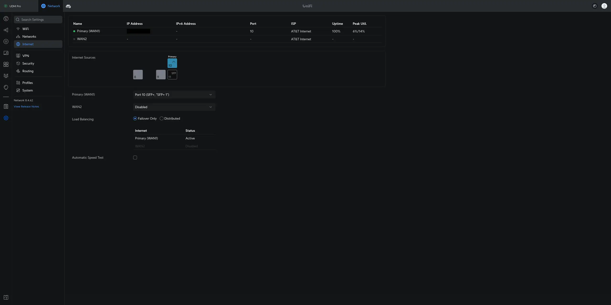
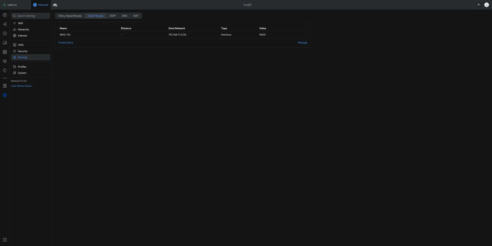

# Accessing the ONT

<!-- more -->
<!-- nocont -->

* [Static IP](#static-ip)
* [Source NAT](#source-nat)
* [Static Route](#static-route)

## Static IP <small>1-to-1</small> { #static-ip data-toc-label="Static IP" }

=== ":material-microsoft: Windows"

    !!! info "For the shameless mouse clickers..."
        If you are more comfortable with the Windows GUI, follow the <ins>manual</ins> steps outlined by Microsoft at:

        <https://support.microsoft.com/en-us/windows/change-tcp-ip-settings-bd0a07af-15f5-cd6a-363f-ca2b6f391ace>

    !!! tip "Run Command Prompt as Administrator"

        1. Press ++win+r++
        2. In the Run dialog box, type `cmd` into the input field and then press
           ++ctrl+shift+enter++.


    1. Retrieve the host __Interface Name__ the WAS-110 is connected to.

        ``` sh
        netsh interface ip show config
        ```

    2. Assign a `192.168.11.2` static IP address to the host interface, replacing `<interface name>` in the
       following commands with the value retrieved from step 1.

        ``` sh
        netsh interface ipv4 set address name="<interface name>" static 192.168.11.2 255.255.255.0 192.168.11.1
        netsh interface ipv4 set interface "<interface name>" mtu=1500
        ```

        !!! tip "Execute the following command to restore DHCP, *only* if the static IP was temporary for setup."

            ``` sh
            netsh interface ipv4 set address name="<interface name>" dhcp
            ```

=== ":simple-apple: macOS"

    !!! info "For the shameless mouse clickers..."
        If you are more comfortable with the macOS GUI, follow the <ins>manual</ins> steps outlined by Apple at:

        * <https://support.apple.com/en-ca/guide/mac-help/mchlp2718/mac>
        * <https://support.apple.com/en-ca/guide/mac-help/mh14129/mac>

    1. Launch __Terminal App__.

    2. Retrieve the __Network Service__ the WAS-110 is connected to.

        ``` sh
        sudo networksetup -listallnetworkservices
        ```

    3. Assign a `192.168.11.2` static IP address to the host network, replacing `<service>` in the
       following commands with the value retrieved from step 2.

        ``` sh
        sudo networksetup -setmanual <service> 192.168.11.2 255.255.255.0 192.168.11.1
        ```

        !!! tip "Execute the following command to restore DHCP, *only* if the static IP was temporary for setup."

            ``` sh
            sudo networksetup -setdhcp <service>
            ```

=== ":simple-linux: Linux"

    !!! info "For the shameless mouse clickers..."
        Use a NetworkManager front-end. Check your distribution documentation.

    !!! note "The following commands set the IP address but will not persist after a power cycle"
        For persistence check your distribution documentation, such as
        [Debian Network Configuration](https://wiki.debian.org/NetworkConfiguration)

    !!! note "The following commands must be run as root `su -` or prepended with `sudo`"

    ``` sh hl_lines="6"
    ip link show
    ethtool <interface>
    ip address show
    ip address flush dev <interface>
    ip route flush dev <interface>
    ip address add 192.168.11.2/24 dev <interface>
    ip address show dev <interface>
    ```

=== ":simple-freebsd: FreeBSD"

    ``` sh
    ifconfig
    ```

## Source NAT <small>Router or Firewall</small> { #source-nat data-toc-label="Source NAT" }

=== ":simple-opnsense: OPNsense"

    { loading=lazy }

    1. Add a virtual IP to the WAN interface by navigating to **Interfaces > Virtual IPs > Settings**, clicking
       :material-plus-thick:, applying the settings below, clicking **Save**, and clicking **Apply**.

        |                                  |                                   |
        | -------------------------------- | --------------------------------- |
        | **Mode**                         | IP Alias                          |
        | **Interface**                    | WAN                               |
        | **Network / Address**            | 192.168.11.2/24                   |
        | **Deny service binding**         | :material-checkbox-blank-outline: |
        | **VHID Group**                   |                                   |
        | **Description**                  | WAS-110 Management                |

    { loading=lazy }

    2. Add a firewall alias for the ONT by navigating to **Firewall > Aliases**, clicking :material-plus-thick:,
       applying the settings below, clicking **Save**, and clicking **Apply**.

        |                                  |                                    |
        | -------------------------------- | ---------------------------------- |
        | **Enabled**                      | :material-checkbox-marked-outline: |
        | **Name**                         | was_110                            |
        | **Type**                         | Host(s)                            |
        | **Categories**                   |                                    |
        | **Content**                      | 192.168.11.1                       |
        | **Statistics**                   | :material-checkbox-blank-outline:  |
        | **Description**                  | WAS-110                            |

    { loading=lazy }

    3. Switch to Hybrid outbound NAT by navigating to **Firewall > Outbound > NAT**, selecting
       **Hybrid outbound NAT rule generation**, clicking **Save**, and clicking **Apply changes**.

    { loading=lazy }

    4. Add a manual outbound NAT rule, click :material-plus-thick: in the **Manual rules** table, apply the
       settings below, click **Save**, and click **Apply changes**.

        |                                   |                                              |
        | --------------------------------- | -------------------------------------------- |
        | **Interface**                     | WAN                                          |
        | **Source address**                | LAN net                                      |
        | **Destination address**           | was_110                                      |
        | **Translation / target**          | 192.168.11.2 (WAS-110 Management)            |

=== ":simple-pfsense: pfSense"

    === "DHCP WAN"

         { loading=lazy }

         1. Add a virtual IP to the WAN interface by navigating to **Firewall > Virtual IPs**, clicking
            :material-plus-thick: **Add**, applying the settings below, clicking **Save**, and clicking **Apply Changes**.

            |                                  |                                   |
            | -------------------------------- | --------------------------------- |
            | **Type**                         | IP Alias                          |
            | **Interface**                    | WAN                               |
            | **Address(es)**                  | 192.168.11.2/24                   |
            | **Description**                  | WAS-110 Management                |

        { loading=lazy }

        2. Add a firewall alias by navigating to **Firewall > Aliases > IP**, clicking :material-plus-thick: **Add**,
           applying the settings below, clicking **Save**, and clicking **Apply Changes**.

            | Properties                       | &nbsp;                             |
            | -------------------------------- | ---------------------------------- |
            | **Name**                         | was_110                            |
            | **Description**                  | WAS-110                            |
            | **Type**                         | Host(s)                            |

            | Host(s)                          | &nbsp;                             |
            | -------------------------------- | ---------------------------------- |
            | **IP or FQDN**                   | 192.168.11.1                       |

        { loading=lazy }

        3. Switch to Hybrid outbound NAT by navigating to **Firewall > NAT > Outbound**, selecting
           **Hybrid Outbound NAT rule generation**, clicking **Save**, and clicking **Apply Changes**.

        { loading=lazy }

        4. Add a manual outbound NAT rule, click :material-arrow-up: **Add** in the **Mappings** table, apply the
           settings below, click **Save**, and click **Apply Changes**.

            | Edit Advanced Outbound NAT Entry  | &nbsp;                                       |
            | --------------------------------- | -------------------------------------------- |
            | **Interface**                     | WAN                                          |
            | **Source**                        | LAN subnets                                  |
            | **Destination**                   | Network or Alias - was_110 / 32              |


            | Translation                       | &nbsp;                                       |
            | --------------------------------- | -------------------------------------------- |
            | **Address**                       | 192.168.11.2 (WAS-110 Management)            |

    === "PPPoE WAN"

         Follow the __Accessing a CPE/Modem from Inside the Firewall__ guide from the pfSense documentation:

         <https://docs.netgate.com/pfsense/en/latest/recipes/modem-access.html>

=== ":simple-ubiquiti: UniFi OS"

    1. Enable SSH by navigating to **OS Settings > Console Settings > Advanced**.

        <https://help.ui.com/hc/en-us/articles/204909374-UniFi-Connect-with-Debug-Tools-SSH>

    2. Login to the UDM remote shell over SSH using a terminal client.

        ``` sh
        ssh root@192.168.1.1 # (1)!
        ```

        1. Replace the `192.168.1.1` IP with the one assigned to the UDM.

    !!! warning "The following steps will not persist with the next power cycle or web UI change and must be repeated each time"

    3. Assign a static IP on the Ethernet interface within the same subnet as the ONT.

        !!! tip "Interface numbers are zero (0) indexed, e.g. `eth9` for Port 10"

        ``` sh
        ip addr add dev eth9 local 192.168.11.2/24 # (1)!
        ```

        1. Replace `eth9` with the Ethernet interface connected to the ONT.

    4. Apply a source NAT rule for the Ethernet interface and assigned IP(s).

        ``` sh
        iptables -t nat -A POSTROUTING -o eth9 -d 192.168.11.1 -j SNAT --to 192.168.11.2 # (1)!
        ```

        1. Replace `eth9`

=== ":simple-mikrotik: MikroTik RouterOS"

    === "WinBox/WebFig"

        1. Assign a static IP on the Ethernet interface within the same subnet as the ONT by navigating to **IP > Addresses**.
        Be sure to set the interface to the correct SFP+ interface of your ONT.

            |                   |                   |
            | ----------------- | ----------------- |
            | **Address**       | 192.168.11.2/24   |
            | **Interface**     | sfp-sfpplus1      |

            { loading=lazy }

        2. From Apply a source NAT rule for the Ethernet interface and assigned IP(s) by navigating to **IP > Firewall > NAT**.
        Be sure to set the out interface to the correct SFP+ interface of your ONT.

            |                       |                   |
            | --------------------- | ----------------- |
            | **Chain**             | srcnat            |
            | **Dst. Address**      | 192.168.11.1      |
            | **Out. Interface**    | sfp-sfpplus1      |
            | **Action**            | src-nat           |
            | **To Addresses**      | 192.168.11.2      |

            { loading=lazy }
            { loading=lazy }

    === "Terminal"

        !!! tip "Be sure to change `sfp-sfpplus1` for the correct SFP+ interface of your ONT. These terminal commands will persist."

        ``` sh
        /ip/address add address=192.168.11.2/24 interface=sfp-sfpplus1 network=192.168.11.0
        /ip firewall nat add action=src-nat chain=srcnat dst-address=192.168.11.1 out-interface=sfp-sfpplus1 to-addresses=192.168.11.2
        ```

## Static Route

=== ":simple-opnsense: OPNsense"

=== ":simple-pfsense: pfSense"

=== ":simple-ubiquiti: UniFi OS"

    { loading=lazy }

    1. Set the SFP port as the WAN interface. This is under **Network > Settings > Internet**.

    { loading=lazy }

    2. Create a static route pointing at the WAN interface. This is under **Network > Settings > Routing > Static Routes**

=== ":simple-mikrotik: MikroTik RouterOS"

You should now be able to access the [WAS-110] at `192.168.11.1`.
