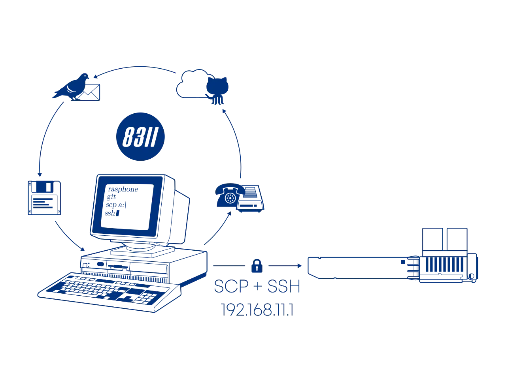

# Install 8311 community firmware on the BFW Solutions WAS-110

{ class="nolightbox" }
<!-- more -->
<!-- nocont -->

Out of the box, the [WAS-110] is not fully compatible with varying ISP OLT configurations, with issues ranging from 
vendor-specific managed entities to VEIP to IEEE standards such as [802.1X] and [802.1ad]. Due to these 
incompatibilities and discovered bugs, a community firmware[^1] has been curated to fix any impeding issues[^2]. 

  [802.1X]: https://en.wikipedia.org/wiki/IEEE_802.1X
  [802.1ad]: https://en.wikipedia.org/wiki/IEEE_802.1ad

## Host setup

Plug the [WAS-110] into a 10-gigabit compatible SFP+ host interface, such as a NIC, media converter, and/or network
switch.

!!! note "Rx loss"
    The [WAS-110] running the default Azores firmware will trigger RX_LOS if the SC/APC fiber cable is unplugged or 
    inactive. Some host interfaces will enter a power-saving state, making the [WAS-110] inaccessible.

### Download firmware

The community firmware comes in two (2) variants: *basic* and *bfw*; for the purposes of this guide, we'll focus on
the recommended <ins>basic</ins> firmware, which can be downloaded at:

<https://github.com/djGrrr/8311-was-110-firmware-builder/releases/latest>

The *basic* firmware is based on a vanilla MaxLinear [OpenWrt] 19.07 build from [Potrontec]. Additionally, it 
includes customized luci web interfaces for hassle-free masquerading and the aforementioned fixes. And unlike the *bfw* 
variant, it does not include the abysmal BFW patches and cruft.

  [OpenWrt]: https://openwrt.org/
  [Potrontec]: https://www.potrontec.com/

### Extract download

The firmware files are archived by [7-Zip] and can be extracted with:

  [7-Zip]: https://www.7-zip.org/

=== ":material-microsoft: Windows"

    ``` sh
    7z x WAS-110_8311_firmware_mod_<version>_basic.7z
    ```

=== ":simple-apple: macOS"

    !!! note "The following commands assume [Homebrew](https://brew.sh) is installed"

    ``` sh
    brew install sevenzip
    7zz x WAS-110_8311_firmware_mod_<version>_basic.7z
    ```

=== ":simple-linux: Linux"

    !!! note "The following commands assume [Debian] or derivatives[^3]"

    ``` sh
    sudo apt-get install p7zip-full
    7z x WAS-110_8311_firmware_mod_<version>_basic.7z #(1)!
    ```

    1. Replace `<version>` with the downloaded version.

### Set a static IP

The default IP address of the [WAS-110] is `192.168.11.1/24`. To connect successfully, a static IP address must be
assigned to the host interface, such as `192.168.11.2/24`[^4].

=== ":material-microsoft: Windows"

    !!! tip "Run Command Prompt as Administrator"

        1. Press <kbd>Win</kbd> + <kbd>R</kbd>
        2. In the Run dialog box, type `cmd` into the input field and then press
           <kbd>Ctrl</kbd> + <kbd>Shift</kbd> + <kbd>Enter</kbd>. 

    ``` sh hl_lines="2"
    netsh interface ip show config
    netsh interface ipv4 set address name="<interface name>" static 192.168.11.2 255.255.255.0 192.168.11.1
    netsh interface ipv4 set interface "<interface name>" mtu=1500
    ```

    ??? info "For the shameless mouse clickers..."
        If you are more comfortable with the Windows GUI, follow the <ins>manual</ins> steps outlined by Microsoft at:

        <https://support.microsoft.com/en-us/windows/change-tcp-ip-settings-bd0a07af-15f5-cd6a-363f-ca2b6f391ace>

=== ":simple-apple: macOS"

    ``` sh hl_lines="2"
    sudo networksetup -listallnetworkservices
    sudo networksetup -setmanual <service> 192.168.11.2 255.255.255.0 192.168.11.1
    ```

    ??? info "For the shameless mouse clickers..."
        If you are more comfortable with the macOS GUI, follow the <ins>manual</ins> steps outlined by Apple at:

        * <https://support.apple.com/en-ca/guide/mac-help/mchlp2718/mac>
        * <https://support.apple.com/en-ca/guide/mac-help/mh14129/mac>

=== ":simple-linux: Linux"

    !!! note "The following commands must be run as root `su -` or prepended with `sudo`"

    ``` sh hl_lines="6"
    ip link show
    ethtool <interface>
    ip address show
    ip address flush dev <interface>
    ip route flush dev <interface>
    ip address add 192.168.11.2/24 dev <interface>
    ip address show dev <interface>
    ```

=== ":simple-ubiquiti: Ubiquiti"

    !!! tip "Replace `<interface>` with the SFP+ interface name e.g. `eth9` for the UDM-SE"

    ``` sh
    ip addr add dev <interface> local 192.168.11.2/24
    iptables -t nat -A POSTROUTING -o <interface> -d 192.168.11.0/24 -j SNAT --to 192.168.11.2
    ```

## Dump & backup firmware <small>optional</small> { #dump-and-backup-firmware data-toc-label="Dump & backup firmware" }

### Dump volumes

Login over SSH using the <em>root</em> [shell credentials].

``` sh
ssh -oHostKeyAlgorithms=+ssh-rsa -oPubkeyAcceptedKeyTypes=+ssh-rsa root@192.168.11.1 
```

The following command sequence will dump the volumes into the local temporary directory: `/tmp/fw`.

``` sh
mkdir -p /tmp/fw ; for part in kernelA bootcoreA rootfsA kernelB bootcoreB rootfsB; do VOL=$(ubinfo /dev/ubi0 -N "$part" | grep "Volume ID" | awk '{print $3}'); [ -n "$VOL" ] && { DEV="/dev/ubi0_$VOL"; OUT="/tmp/fw/ubi0_$VOL-$part.img"; echo "Dumping $part ($DEV) to: $OUT"; dd if="$DEV" of="$OUT"; }; done
```

### Backup to host

=== ":material-microsoft: Windows"

    ``` sh
    scp -oHostKeyAlgorithms=+ssh-rsa -oPubkeyAcceptedKeyTypes=+ssh-rsa root@192.168.11.1:/tmp/fw/ubi* .
    ```

=== ":simple-apple: macOS / :simple-linux: Linux"

    ``` sh
    scp -O -oHostKeyAlgorithms=+ssh-rsa -oPubkeyAcceptedKeyTypes=+ssh-rsa root@192.168.11.1:/tmp/fw/ubi* .
    ```

## Web UI upgrade <small>not recommended</small> { #web-ui-upgrade data-toc-label="Web UI upgrade" }

!!! danger "Proceed with caution!"
    The [WAS-110] firmware upgrade utility on occasion has been known to soft-brick itself. To recover, a host device 
    with serial breakout on SFP pins 2 (rx) and 7 (tx) will be required.

    Alternatively, jump past to the <ins>safer</ins> [shell upgrade](#shell-upgrade) method later in this guide.


1. Within a web browser, navigate to 
   <https://192.168.11.1/html/main.html#admin/upgrade>
   and, if asked, input the <em>admin</em> [web credentials]. 


2. At the __Firmware Upgrade__ page, browse for `local-upgrade.img` from the extracted download, and click 
   __Upgrade__.

Patiently wait out the process, 4 to 5 minutes, or until the web session becomes unresponsive.

??? tip "Run a continuous ping"
    To recieve an early indication that the [WAS-110] has completed its upgrade reboot cycle, run a continuous ping:

    === ":material-microsoft: Windows"

        ``` sh
        ping -t 192.168.11.1
        ```

    === ":simple-apple: macOS / :simple-linux: Linux"

        ``` sh
        ping 192.168.11.1
        ```

Once rebooted, begin to enjoy the fruits of the 8311 community. It is not at all possible without the help and support
of every one of us.

## Shell upgrade <small>safer</small> { #shell-upgrade data-toc-label="Shell upgrade" }

The extracted `local-upgrade.tar` includes a <ins>safer</ins> upgrade script in comparison to the built-in web UI.

### Enable SSH

SSH must be enabled from the web UI prior to running the shell commands.


1. Within a web browser, navigate to 
   <https://192.168.11.1/html/main.html#service/servicecontrol>
   and, if asked, input the <em>admin</em> [web credentials].


2. From the __Service Control__ page, check the __SSH__ checkbox and click __Save__.

### Upgrade firmware

Run the following commands from the host terminal to upgrade to the 8311 community firmware. Input the <em>root</em>
[shell credentials] when asked.

=== ":material-microsoft: Windows"

    ``` sh
    scp -oHostKeyAlgorithms=+ssh-rsa -oPubkeyAcceptedKeyTypes=+ssh-rsa local-upgrade.tar root@192.168.11.1:/tmp/
    ssh -oHostKeyAlgorithms=+ssh-rsa -oPubkeyAcceptedKeyTypes=+ssh-rsa root@192.168.11.1 "tar xvf /tmp/local-upgrade.tar -C /tmp/ -- upgrade.sh && /tmp/upgrade.sh -y -r /tmp/local-upgrade.tar"
    ```

=== ":simple-apple: macOS / :simple-linux: Linux"

    ``` sh
    scp -O -oHostKeyAlgorithms=+ssh-rsa -oPubkeyAcceptedKeyTypes=+ssh-rsa local-upgrade.tar root@192.168.11.1:/tmp/
    ssh -oHostKeyAlgorithms=+ssh-rsa -oPubkeyAcceptedKeyTypes=+ssh-rsa root@192.168.11.1 'tar xvf /tmp/local-upgrade.tar -C /tmp/ -- upgrade.sh && /tmp/upgrade.sh -y -r /tmp/local-upgrade.tar'
    ```

Once rebooted, begin to enjoy the fruits of the 8311 community. It is not at all possible without the help and support
of every one of us.

  [Debian]: https://www.debian.org/
  [WAS-110]: ../xgs-pon/ont/bfw-solutions/was-110.md
  [web credentials]: ../xgs-pon/ont/bfw-solutions/was-110.md#web-credentials
  [shell credentials]: ../xgs-pon/ont/bfw-solutions/was-110.md#shell-credentials

[^1]: <https://github.com/djGrrr/8311-was-110-firmware-builder>
[^2]: <https://github.com/djGrrr/8311-xgspon-bypass>

      <https://github.com/djGrrr/8311-was-110-firmware-builder/blob/master/mods/>
[^3]: <https://www.debian.org/derivatives/>
[^4]: <https://en.wikipedia.org/wiki/Internet_Protocol_version_4#First_and_last_subnet_addresses>
