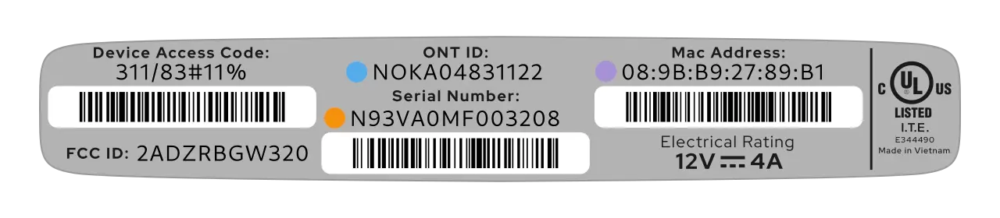

# Masquerade as the AT&T Inc. BGW320-500/505 on XGS-PON with the BFW Solutions WAS-110

<!-- more -->
<!-- nocont -->

## Determine if you're an XGS-PON subscriber

!!! info "2Gbps or higher tiers"
    If you're subscribed to 2 GIG speed or a similar 2Gbps or higher tier, skip past to [Purchase a WAS-110].

There are two (2) methods to determine if you're an XGS-PON subscriber. First, through the [web UI](#with-web-ui) Fiber 
Status page, and second, by inspecting the SFP [transceiver](#with-the-transceiver).

### with the web UI <small>recommended</small> { #with-the-web-ui data-toc-label="with the web UI" }


1. Within a web browser, navigate to
   <http://192.168.1.254/cgi-bin/fiberstat.ha>

If the wave length matches <em>1270 nm</em>, you're subscribed on XGS-PON.

### with the transceiver

First, identify the color of the bale clasp. If the clasp is orange, continue by carefully pulling out the 
transceiver by engaging the bale clasp and latch. If the label on the transceiver contains the text XGS-PON or 
1270 TX, you're subscribed on XGS-PON.

## Purchase a WAS-110

The WAS-110 is available from select distributors and at a discounted rate with group buys on the 
[8311 Discord community server](https://discord.com/servers/8311-886329492438671420).

## Install community firmware

Although, not strictly necessary for AT&T, the community firmware is highly recommended for masquerading with the 
WAS-110 and used for the remainder of this guide. To install the community firmware, follow the steps outlined in the 
community firmware installation guide:

[Install 8311 community firmware on the BFW Solutions WAS-110](install-8311-community-firmware-on-the-bfw-solutions-was-110.md)

## WAS-110 masquerade setup

To successfully masquerade on XGS-PON, the original ONT serial number is mandatory. It, along with other key 
identifiers are available on the bottom label of the BGW320-500/505, color-coordinated in the following depiction:

<div id="bgw320-500-505-label"></div>

=== "BGW320-500"

    { class="nolightbox" }

=== "BGW320-505"

    { class="nolightbox" }

### from the web UI <small>recommended</small> { #from-the-web-ui data-toc-label="from the web UI"}


1. Within a web browser, navigate to 
   <https://192.168.11.1/cgi-bin/luci/admin/8311/config> 
   and, if asked, input your <em>root</em> password.

    ??? info "As of version 2.4.0 `https://` is supported and enabled by default"
        All `http://` URLs will redirect to `https://` unless the `8311_https_redirect` environment variable is set to
        0 or false.


2. From the __8311 Configuration__ page, on the __PON__ tab, fill in the configuration with the following values:

    !!! reminder 
        <ins>Replace</ins> the :blue_circle: __ONT ID__ and :purple_circle: __MAC address__ with the 
        provisioned values on the bottom [label] of the BGW320-500/505.

    === "BGW320-500"

        | Parameter                  | Value             | Mandatory    | Remarks         |
        | -------------------------- | ----------------- | ------------ | --------------- |
        | PON Serial Number (ONT ID) | HUMA04831122      | :check_mark: | :blue_circle:   |
        | Equipment ID               | iONT320500G       |              |                 |
        | Hardware Version           | BGW320-500_2.1    |              |                 |
        | Sync Circuit Pack Version  | :check_mark:      |              |                 |
        | Software Version A         | BGW320_3.21.4     |              |                 |
        | Software Version B         | BGW320_3.21.4     |              |                 |
        | IP Host MAC Address        | E8:B2:FE:FE:FE:70 |              | :purple_circle: |

    === "BGW320-505"

        | Parameter                  | Value             | Mandatory    | Remarks         |
        | -------------------------- | ----------------- | ------------ | --------------- |
        | PON Serial Number (ONT ID) | NOKA04831122      | :check_mark: |:blue_circle:    |
        | Equipment ID               | iONT320505G       |              |                 |
        | Hardware Version           | BGW320-505_2.2    |              |                 |
        | Sync Circuit Pack Version  | :check_mark:      |              |                 |
        | Software Version A         | BGW320_3.21.4     |              |                 |
        | Software Version B         | BGW320_3.21.4     |              |                 |
        | IP Host MAC Address        | 08:9B:B9:27:89:B1 |              | :purple_circle: |

3. __Save__ changes and reboot from the __System__ menu.

Once rebooted, the SC/APC cable can safely be plugged into the WAS-110 and immediately receive O5 
operational status.

### from the shell

<h4>Login over SSH</h4>

``` sh
ssh root@192.168.11.1
```

<h4>Configure 8311 U-Boot environment</h4>

!!! reminder 
    <ins>Replace</ins> the :orange_circle: __Device serial number__, :purple_circle: __MAC address__, and 
    :blue_circle: __ONT ID__ with the provisioned values on the bottom [label] of the BGW320-500/505.

=== "BGW320-500"

    ``` sh hl_lines="3"
    fwenv_set 8311_device_sn D93LA0D0D0D211
    fwenv_set 8311_iphost_mac E8:B2:FE:FE:FE:70
    fwenv_set 8311_gpon_sn HUMA03831122
    fwenv_set 8311_equipment_id iONT320500G
    fwenv_set 8311_hw_ver BGW320-500_2.1
    fwenv_set 8311_cp_hw_ver_sync 1
    fwenv_set 8311_sw_verA BGW320_3.21.4
    fwenv_set 8311_sw_verB BGW320_3.21.4
    ```
    
=== "BGW320-505"

    ``` sh hl_lines="3"
    fwenv_set 8311_device_sn N93VA0MF003208
    fwenv_set 8311_iphost_mac 08:9B:B9:27:89:B1
    fwenv_set 8311_gpon_sn NOKA03831122
    fwenv_set 8311_equipment_id iONT320505G
    fwenv_set 8311_hw_ver BGW320-505_2.2
    fwenv_set 8311_cp_hw_ver_sync 1
    fwenv_set 8311_sw_verA BGW320_3.21.4
    fwenv_set 8311_sw_verB BGW320_3.21.4
    ```
    
!!! info "Additional details and variables are described at the original repository [^2]"
    `/usr/sbin/fwenv_set` is a helper script that executes `/usr/sbin/fw_setenv` twice consecutively.

    The WAS-110 functions as an A/B system, requiring the U-Boot environment variables to be set twice, once for each 
    environment.

<h4>Verify and reboot</h4>

Prior to rebooting, verify that the 8311 environment variables are set correctly. If not, proceed to correct them with
the `fwenv_set` command as before.

``` sh
fw_printenv | grep ^8311
reboot
```

Once rebooted, the SC/APC cable can safely be plugged into the WAS-110 and immediately receive O5 
operational status.

  [Purchase a WAS-110]: #purchase-a-was-110
  [label]: #bgw320-500-505-label

[^1]: <https://github.com/up-n-atom/sagemcom-modem-scripts>
[^2]: <https://github.com/djGrrr/8311-was-110-firmware-builder>
