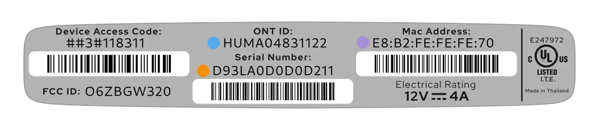

# Masquerade as the AT&T Inc. BGW320-500/505 with the WAS-110

{ class="nolightbox" }

<!-- more -->
<!-- nocont -->

## Determine if you're an XGS-PON subscriber

!!! info "2 Gbps or higher tiers"
    If you're subscribed to 2 GIG speed or a similar 2 Gbps or higher tier, skip past to [Purchase a WAS-110].

There are two (2) methods to determine if you're an XGS-PON subscriber. First, through the [web UI](#with-the-web-ui)
Fiber Status page, and second, by inspecting the SFP [transceiver](#with-the-transceiver).

### with the web UI <small>recommended</small> { #with-the-web-ui data-toc-label="with the web UI" }


!!! info "Since the 6x series firmware, the web UI may report 0 (zero) for the Wave Length. Jump past to [with the transciever](#with-the-transceiver) to help determine if you're an XGS-PON subscriber."

{ loading=lazy }

1. Within a web browser, navigate to
   <http://192.168.1.254/cgi-bin/fiberstat.ha>

If the wave length matches <em>1270 nm</em>, you're subscribed on XGS-PON.

### with the transceiver

First, identify the color of the bale clasp. If the clasp is orange/red, continue by carefully pulling out the
transceiver by engaging the bale clasp and latch. If the label on the transceiver contains the text XGS-PON or
1270 TX, you're subscribed on XGS-PON.

## Purchase a WAS-110

!!! note
    The [WAS-110] is __NOT__ a substitute for a layer 7 router; It is an *ONT*, and its __ONLY__ function is to convert
    *Ethernet* to *PON* over fiber medium. Additional hardware and software are required to access the Internet.

The [WAS-110] is available from select [resellers] worldwide.

 [resellers]: https://pon.wiki/xgs-pon/ont/bfw-solutions/was-110/#value-added-resellers

## Install community firmware

Although, not strictly necessary for AT&T, the community firmware is highly recommended for masquerading with the
WAS-110 and used for the remainder of this guide. To install the community firmware, follow the steps outlined in the
community firmware installation guide: [Install the 8311 community firmware on the WAS-110].

  [Install the 8311 community firmware on the WAS-110]: install-the-8311-community-firmware-on-the-was-110.md

## WAS-110 masquerade setup

To successfully masquerade on XGS-PON, the original ONT serial number is mandatory. It, along with other key
identifiers are available on the bottom label of the BGW320-500/505, color-coordinated in the following depiction:

<div id="bgw320-500-505-label"></div>

=== "BGW320-500"

    { class="nolightbox" }

=== "BGW320-505"

    { class="nolightbox" }

### from the web UI <small>recommended</small> { #from-the-web-ui data-toc-label="from the web UI"}

??? info "As of version 2.4.0 `https://` is supported and enabled by default"
    All `http://` URLs will redirect to `https://` unless the `8311_https_redirect` environment variable is set to
    0 or false.

<div class="swiper" markdown>

<div class="swiper-slide" markdown>

{ loading=lazy }

</div>

<div class="swiper-slide" markdown>

{ loading=lazy }

</div>

<div class="swiper-slide" markdown>

{ loading=lazy }

</div>

</div>

1. Within a web browser, navigate to
   <https://192.168.11.1/cgi-bin/luci/admin/8311/config>
   and, if asked, input your <em>root</em> password.

2. From the __8311 Configuration__ page, on the __PON__ tab, fill in the configuration with the following values:

    !!! reminder
        <ins>Replace</ins> the mandatory :blue_circle: __PON Serial Number__ with the provisioned value on the bottom
        [label] of the BGW320-500/505.

    === "BGW320-500"

        | Attribute                  | Value                   | Mandatory    | Remarks                 |
        | -------------------------- | -----------------       | ------------ | ----------------------- |
        | PON Serial Number (ONT ID) | HUMA&hellip;            | :check_mark: | :blue_circle: ONT ID    |
        | Equipment ID               | iONT320500X             |              |                         |
        | Hardware Version           | BGW320-500_2.1          |              |                         |
        | Sync Circuit Pack Version  | :check_mark:            |              |                         |
        | Software Version A         | BGW320_4.27.7           |              | [Version listing]       |
        | Software Version B         | BGW320_4.27.7           |              | [Version listing]       |
        | MIB File                   | /etc/mibs/prx300_1U.ini | :check_mark: | PPTP i.e. default value |

    === "BGW320-505"

        | Attribute                  | Value                   | Mandatory    | Remarks                 |
        | -------------------------- | -----------------       | ------------ | ----------------------- |
        | PON Serial Number (ONT ID) | NOKA&hellip;            | :check_mark: |:blue_circle: ONT ID     |
        | Equipment ID               | iONT320505X             |              |                         |
        | Hardware Version           | BGW320-505_2.2          |              |                         |
        | Sync Circuit Pack Version  | :check_mark:            |              |                         |
        | Software Version A         | BGW320_4.27.7           |              | [Version listing]       |
        | Software Version B         | BGW320_4.27.7           |              | [Version listing]       |
        | MIB File                   | /etc/mibs/prx300_1U.ini | :check_mark: | PPTP i.e. default value |

3. From the __8311 Configuration__ page, on the __ISP Fixes__ tab, enable __Fix VLANs__ from the drop-down.

4. __Save__ changes and reboot from the __System__ menu.

### from the shell


1. Login over secure shell (SSH).

    ``` sh
    ssh root@192.168.11.1
    ```

2. Configure the 8311 U-Boot environment.

    !!! reminder "Highlighted lines are <ins>mandatory</ins>"
        <ins>Replace</ins> the mandatory :blue_circle: __8311_gpon_sn__ with the provisioned value on the bottom
        [label] of the BGW320-500/505.

    === "BGW320-500"

        ``` sh hl_lines="1 7"
        fwenv_set -8 gpon_sn HUMA... # (1)!
        fwenv_set -8 equipment_id iONT320500X
        fwenv_set -8 hw_ver BGW320-500_2.1
        fwenv_set -8 cp_hw_ver_sync 1
        fwenv_set -8 sw_verA BGW320_4.27.7
        fwenv_set -8 sw_verB BGW320_4.27.7
        fwenv_set -8 fix_vlans 1
        ```

        1. :blue_circle: ONT ID

    === "BGW320-505"

        ``` sh hl_lines="1 7"
        fwenv_set -8 gpon_sn NOKA... # (1)!
        fwenv_set -8 equipment_id iONT320505X
        fwenv_set -8 hw_ver BGW320-505_2.2
        fwenv_set -8 cp_hw_ver_sync 1
        fwenv_set -8 sw_verA BGW320_4.27.7
        fwenv_set -8 sw_verB BGW320_4.27.7
        fwenv_set -8 fix_vlans 1
        ```

        1. :blue_circle: ONT ID

    !!! info "Additional details and variables are described at the original repository [^1]"
        `/usr/sbin/fwenv_set` is a helper script that executes `/usr/sbin/fw_setenv` twice consecutively.

        The WAS-110 functions as an A/B system, requiring the U-Boot environment variables to be set twice, once for each
        environment.

        The `-8` option prefixes the U-Boot environment variable with `8311_`.

3. Verify the 8311 U-boot environment and reboot.

    ``` sh
    fw_printenv | grep ^8311
    reboot
    ```

After rebooting the WAS-110, safely remove the SC/APC cable from the BGW320-500/505 and connect it to the
WAS-110. If all previous steps were followed correctly, the WAS-110 should operate with O5.1 [PLOAM status].
For troubleshooting, please read the [Troubleshoot connectivity issues with the WAS-110] guide before seeking help on
the [8311 Discord community server].

  [PLOAM status]: troubleshoot-connectivity-issues-with-the-was-110.md#ploam-status
  [Troubleshoot connectivity issues with the WAS-110]: troubleshoot-connectivity-issues-with-the-was-110.md
  [8311 Discord community server]: https://discord.com/servers/8311-886329492438671420

!!! tip "Clone the BGW320-500/505 :purple_circle: __MAC address__ on the router's DHCP WAN interface to avoid waiting for the 20 minute lease to expire."

!!! note "Do not be alarmed..."
    If you receive an e-mail and/or text informing you to:

    > Check your AT&T Fiber equipment since you might be offline currently.

    The BGW-500/505 sends telemetry data to *better* the customer experience.

## BGW320-500/505 software versions { #bgw320-500-505-software-versions data-toc-label="BGW320-500/505 software versions" }

The OLT *can* utilize the software version as a provisioning attribute. It is recommended to stay updated with the
software upgrades of the BGW320-500/505 if the WAS-110 reports a fake O5 state.

{ loading=lazy }

The software version can be acquired by reconnecting the BGW320-500/505 and navigating to
<http://192.168.1.254/cgi-bin/update.ha> and replacing the `X` placeholders in the following string pattern with the
version number: `BGW320_X.XX.X`.

  [Purchase a WAS-110]: #purchase-a-was-110
  [WAS-110]: ../xgs-pon/ont/bfw-solutions/was-110.md
  [label]: #bgw320-500-505-label
  [Version listing]: #bgw320-500-505-software-versions
  [Troubleshoot connectivity issues with the WAS-110]: troubleshoot-connectivity-issues-with-the-was-110.md

[^1]: <https://github.com/djGrrr/8311-was-110-firmware-builder>
