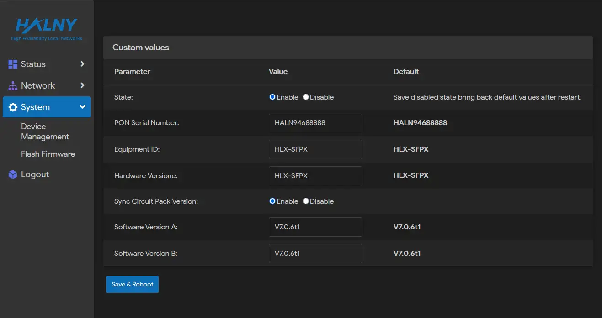
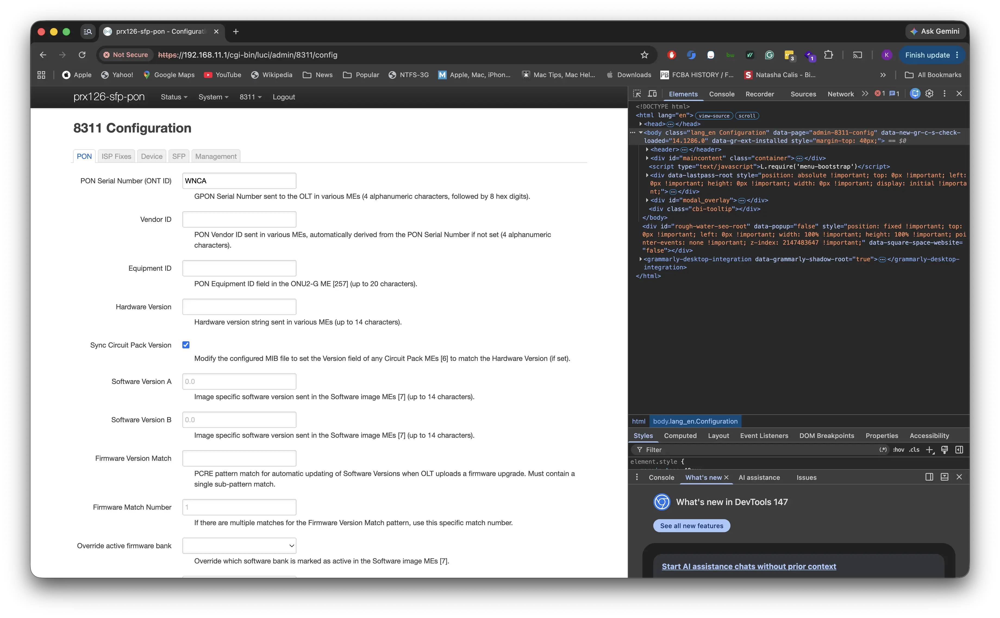
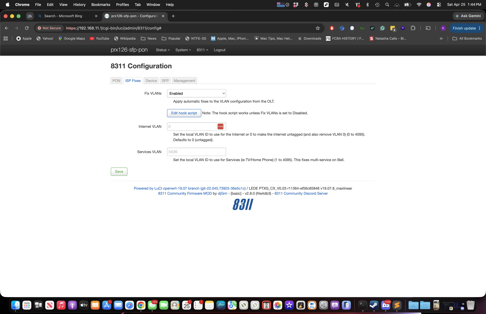
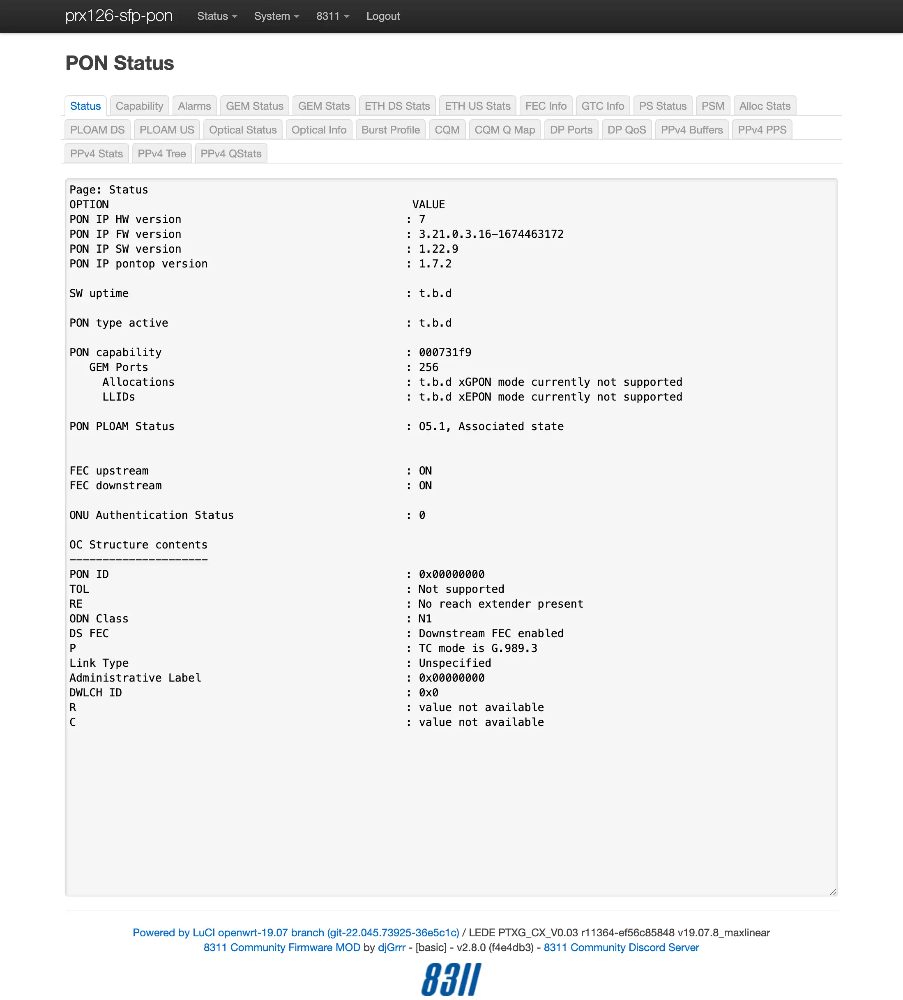

# Masquerade as the AT&T Inc. CGW452-400 with the WAS-110 or HLX-SFPX

![Bypass family]

<!-- more -->
<!-- nocont -->









## Getting Started Business Fiber Important Notes

The CGW452-400 is equipped with a cellular modem for limited backup internet functionality and is distributed with AT&T Business Fiber. It is imparitive that once you have all the information you need to transition from the CGW452-400 to a masquerade set-up that you remove power from the device so that your own ONU has no issues reacquiring your connection to the AT&T Fiber Network.

## Configure ONT settings

To masquerade, you will need the original ONT serial number identifier (e.g., __WNCA...__) from your
{{ page.meta.ont }}'s fiber stats page, as well as the bottom label.

<http://192.168.1.254/cgi-bin/fiberstat.ha>

=== "WAS-110 / X-ONU-SFPP"

    Use your preferred setup method and carefully follow the steps to avoid unnecessary downtime and troubleshooting:

    * [Web (luci)](#config-via-web)
    * [Shell (linux)](#config-via-shell)

    <h3 id="config-via-web">Via web <small>recommended</small></h3>

    <div class="swiper" markdown>

    <div class="swiper-slide" markdown>

    { loading=lazy }

    </div>

    <div class="swiper-slide" markdown>

    { loading=lazy }

    </div>

    <div class="swiper-slide" markdown>

    { loading=lazy }

    </div>

    <div class="swiper-slide" markdown>

    { loading=lazy }

    </div>

    </div>

    1. Within a web browser, navigate to
       <https://192.168.11.1/cgi-bin/luci/admin/8311/config>
       and, if asked, input your *root* [password]{ data-preview target="_blank" }.

    2. From the __8311 Configuration__ page, on the __PON__ tab, fill in the configuration with the following values:

        !!! info "All attributes below are <ins>mandatory</ins>"
            Replace the ONT ID with the one found on the {{ page.meta.ont }}'s label.

        | Attribute                  | Value                   | Remarks                                       |
        | -------------------------- | -----------------       | --------------------------------------------- |
        | PON Serial Number (ONT ID) | WNCA&hellip;            | Replace with the ONT ID from the bottom label |
        | Sync Circuit Pack Version  | :check_mark:            |                                               |
        | MIB File                   | /etc/mibs/prx300_1U.ini | PPTP i.e. default value                       |

    3. From the __8311 Configuration__ page, on the __ISP Fixes__ tab, enable __Fix VLANs__ from the drop-down.

    4. __Save__ changes and *reboot* from the __System__ menu.

    <h3 id="config-via-shell">Via shell <small>alternative</small></h3>

    1. Login over secure shell (SSH).

        ``` sh
        ssh root@192.168.11.1
        ```

    2. Configure the 8311 U-Boot environment.

        !!! info "All attributes below are <ins>mandatory</ins>"

        ``` sh
        fwenv_set -8 gpon_sn WNCA...
        fwenv_set -8 cp_hw_ver_sync 1
        fwenv_set -8 fix_vlans 1
        ```

        !!! info "Additional details and variables are described at the original repository [^1]"
            `/usr/sbin/fwenv_set` is a helper script that executes `/usr/sbin/fw_setenv` twice consecutively.

            The WAS-110 functions as an A/B system, requiring the U-Boot environment variables to be set twice, once
            for each environment.

            The `-8` option prefixes the U-Boot environment variable with `8311_`.

    3. Verify the 8311 U-boot environment and reboot.

        ``` sh
        fw_printenv | grep ^8311
        reboot
        ```

  [password]: ../xgs-pon/ont/bfw-solutions/was-110.md#web-credentials

=== "HLX-SFPX"

    { loading=lazy }

    1. Within a web browser, navigate to <http://192.168.33.1/cgi-bin/luci/admin/system/halny-settings/> and, if asked,
       input the *useradmin* [web credentials]{ data-preview target="_blank" }.
    3. From the hidden __HALNy Settings__ page, in the __Custom values__ section, fill in the configuration with the
       following values:

        !!! info "All attributes below are <ins>mandatory</ins>"
            Replace the PON Serial Number with the ONT ID found on the {{ page.meta.ont }}'s label.

        | Parameter                  | Value                   | Remarks                                       |
        | -------------------------- | -----------------       | --------------------------------------------- |
        | State                      | Enable                  |                                               |
        | PON Serial Number          | WNCA&hellip;            | Replace with the ONT ID from the bottom label |
        | Sync Circuit Pack Version  | Enable                  |                                               |


    4. Click __Save & Reboot__ to apply the parameters.

  [web credentials]: ../xgs-pon/ont/calix/100-05610.md#web-credentials
  [Version listing]: #software-versions







## Troubleshooting

The {{ page.meta.ont }} is unique in that it is almost primarily used in AT&T Business Fiber and not generally available "in the wild." While these settings work with the tested OLT, it may not entirely mean that this masquerade is able to be used by all customers with CGW452-400, keeping the [WAS-110] settings up-to-date with any new discoveries may be beneficial but not strictly necessary.

__For the purpose of showing a successful bypass__, see below for screenshots of what your [WAS-110] Web GUI should look like.

    { loading=lazy }

    { loading=lazy }

    { loading=lazy }

    ![PLOAM Status on 8311 [WAS-110] Page](masquerade-as-the-att-inc-cgw452-400-with-the-was-110/screenshot_cgw450_04.webp){ loading=lazy }

[^1]: <https://github.com/djGrrr/8311-was-110-firmware-builder>
