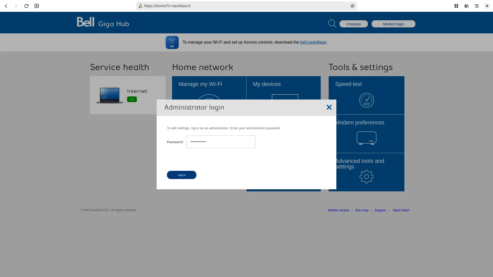
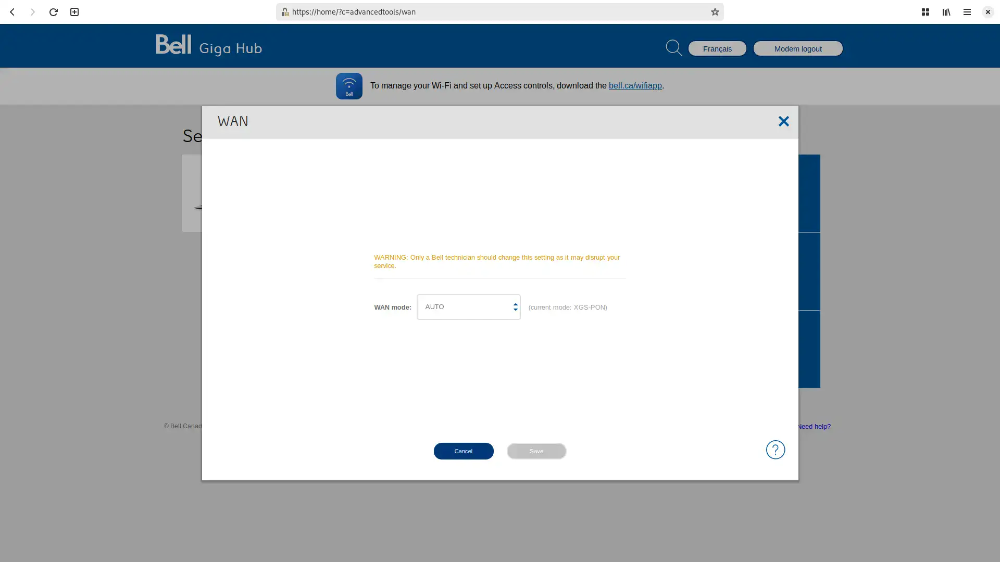
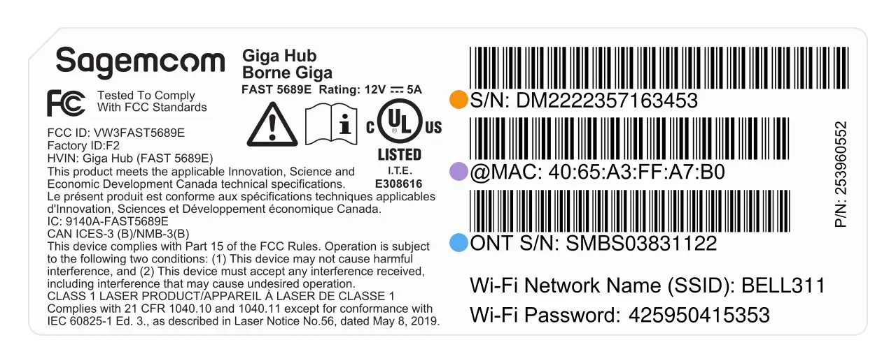
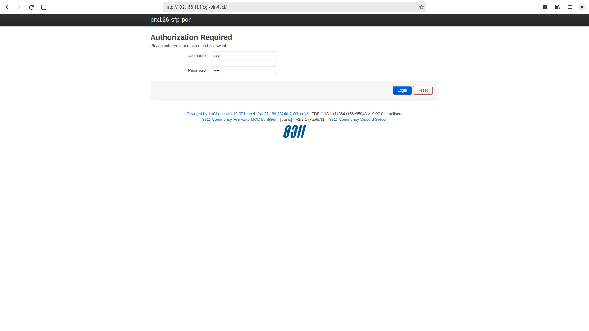

# Masquerade as the BCE Inc. Giga Hub on XGS-PON with the BFW Solutions WAS-110

{ class="nolightbox" }

<!-- more -->
<!-- nocont -->

## Determine if you're an XGS-PON subscriber

!!! info "3Gbps or higher packages"
    If you're subscribed to Gigabit Fibe 3.0 or a similar 3Gbps or higher package, skip past to [Purchase a WAS-110].

There are two (2) methods to determine if you're an XGS-PON subscriber: the simpler [Web UI](#with-web-ui) WAN page, 
and the more comprehensive [XMO API client](#with-xmo-client). 

### with the web UI <small>recommended</small> { #with-the-web-ui data-toc-label="with the web UI" }



1. Within a web browser, navigate to
   <https://home/?c=advancedtools/wan>
   and, if asked, input your Administrator password. (1)
   { .annotate }

    1. The default Administrator password is the S/N located on the back [label] of the Giga Hub.



2. From the __WAN__ page, verify the displayed __current mode__ is XGS-PON.

### with a XMO client

The open-source XMO client[^1] has a prerequisite of Python 3.10 or newer.
Python installation varies by Operating System and has been outlined by the tutors at 
[Real Python &mdash; Python 3 Installation & Setup Guide](https://realpython.com/installing-python).

<h4>Install client</h4>

Open a terminal and install the open-source XMO client with:

=== ":fontawesome-brands-windows: Windows"

    ``` sh hl_lines="5"
    py --version
    py -m venv venv
    venv\Scripts\activate
    py -m pip install --upgrade pip 
    pip install https://github.com/up-n-atom/sagemcom-modem-scripts/releases/download/v0.0.4/xmo_remote_client-0.0.4-py3-none-any.whl
    ```

=== ":material-apple: macOS / :material-linux: Linux"

    ``` sh hl_lines="5"
    python3 --version # (1)!
    python3 -m venv .venv
    . .venv/bin/activate
    python3 -m pip install --upgrade pip
    pip3 install https://github.com/up-n-atom/sagemcom-modem-scripts/releases/download/v0.0.4/xmo_remote_client-0.0.4-py3-none-any.whl
    ```

    1. Verify the installed Python version is >= __3.10__

<h4>Exec client</h4>

Finally, to determine if you're an XGS-PON subscriber, execute the following:

``` sh
xmo-remote-client --password=<password> get-wan-mode
```

!!! note
    Replace the `<password>` argument; the default Administrator password is the S/N located on the back [label] of the 
    Giga Hub.

## Purchase a WAS-110

The WAS-110 is available from select distributors and at a discounted rate with group buys on the 
[8311 Discord community server](https://discord.com/servers/8311-886329492438671420).

## Install community firmware

As a prerequisite to masquerading with the WAS-110, the community firmware is necessary; follow the steps 
outlined in the community firmware installation guide:

[Install 8311 community firmware on the BFW Solutions WAS-110](install-8311-community-firmware-on-the-bfw-solutions-was-110.md)

## WAS-110 masquerade setup

To successfully masquerade on XGS-PON, the original ONT serial number is mandatory. It, along with other key 
identifiers are available on the back label of the Giga Hub, color-coordinated in the following depiction:

{ class="nolightbox" id="giga-hub-label" }

### from the web UI <small>recommended</small> { #from-the-web-ui data-toc-label="from the web UI"}



1. Within a web browser, navigate to 
   <https://192.168.11.1/cgi-bin/luci/admin/8311/config> 
   and, if asked, input your <em>root</em> password.

    ??? info "As of version 2.4.0 `https://` is supported and enabled by default"
        All `http://` URLs will redirect to `https://` unless the `8311_https_redirect` environment variable is set to
        0 or false.


2. From the __8311 Configuration__ page, on the __PON__ tab, fill in the configuration with the following values:

    !!! reminder 
        <ins>Replace</ins> the :blue_circle: __PON serial number__ and :purple_circle: __MAC address__ with the 
        provisioned values on the back [label] of the Giga Hub.

    | Attribute                  | Value                        | Mandatory    | Remarks                         |
    | -------------------------- | ---------------------------- | ------------ | ------------------------------- |
    | PON Serial Number (ONT ID) | SMBS03831122                 | :check_mark: | :blue_circle:                   |
    | Equipment ID               | 5690                         |              |                                 |
    | Hardware Version           | Fast5689EBell                |              |                                 |
    | Sync Circuit Pack Version  | :check_mark:                 |              |                                 |
    | Software Version A         | SGC8400058                   |              | [Version listing]               |
    | Software Version B         | SGC8400058                   |              | [Version listing]               |
    | MIB File                   | /etc/mibs/prx300_1V_bell.ini | :check_mark: | VEIP and more                   |
    | IP Host MAC Address        | 40:65:A3:FF:A7:B1            |              | :purple_circle: MAC address + 1 |

3. __Save__ changes and reboot from the __System__ menu.

Once rebooted, the SC/APC cable can safely be plugged into the WAS-110 and immediately receive O5 
operational status.

### from the shell

<h4>Login over SSH</h4>

``` sh
ssh root@192.168.11.1
```

<h4>Configure 8311 U-Boot environment</h4>

!!! reminder 
    <ins>Replace</ins> the :orange_circle: __Device serial number__, :purple_circle: __MAC address__, and 
    :blue_circle: __PON serial number__ with the provisioned values on the back [label] of the Giga Hub.

``` sh hl_lines="1 4 10"
fwenv_set mib_file
fwenv_set 8311_device_sn DM2222357163453
fwenv_set 8311_iphost_mac 40:65:A3:FF:A7:B1 # (1)!
fwenv_set 8311_gpon_sn SMBS03831122
fwenv_set 8311_equipment_id 5690
fwenv_set 8311_hw_ver Fast5689EBell
fwenv_set 8311_cp_hw_ver_sync 1
fwenv_set 8311_sw_verA SGC8400058 # (2)!
fwenv_set 8311_sw_verB SGC8400058
fwenv_set 8311_mib_file /etc/mibs/prx300_1V_bell.ini 
```

1. :purple_circle: MAC address + 1, e.g. 
   `40:65:A3:FF:A7:B0` becomes `40:65:A3:FF:A7:B1`
2. [Version listing]

!!! info "Additional details and variables are described at the original repository [^2]"
    `/usr/sbin/fwenv_set` is a helper script that executes `/usr/sbin/fw_setenv` twice consecutively.

    The WAS-110 functions as an A/B system, requiring the U-Boot environment variables to be set twice, once for each 
    environment.

<h4>Verify and reboot</h4>

Prior to rebooting, verify that the 8311 environment variables are set correctly. If not, proceed to correct them with
the `fwenv_set` command as before.

``` sh
fw_printenv | grep ^8311
reboot
```

Once rebooted, the SC/APC cable can safely be plugged into the WAS-110 and immediately receive O5 
operational status.

## Giga Hub software versions

The software version can be used as a provisioning attribute by the OLT. Therefore, it is important to keep up-to-date
with the latest listing.

| Firmware Version | External Firmware Version |
| ---------------- | ------------------------- |
| 2.9              | SGC8400058                |
| 1.19.6           | SGC83000DC                |
| 1.19.5.4         | SGC83000D0                |
| 1.19.5.1         | SGC83000C8                |
| 1.16.5           | SGC830007C                |
| 1.16.3           | SGC830006E                |


Please help us by contributing new versions via the
[8311 Discord community server](https://discord.com/servers/8311-886329492438671420)
or submitting a 
[Pull Request](https://github.com/up-n-atom/8311/pulls) on GitHub.

The following command extracts the external firmware version used by OMCI managed entity 7 and requires the 
[XMO client] described earlier in this guide.

``` sh
xmo-remote-client -p <password> get-value --path "Device/DeviceInfo/SoftwareVersion" --path "Device/DeviceInfo/ExternalFirmwareVersion"
```

  [Purchase a WAS-110]: #purchase-a-was-110
  [label]: #giga-hub-label
  [Version listing]: #giga-hub-software-versions
  [XMO client]: #with-a-xmo-client

[^1]: <https://github.com/up-n-atom/sagemcom-modem-scripts>
[^2]: <https://github.com/djGrrr/8311-was-110-firmware-builder>
