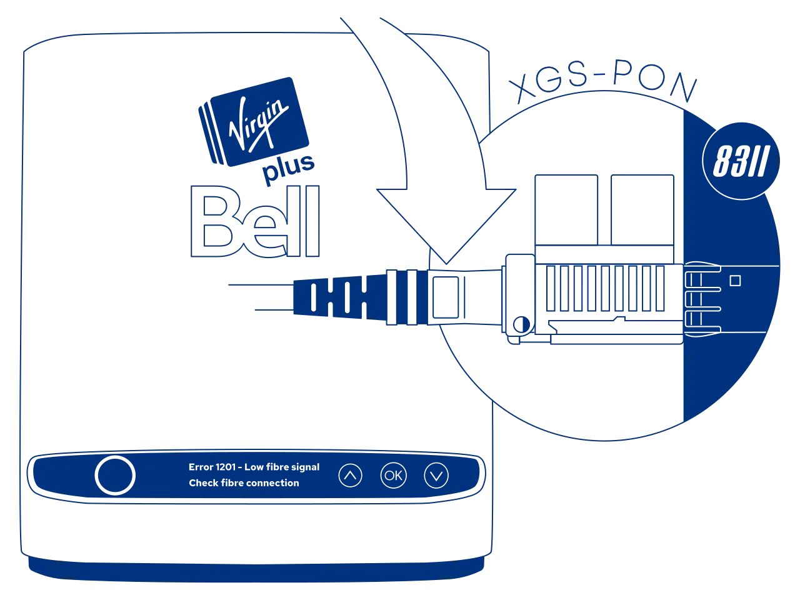
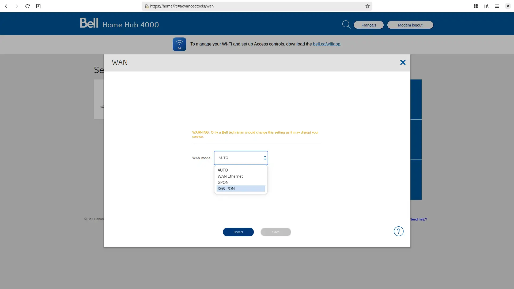

# Masquerade as the BCE Inc. Home Hub 4000 with the WAS-110

!!! info "Including the rebadged Virgin Plus Vincent"

{ class="nolightbox" }

<!-- more -->
<!-- nocont -->

## Determine if you're an XGS-PON subscriber

!!! info "3 Gbps or higher packages"
    If you're subscribed to Gigabit Fibe 3.0 or a similar 3 Gbps or higher package, skip past to [Purchase a WAS-110].

There are two (2) methods to determine if you're an XGS-PON subscriber: the simpler [Web UI](#with-the-web-ui) WAN mode
switcheroo and the more comprehensive [XMO API client](#with-a-xmo-client).

### with the web UI <small>recommended</small> { #with-the-web-ui data-toc-label="with the web UI" }

!!! info "Firmware version __1.7.11__ removed the helpful auto-detected mode output"

<div class="swiper" markdown>

<div class="swiper-slide" markdown>

{ loading=lazy }

</div>

<div class="swiper-slide" markdown>

{ loading=lazy }

</div>

</div>

1. Within a web browser, navigate to
   <https://home/?c=advancedtools/wan>
   and, if asked, input your Administrator password. (1)
   { .annotate }

    1. The default Administrator password is located on the back [label] of the Home Hub 4000.

2. From the __WAN mode__ drop-down, switch from `AUTO` to `XGS-PON` and click __Save__.

If your internet access doesn't drop out, you're subscribed on XGS-PON.

### with a XMO client

The open-source XMO client[^1] has a prerequisite of Python 3.10 or newer.
Python installation varies by Operating System and has been outlined by the tutors at
[Real Python &mdash; Python 3 Installation & Setup Guide](https://realpython.com/installing-python).

<h4>Install client</h4>

Open a terminal and install the open-source XMO client with:

=== ":material-microsoft: Windows"

    ``` sh hl_lines="5"
    py --version
    py -m venv venv
    venv\Scripts\activate
    py -m pip install --upgrade pip
    pip install https://github.com/up-n-atom/sagemcom-modem-scripts/releases/download/v0.0.4/xmo_remote_client-0.0.4-py3-none-any.whl
    ```

=== ":simple-apple: macOS / :simple-linux: Linux"

    ``` sh hl_lines="5"
    python3 --version # (1)!
    python3 -m venv .venv
    . .venv/bin/activate
    python3 -m pip install --upgrade pip
    pip3 install https://github.com/up-n-atom/sagemcom-modem-scripts/releases/download/v0.0.4/xmo_remote_client-0.0.4-py3-none-any.whl
    ```

    1. Verify the installed Python version is >= __3.10__

<h4>Exec client</h4>

Finally, to determine if you're an XGS-PON subscriber, execute the following:

``` sh
xmo-remote-client --password=<password> -a MD5 get-wan-mode
```

!!! note
    Replace the `<password>` argument. The default Administrator password is the serial number (S/N) located on the
    back [label] of the Home Hub 4000.

## Purchase a WAS-110

!!! note
    The WAS-110 is __NOT__ a substitute for a layer 7 router; It is an ONT, and its __ONLY__ function is to convert
    Ethernet to PON over fiber medium. Additional hardware and software are required to access the Internet.

The [WAS-110] is available from select [resellers] worldwide.

 [resellers]: https://pon.wiki/xgs-pon/ont/bfw-solutions/was-110/#value-added-resellers

!!! tip "Beyond budget?"
    An alternative is to subscribe to an Internet Companies Group ISP, a division of Bell Canada, who provision an
    XS-010X-Q ONT, an SFU.

    * [Acanac](https://acanac.com/)
    * [Distributel](https://www.distributel.ca/)
    * [EBOX](https://www.ebox.ca/)
    * [Oricom](https://www.oricom.ca/)
    * [Primus](https://primus.ca/)

    If budget is no longer a concern later on, and an SFP is appealing, check out the XS-010X-Q
    guide: [Swap out the Nokia XS-010X-Q for a Small Form-factor Pluggable WAS-110](swap-out-the-nokia-xs-010x-q-for-a-small-form-factor-pluggable-was-110.md)

## Install community firmware

## Install community firmware

As a prerequisite to masquerading with the WAS-110, the community firmware is necessary; follow the steps
outlined in the community firmware installation guide: [Install the 8311 community firmware on the WAS-110](install-the-8311-community-firmware-on-the-was-110.md).

## WAS-110 masquerade setup

To successfully masquerade on XGS-PON, the original ONT serial number is mandatory. It, along with other key
identifiers are available on the back label of the Home Hub 4000, color-coordinated in the following depiction:

{ class="nolightbox" id="home-hub-4000-label" }

### from the web UI <small>recommended</small> { #from-the-web-ui data-toc-label="from the web UI"}

??? info "As of version 2.4.0 `https://` is supported and enabled by default"
    All `http://` URLs will redirect to `https://` unless the `8311_https_redirect` environment variable is set to
    0 or false.

<div class="swiper" markdown>

<div class="swiper-slide" markdown>

{ loading=lazy }

</div>

<div class="swiper-slide" markdown>

{ loading=lazy }

</div>

<div class="swiper-slide" markdown>

{ loading=lazy }

</div>

</div>

1. Within a web browser, navigate to
   <https://192.168.11.1/cgi-bin/luci/admin/8311/config>
   and, if asked, input your <em>root</em> password.

2. From the __8311 Configuration__ page, on the __PON__ tab, fill in the configuration with the following values:

    !!! reminder
        <ins>Replace</ins> the :blue_circle: mandatory __PON Serial Number__ and optional :purple_circle:
        __IP Host MAC address__ with the provisioned values on the back [label] of the Home Hub 4000.

    | Attribute                  | Value                        | Mandatory    | Remarks                         |
    | -------------------------- | ---------------------------- | ------------ |-------------------------------- |
    | PON Serial Number (ONT ID) | SMBS&hellip;                 | :check_mark: | :blue_circle: ONT S/N           |
    | Equipment ID               | 5689                         |              |                                 |
    | Hardware Version           | Fast5689Bell                 |              |                                 |
    | Sync Circuit Pack Version  | :check_mark:                 |              |                                 |
    | Software Version A         | SGC8210154                   |              | [Version listing]               |
    | Software Version B         | SGC8210154                   |              | [Version listing]               |
    | MIB File                   | /etc/mibs/prx300_1V_bell.ini | :check_mark: | VEIP and more                   |
    | IP Host MAC Address        | 40:65:A3:FF:A7:B1            |              | :purple_circle: @MAC + 1        |

3. From the __8311 Configuration__ page, on the __ISP Fixes__ tab, enable __Fix VLANs__ from the drop-down.

4. __Save__ changes and *reboot* from the __System__ menu.

### from the shell

1. Login over secure shell (SSH).

    ``` sh
    ssh root@192.168.11.1
    ```

2. Configure the 8311 U-Boot environment.

    !!! reminder "Highlighted lines are <ins>mandatory</ins>"
        <ins>Replace</ins> the mandatory :blue_circle: __8311_gpon_sn__ and optional :purple_circle:
        __8311_iphost_mac__ with the provisioned values on the back [label] of the Home Hub 4000.

    ``` sh hl_lines="1 3 9 10"
    fwenv_set mib_file
    fwenv_set -8 iphost_mac 40:65:A3:FF:A7:B1 # (1)!
    fwenv_set -8 gpon_sn SMBS... # (2)!
    fwenv_set -8 equipment_id 5689
    fwenv_set -8 hw_ver Fast5689Bell
    fwenv_set -8 cp_hw_ver_sync 1
    fwenv_set -8 sw_verA SGC8210154 # (3)!
    fwenv_set -8 sw_verB SGC8210154
    fwenv_set -8 mib_file /etc/mibs/prx300_1V_bell.ini
    fwenv_set -8 fix_vlans 1
    ```

    1. :purple_circle: @MAC + 1, e.g. `40:65:A3:FF:A7:B0` becomes `40:65:A3:FF:A7:B1`
    2. :blue_circle: ONT S/N
    2. [Version listing]

3. Verify the 8311 U-boot environment and reboot.

    ``` sh
    fw_printenv | grep ^8311
    reboot
    ```

After rebooting the WAS-110, safely remove the SC/APC cable from the Home Hub 4000 and connect it to the
WAS-110. If all previous steps were followed correctly, the WAS-110 should operate with O5.1 [PLOAM status].
For troubleshooting, please read the [Troubleshoot connectivity issues with the WAS-110] guide before seeking help on
the [8311 Discord community server].

  [PLOAM status]: troubleshoot-connectivity-issues-with-the-was-110.md#ploam-status
  [Troubleshoot connectivity issues with the WAS-110]: troubleshoot-connectivity-issues-with-the-was-110.md

## Home Hub 4000 software versions

The software version <ins>can</ins> be utilized as a provisioning attribute by the OLT, but this is not the case for
the Home Hub 4000, which uses CWMP[^3]. However, it is recommended to keep somewhat up-to-date with the following
listing, but it is not strictly necessary.

| Firmware Version | External Firmware Version |
| ---------------- | ------------------------- |
| 2.13             | SGC84000AE                |
| ?                | SGC8400090                |
| 1.7.11           | SGC8210154                |
| 1.7.8.1          | SGC8210140                |
| 1.7.2            | SGC821011A                |

Please help us by contributing new versions via the [8311 Discord community server] or submitting a
[Pull Request](https://github.com/up-n-atom/8311/pulls) on GitHub.

The following command extracts the external firmware version used by OMCI managed entity 7 and requires the
[XMO client] described earlier in this guide.

``` sh
xmo-remote-client -p <password> -a MD5 get-value --path "Device/DeviceInfo/SoftwareVersion" --path "Device/DeviceInfo/ExternalFirmwareVersion"
```

  [Purchase a WAS-110]: #purchase-a-was-110
  [WAS-110]: ../xgs-pon/ont/bfw-solutions/was-110.md
  [label]: #home-hub-4000-label
  [Version listing]: #home-hub-4000-software-versions
  [XMO client]: #with-a-xmo-client
  [8311 Discord community server]: https://discord.com/servers/8311-886329492438671420

[^1]: <https://github.com/up-n-atom/sagemcom-modem-scripts>
[^2]: <https://github.com/djGrrr/8311-was-110-firmware-builder>
[^3]: <https://en.wikipedia.org/wiki/TR-069>
