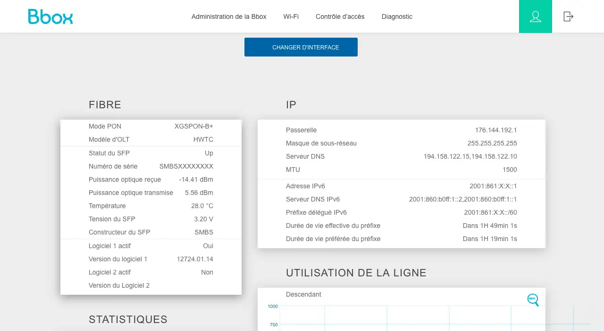

# Masquerade as the Bouygues S.A Bbox with the WAS-110

{ class="nolightbox" }

<!-- more -->
<!-- nocont -->

## Determine if you're an XGS-PON subscriber

!!! info "[Debit+] option"
    To subscribe to XGS-PON, you must enable and/or purchase the [Debit+] option, which is necessary to receive the
    Bbox Ultym along with an XGS-PON SFP+ transceiver.

    [Debit+]: https://www.assistance.bouyguestelecom.fr/s/article/option-debit-plus

<div class="swiper" markdown>

<div class="swiper-slide" markdown>

{ loading=lazy }

</div>

<div class="swiper-slide" markdown>

{ loading=lazy }

</div>

<div class="swiper-slide" step="4" markdown>

{ loading=lazy }

</div>

</div>

1. Within a web browser, navigate to <https://mabbox.bytel.fr/> or <https://192.168.1.254> and, if asked, input your
   Administrator password and click the __Connect__ button.

2. From the __Main__ page, click on the __:material-cog: Administration interface__ to revert to the old interface.

3. From the __Administration__ page, click on the __Fiber__ section inside the __Internet__ panel on the left-hand side.

4. From the __Fiber__ page, verify that the __PON Mode__ is XGS-PON.

    !!! tip "Take note of the Serial Number beginning with *SMBS* and Software Versions for the WAS-110 configuration"

## Extract required attributes

### PON serial number

<div class="swiper" markdown>

<div class="swiper-slide" markdown>

{ loading=lazy }

</div>

<div class="swiper-slide" markdown>

{ loading=lazy }

</div>

<div class="swiper-slide" step="4" markdown>

{ loading=lazy }

</div>

</div>

1. Within a web browser, navigate to <https://mabbox.bytel.fr/> or <https://192.168.1.254> and, if asked, input your
   Administrator password and click the __Connect__ button.

2. From the __Main__ page, click on the __:material-cog: Administration interface__ to revert to the old interface.

3. From the __Administration__ page, click on the __Fiber__ section inside the __Internet__ panel on the left-hand side.

4. From the __Fiber__ page, copy the __Serial Number__ beginning with `SMBS`.

### PLOAM registration ID

The registration ID is composed of a seventy-two (72) octets from the fifteen (15) octet IMEI prefixed with five (5)
0's and suffixed with fifty-two (52) 1's.

<div>
  <form onsubmit="document.querySelector('#__code_0 > code').innerHTML = '0'.repeat(5) + escapeHTML(event.target.elements['imei'].value) + '1'.repeat(52); event.preventDefault(); location.assign(`${location.origin}${location.pathname}#ploam-registration-id`)">
    <input type="text" id="imei" placeholder="IMEI" pattern="^[0-9A-Fa-f]{15}$"/>
    <input type="submit" value="Submit" />
  </form>
</div>

``` sh
00000XXXXXXXXXXXXXXX1111111111111111111111111111111111111111111111111111
```

The IMEI can be obtained from the back label of the Bbox or from the web UI.


<div class="swiper" markdown>

<div class="swiper-slide" markdown>

{ loading=lazy }

</div>

<div class="swiper-slide" markdown>

{ loading=lazy }

</div>

<div class="swiper-slide" step="4" markdown>

{ loading=lazy }

</div>

</div>

1. Within a web browser, navigate to <https://mabbox.bytel.fr/> or <https://192.168.1.254> and, if asked, input your
   Administrator password and click the __Connect__ button.

2. From the __Main__ page, click on the __:material-cog: Administration interface__ to revert to the old interface.

3. From the __Administration__ page, click on the __Model__ section inside the __Bbox__ panel on the right-hand side.

4. From the __Bbox__ page, copy the __IMEI__ number.

## Purchase a WAS-110

The [WAS-110] is available from select [resellers].

 [resellers]: https://pon.wiki/xgs-pon/ont/bfw-solutions/was-110/#value-added-resellers

## Install community firmware

As a prerequisite to masquerading with the WAS-110, the community firmware is necessary; follow the steps
outlined in the community firmware installation guide:

[Install the 8311 community firmware on the WAS-110](install-the-8311-community-firmware-on-the-was-110.md)

## WAS-110 masquerade setup

### from the web UI <small>recommended</small> { #from-the-web-ui data-toc-label="from the web UI"}

??? info "As of version 2.4.0 `https://` is supported and enabled by default"
    All `http://` URLs will redirect to `https://` unless the `8311_https_redirect` environment variable is set to
    0 or false.

<div class="swiper" markdown>

<div class="swiper-slide" markdown>

{ loading=lazy }

</div>

<div class="swiper-slide" markdown>

{ loading=lazy }

</div>

<div class="swiper-slide" markdown>

{ loading=lazy }

</div>

</div>

1. Within a web browser, navigate to
   <https://192.168.11.1/cgi-bin/luci/admin/8311/config>
   and, if asked, input your <em>root</em> password.

2. From the __8311 Configuration__ page, on the __PON__ tab, fill in the configuration with the following values:

    !!! info "All attributes below are mandatory to achieve O5 operation state"

    | Attribute                  | Value                        | Remarks                          |
    | -------------------------- | ---------------------------- | -------------------------------- |
    | PON Serial Number (ONT ID) | SMBS...                      | [PON serial number]              |
    | Registration ID            | 00000...                     | [PLOAM registration ID]          |
    | MIB File                   | /etc/mibs/prx300_1U.ini      |                                  |

    [PON serial number]: #pon-serial-number
    [PLOAM registration ID]: #ploam-registration-id

3. From the __8311 Configuration__ page, on the __ISP Fixes__ tab, disable __Fix VLANs__ from the drop-down.

4. __Save__ changes and reboot from the __System__ menu.

### from the shell

1. Login over secure shell (SSH).

    ``` sh
    ssh root@192.168.11.1
    ```

2. Configure the 8311 U-Boot environment.

    !!! info "All attributes below are mandatory to achieve O5 operation state"

    ``` sh
    fwenv_set -8 gpon_sn SMBS... # (1)!
    fwenv_set -8 reg_id_hex 00000... # (2)!
    fwenv_set -8 fix_vlans 0
    ```

    1. [PON serial number]
    2. [PLOAM registration ID]

    !!! info "Additional details and variables are described at the original repository [^1]"
        `/usr/sbin/fwenv_set` is a helper script that executes `/usr/sbin/fw_setenv` twice consecutively.

        The WAS-110 functions as an A/B system, requiring the U-Boot environment variables to be set twice, once for each
        environment.

        The `-8` option prefixes the U-Boot environment variable with `8311_`.

3. Verify the 8311 U-boot environment and reboot.

    ``` sh
    fw_printenv | grep ^8311
    reboot
    ```

After rebooting, the SC/APC cable can safely be plugged into the [WAS-110] and immediately receive O5
operational status. For troubleshooting, please read:

[Troubleshoot connectivity issues with the WAS-110]

!!! note "Tag the router's DHCP WAN interface and/or anything in-between the WAS-110 with VLAN 100"

Finally, continue with your bypass by consulting the [routing guide(s)](#routing-guides).

## Routing guides

* [LaFibre - Bouygues Telecom Remplacer la Bbox par un routeur](https://lafibre.info/remplacer-bbox/)

  [Purchase a WAS-110]: #purchase-a-was-110
  [WAS-110]: ../xgs-pon/ont/bfw-solutions/was-110.md#value-added-resellers
  [Troubleshoot connectivity issues with the WAS-110]: troubleshoot-connectivity-issues-with-the-was-110.md

[^1]: <https://github.com/djGrrr/8311-was-110-firmware-builder>
