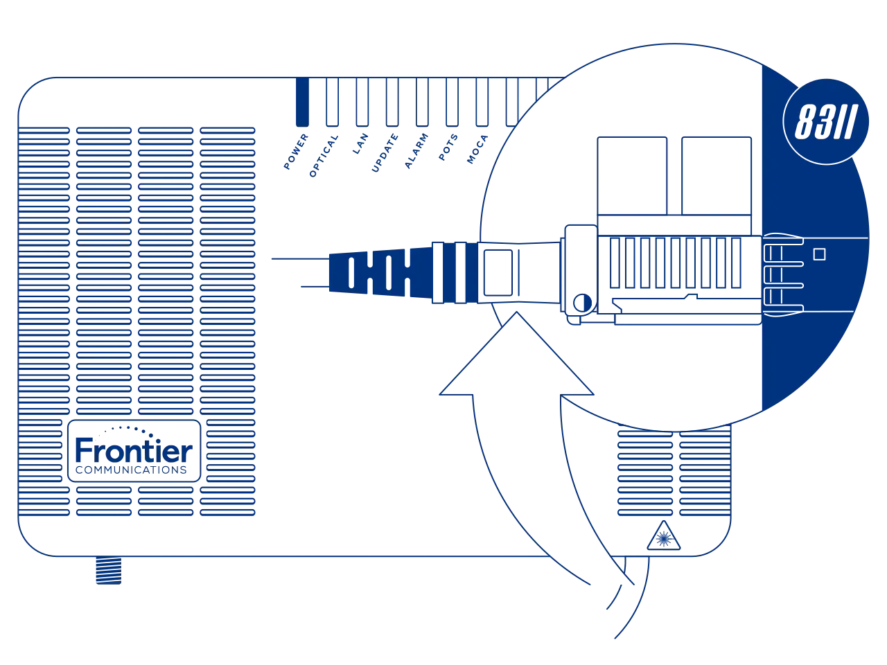
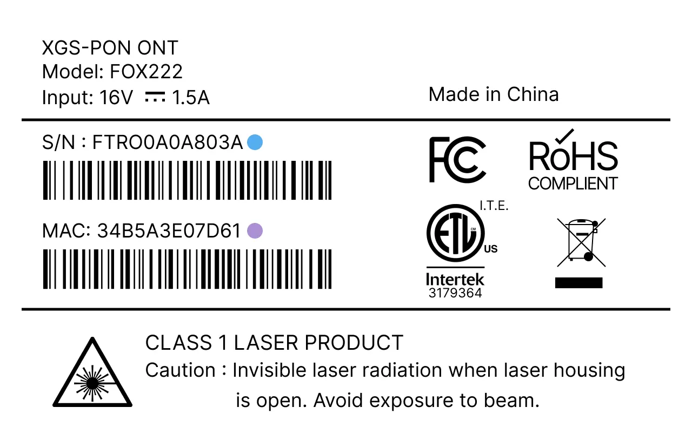

# Masquerade as the Frontier Communications Inc. FOX222 or FRX523 with the BFW Solutions WAS-110

{ class="nolightbox" }

<!-- more -->
<!-- nocont -->

## Purchase a WAS-110

The [WAS-110] is available from select distributors and at a discounted rate with group buys on the
[8311 Discord community server](https://discord.com/servers/8311-886329492438671420).

## Install community firmware

As a prerequisite to masquerading with the WAS-110, the community firmware is necessary; follow the steps
outlined in the community firmware installation guide:

[Install 8311 community firmware on the BFW Solutions WAS-110](install-8311-community-firmware-on-the-bfw-solutions-was-110.md)

## WAS-110 masquerade setup

To successfully masquerade on XGS-PON, the original ONT serial number is mandatory. It, along with other key
identifiers are available on the back label of the FOX222 or FRX523, color-coordinated in the following depiction:

<div id="fox222-frx523-label"></div>

=== "FOX222"

    { class="nolightbox" }

=== "FRX523"

    { class="nolightbox" }

### from the web UI <small>recommended</small> { #from-the-web-ui data-toc-label="from the web UI"}


1. Within a web browser, navigate to
   <https://192.168.11.1/cgi-bin/luci/admin/8311/config>
   and, if asked, input your <em>root</em> password.

    ??? info "As of version 2.4.0 `https://` is supported and enabled by default"
        All `http://` URLs will redirect to `https://` unless the `8311_https_redirect` environment variable is set to
        0 or false.


2. From the __8311 Configuration__ page, on the __PON__ tab, fill in the configuration with the following values:

    !!! reminder
        <ins>Replace</ins> the :blue_circle: __PON Serial Number__ with the provisioned value on the bottom [label] of 
        the FOX222 or FRX523.

    !!! info "All attributes below are <ins>mandatory</ins> to achieve O5 operation state"

    === "FOX222"

        | Attribute                        | Value                   | Remarks                         |
        | -------------------------------- | ----------------------- | ------------------------------- |
        | PON Serial Number (ONT ID)       | FTRO&hellip;            | :blue_circle: S/N               |
        | Equipment ID                     | FOX222                  |                                 |
        | Hardware Version                 | FOX222                  |                                 |
        | Sync Circuit Pack Version        | :check_mark:            |                                 |
        | Software Version A               | R4.4.08.030             | [Version listing]               |
        | Software Version B               | R4.4.08.030             | [Version listing]               |
        | Firmware Version Match           | ^(R\d+(?:\.\d+){3})$    | Community FW v2.5.0+            |
        | Override active firmware bank    | A                       | OLT inits a reboot if on bank B |
        | Override committed firmware bank | A                       | OLT inits a reboot if on bank B |
        | Registration ID (HEX)            | 44454641554c54          | `DEFAULT` in hex                |
        | MIB File                         | /etc/mibs/prx300_1U.ini | PPTP i.e. default value         |
        | Pon Slot                         | 10                      |                                 |

    === "FRX523"

        | Attribute                        | Value                   | Remarks                         |
        | -------------------------------- | ----------------------- | ------------------------------- |
        | PON Serial Number (ONT ID)       | FTRO&hellip;            | :blue_circle:  S/N              |
        | Equipment ID                     | FRX523                  |                                 |
        | Hardware Version                 | FRX523                  |                                 |
        | Sync Circuit Pack Version        | :check_mark:            |                                 |
        | Software Version A               | R4.4.13.057             | [Version listing]               |
        | Software Version B               | R4.4.13.057             | [Version listing]               |
        | Firmware Version Match           | ^(R\d+(?:\.\d+){3})$    | Community FW v2.5.0+            |
        | Override active firmware bank    | A                       | OLT inits a reboot if on bank B |
        | Override committed firmware bank | A                       | OLT inits a reboot if on bank B |
        | Registration ID (HEX)            | 44454641554c54          | `DEFAULT` in hex                |
        | MIB File                         | /etc/mibs/prx300_1U.ini | PPTP i.e. default value         |
        | Pon Slot                         | 10                      |                                 |

3. __Save__ changes and reboot from the __System__ menu.

Once rebooted, the SC/APC cable can safely be plugged into the WAS-110 and immediately receive O5 operational status.

For troubleshooting, please read:

[Troubleshoot connectivity issues with the BFW Solutions WAS-110]

### from the shell

<h4>Login over SSH</h4>

```sh
ssh root@192.168.11.1
```

<h4>Configure 8311 U-Boot environment</h4>

!!! reminder
    <ins>Replace</ins> the :blue_circle: __8311_gpon_sn__ with the provisioned value on the bottom [label] of the 
    FOX222 or FRX523.

!!! info "All attributes below are <ins>mandatory</ins> to achieve O5 operation state"

=== "FOX222"

    ``` sh
    fwenv_set -8 gpon_sn FTRO... # (1)!
    fwenv_set -8 equipment_id FOX222
    fwenv_set -8 hw_ver FOX222
    fwenv_set -8 cp_hw_ver_sync 1
    fwenv_set -8 sw_verA R4.4.08.030 # (2)!
    fwenv_set -8 sw_verB R4.4.08.030 
    fwenv_set -8 -b fw_match '^(R\d+(?:\.\d+){3})$'
    fwenv_set -8 override_active A
    fwenv_set -8 override_commit A
    fwenv_set -8 pon_slot 10
    fwenv_set -8 reg_id_hex 44454641554c54
    ```

    1. :blue_circle: S/N
    2. [Version listing]

=== "FRX523"

    ``` sh
    fwenv_set -8 gpon_sn FTRO... # (1)!
    fwenv_set -8 equipment_id FRX523
    fwenv_set -8 hw_ver FRX523
    fwenv_set -8 cp_hw_ver_sync 1
    fwenv_set -8 sw_verA R4.4.13.057 # (2)!
    fwenv_set -8 sw_verB R4.4.13.057
    fwenv_set -b 8311_fw_match '^(R\d+(?:\.\d+){3})$'
    fwenv_set -8 override_active A
    fwenv_set -8 override_commit A
    fwenv_set -8 pon_slot 10
    fwenv_set -8 reg_id_hex 44454641554c54
    ```

    1. :blue_circle: S/N
    2. [Version listing]

!!! info "Additional details and variables are described at the original repository [^1]"
    `/usr/sbin/fwenv_set` is a helper script that executes `/usr/sbin/fw_setenv` twice consecutively.

    The WAS-110 functions as an A/B system, requiring the U-Boot environment variables to be set twice, once for each
    environment.

    The `-8` option prefixes the U-Boot environment variable with `8311_`.

<h4>Verify and reboot</h4>

Prior to rebooting, verify that the 8311 environment variables are set correctly. If not, proceed to correct them with
the `fwenv_set` command as before.

```sh
fw_printenv | grep ^8311
reboot
```

Once rebooted, the SC/APC cable can safely be plugged into the WAS-110 and immediately receive O5 operational status.

For troubleshooting, please read:

[Troubleshoot connectivity issues with the BFW Solutions WAS-110]

## Software versions

!!! info "Automatic software version updater built-in community firmware version(s) 2.5.0+"
    Firmware upgrades sent over OMCI will be compared against the Firmware Version Match pattern and automatically
    update the Software Version A/B attributes if there is a match.

    Firmware images are stored in `/tmp/firmware.img` if further analysis is required.

The software version is used as a provisioning attribute by the OLT and must be kept up-to-date with the latest
version. Otherwise, upon a reboot, the WAS-110 will operate in a fake O5 state until corrected.

=== "FOX222"

    | Software Version |
    | ---------------- |
    | R4.4.08.030      |
    | R4.4.08.025      |

=== "FRX523"

    | Software Version |
    | ---------------- |
    | R4.4.13.057      |
    | R4.4.13.051      |
    | R4.4.13.041      |

Please help us by contributing new versions via the
[8311 Discord community server](https://discord.com/servers/8311-886329492438671420)
or submitting a
[Pull Request](https://github.com/up-n-atom/8311/pulls) on GitHub.

??? info "Serial access"
    The version can be extracted by means of the internal TTL UART header and a 3.3V USB to TTL UART adapter.

    <h4>Serial pinout</h4>

    | Pin | IO |
    | --- | -- |
    | 2   | Rx |
    | 4   | Tx |

    <h4>Serial setup</h4>

    |           | Value |
    | --------- | ----- |
    | Speed     | 15200 |
    | Parity    | None  |
    | Data-bits | 8     |
    | Stop-bits | 1     |

    <h4>Shell commands</h4>

    ``` sh
    enable
    ontver
    ```

  [WAS-110]: ../xgs-pon/ont/bfw-solutions/was-110.md#value-added-resellers
  [label]: #fox222-frx523-label
  [Version listing]: #software-versions
  [Troubleshoot connectivity issues with the BFW Solutions WAS-110]: troubleshoot-connectivity-issues-with-the-bfw-solutions-was-110.md

[^1]: <https://github.com/djGrrr/8311-was-110-firmware-builder>
