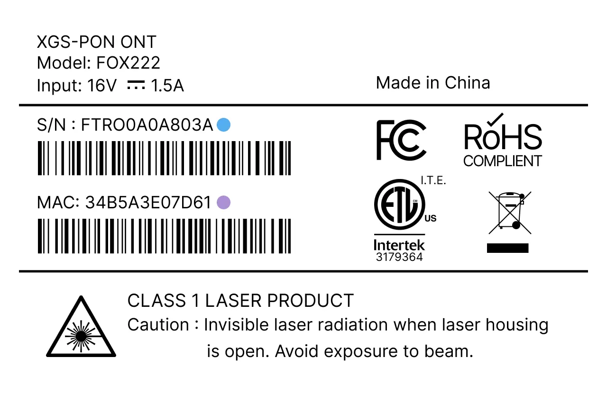

# Masquerade as the Frontier FOX222/FRX523 with the BFW Solutions WAS-110

## Purchase a WAS-110

The WAS-110 is available from select distributors and at a discounted rate with group buys on the
[8311 Discord community server](https://discord.com/servers/8311-886329492438671420).

## Install community firmware

Although, not strictly necessary for AT&T, the community firmware is highly recommended for masquerading with the
WAS-110 and used for the remainder of this guide. To install the community firmware, follow the steps outlined in the
community firmware installation guide:

[Install 8311 community firmware on the BFW Solutions WAS-110](install-8311-community-firmware-on-the-bfw-solutions-was-110.md)

## WAS-110 masquerade setup

To successfully masquerade on XGS-PON, the original ONT serial number is mandatory. It, along with other key
identifiers are available on the bottom label of the FOX222/FRX523, color-coordinated in the following depiction:

=== "FOX222"

    { class="nolightbox" }

=== "FRX523"

    { class="nolightbox" }

### from the web UI <small>recommended</small> { #from-the-web-ui data-toc-label="from the web UI"}


1. Within a web browser, navigate to
   <https://192.168.11.1/cgi-bin/luci/admin/8311/config>
   and, if asked, input your <em>root</em> password.

   ??? info "As of version 2.4.0 `https://` is supported and enabled by default"
   All `http://` URLs will redirect to `https://` unless the `8311_https_redirect` environment variable is set to
   0 or false.


2.  From the **8311 Configuration** page, on the **PON** tab, fill in the configuration with the following values:
    !!! reminder
    <ins>Replace</ins> the :blue_circle: **PON serial number** and :purple_circle: **MAC address** with the
    provisioned values on the bottom [label] of the FOX222/FRX523.

    === "FOX222"

        | Parameter                  | Value                   | Remarks       |
        | -------------------------- | ----------------------- | ------------- |
        | PON Serial Number (ONT ID) | FTROxxxxxxxx            | :blue_circle: |
        | Equipment ID               | FRX523                  |               |
        | Hardware Version           | FRX523                  |               |
        | Sync Circuit Pack Version  | :check_mark:            |               |
        | Software Version A         | R4.4.13.051             |               |
        | Software Version B         | R4.4.13.051             |               |
        | MIB File                   | /etc/mibs/prx300_1U.ini | VEIP and more |

    === "FRX523"

        | Parameter                  | Value                   | Remarks       |
        | -------------------------- | ----------------------- | ------------- |
        | PON Serial Number (ONT ID) | FTROxxxxxxxx            | :blue_circle: |
        | Equipment ID               | FRX523                  |               |
        | Hardware Version           | FRX523                  |               |
        | Sync Circuit Pack Version  | tbd                     |               |
        | Software Version A         | R4.4.13.051             |               |
        | Software Version B         | R4.4.13.051             |               |
        | MIB File                   | /etc/mibs/prx300_1U.ini | VEIP and more |

3.  **Save** changes and reboot from the **System** menu.

Once rebooted, the SC/APC cable can safely be plugged into the WAS-110 and immediately receive O5
operational status.

### from the shell

<h4>Login over SSH</h4>

```sh
ssh root@192.168.11.1
```

<h4>Configure 8311 U-Boot environment</h4>

!!! reminder
<ins>Replace</ins> the :orange_circle: **Device serial number**, :purple_circle: **MAC address**, and
:blue_circle: **ONT ID** with the provisioned values on the bottom [label] of the BGW320-500/505.

=== "FOX222"

    ``` sh hl_lines="1 4 10"
    fwenv_set 8311
    ```

=== "FRX523"

    ``` sh hl_lines="1 4 10"
    fwenv_set 8311
    ```

!!! info "Additional details and variables are described at the original repository [^2]"
`/usr/sbin/fwenv_set` is a helper script that executes `/usr/sbin/fw_setenv` twice consecutively.

    The WAS-110 functions as an A/B system, requiring the U-Boot environment variables to be set twice, once for each
    environment.

<h4>Verify and reboot</h4>

Prior to rebooting, verify that the 8311 environment variables are set correctly. If not, proceed to correct them with
the `fwenv_set` command as before.

```sh
fw_printenv | grep ^8311
reboot
```

Once rebooted, the SC/APC cable can safely be plugged into the WAS-110 and immediately receive O5
operational status.

## Software versions

The software version can be used as a verification parameter by the OLT. Therefore, it is important to keep up-to-date
with the latest listing.

    === "FOX222"

         | External Firmware Version |
         | ------------------------- |
         | R4.4.08.030 last known    |
         | R4.4.08.025               |

    === "FRX523"

         | External Firmware Version |
         | ------------------------- |
         | R4.4.13.051 last known    |
         | R4.4.13.041               |

Please help us by contributing new versions via the
[8311 Discord community server](https://discord.com/servers/8311-886329492438671420)
or submitting a
[Pull Request](https://github.com/up-n-atom/8311/pulls) on GitHub.

[^1]: <https://github.com/djGrrr/8311-was-110-firmware-builder>
