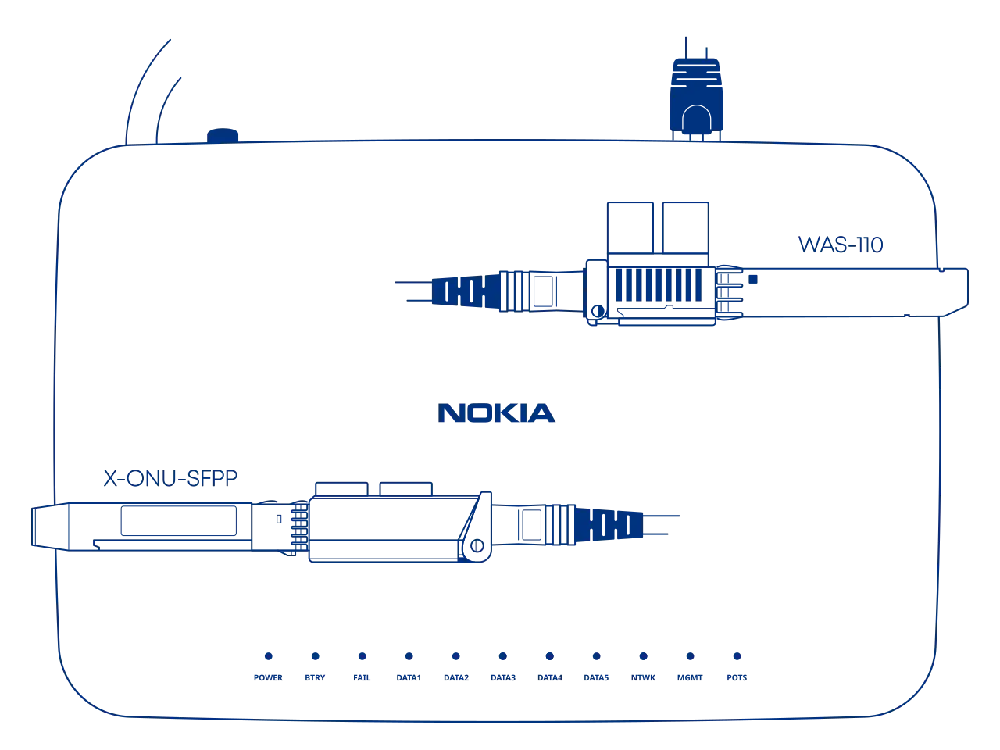

# Masquerade as the Nokia XS-250X-A with the WAS-110 or X-ONU-SFPP

{ class="nolightbox" }

<!-- more -->
<!-- nocont -->

--8<-- "docs/posts/shared-assets/template.md:purchase-ont"

--8<-- "docs/posts/shared-assets/template.md:install-8311"

## Masquerade setup

Additionally, mandatory identifiers are available on the back label of the XS-250X-A, such as ONT P/N, ICS, and CLEI if
present.

### from the web UI <small>recommended</small> { #from-the-web-ui data-toc-label="from the web UI"}

??? info "As of version 2.4.0 `https://` is supported and enabled by default"
    All `http://` URLs will redirect to `https://` unless the `8311_https_redirect` environment variable is set to
    0 or false.

<div class="swiper" markdown>

<div class="swiper-slide" markdown>

{ loading=lazy }

</div>

<div class="swiper-slide" markdown>

{ loading=lazy }

</div>

<div class="swiper-slide" markdown>

{ loading=lazy }

</div>

<div class="swiper-slide" markdown>

{ loading=lazy }

</div>

</div>

1. Within a web browser, navigate to
   <https://192.168.11.1/cgi-bin/luci/admin/8311/config>
   and, if asked, input your <em>root</em> password.

2. From the __8311 Configuration__ page, on the __PON__ tab, fill in the configuration with the following values:

    !!! reminder "All attributes below are <ins>mandatory</ins> to achieve O5 operation state"
        <ins>Replace</ins> the __PON Serial Number__, __IP Host MAC address__, __Registration ID__, and
        __Software Version A/B__ with the provisioned values.

    | Attribute                        | Value                         | Remarks                                    |
    | -------------------------------- | ----------------------------- | ------------------------------------------ |
    | PON Serial Number (ONT ID)       | ALCL&hellip;                  | Serial number                              |
    | Equipment ID                     | BVMGJ10BRAXS250XA             | CLEI + Mnemonic                            |
    | Hardware Version                 | 3FE48114ABBD01                | ONT P/N. + ICS                             |
    | Sync Circuit Pack Version        | :check_mark:                  |                                            |
    | Software Version A               | 3FE47493IJHK03                | Active software version                    |
    | Software Version B               | 3FE47493BGDB09                | Standby software version                   |
    | Firmware Version Match           | ^(3FE4793[A-Z]{4}\d{2})$      |                                            |
    | Override active firmware bank    | A                             | OLT inits a reboot if on bank B            |
    | Override committed firmware bank | A                             | OLT inits a reboot if on bank B            |
    | MIB File                         | /etc/mibs/prx300_1U.ini       | PPTP i.e. default value (Telus customers use `prx300_1U_telus.mib`) |
    | PON Slot                         | 10                            |                                            |

3. From the __8311 Configuration__ page, on the __ISP Fixes__ tab, disable __Fix VLANs__ from the drop-down.

4. __Save__ changes and *reboot* from the __System__ menu.

### from the shell

1. Login over secure shell (SSH).

    ``` sh
    ssh root@192.168.11.1
    ```

2. Configure the 8311 U-Boot environment.

    !!! reminder "All attributes below are <ins>mandatory</ins> to achieve O5 operation state"
        <ins>Replace</ins> the __8311_gpon_sn__, __8311_iphost_mac__, and __8311_sw_verA/B__ with
        the provisioned values.


    ``` sh
    fwenv_set -8 gpon_sn ALCL... # (1)!
    fwenv_set -8 equipment_id BVMGJ10BRAXS250XA # (2)!
    fwenv_set -8 hw_ver 3FE48114ABBD01 # (3)!
    fwenv_set -8 cp_hw_ver_sync 1
    fwenv_set -8 sw_verA 3FE47493IJHK03
    fwenv_set -8 sw_verB 3FE47493BGDB09
    fwenv_set -8 -b fw_match '^(3FE4793[A-Z]{4}\d{2})$'
    fwenv_set -8 override_active A
    fwenv_set -8 override_commit A
    fwenv_set -8 pon_slot 10
    fwenv_set -8 fix_vlans 0
    ```

    1. Serial number or S/N
    2. CLEI + Mnemonic
    3. ONT P/N + ICS

    !!! info "Additional details and variables are described at the original repository [^1]"
        `/usr/sbin/fwenv_set` is a helper script that executes `/usr/sbin/fw_setenv` twice consecutively.

        The WAS-110 functions as an A/B system, requiring the U-Boot environment variables to be set twice, once for each
        environment.

        The `-8` option prefixes the U-Boot environment variable with `8311_`.

3. Verify the 8311 U-boot environment and reboot.

    ``` sh
    fw_printenv | grep ^8311
    reboot
    ```

After rebooting the WAS-110, safely remove the SC/APC cable from the XS-250X-A and connect it to the
WAS-110. If all previous steps were followed correctly, the WAS-110 should operate with O5.1 [PLOAM status].
For troubleshooting, please read the [Troubleshoot connectivity issues with the WAS-110] guide before seeking help on
the [8311 Discord community server].

  [PLOAM status]: troubleshoot-connectivity-issues-with-the-was-110.md#ploam-status
  [Troubleshoot connectivity issues with the WAS-110]: troubleshoot-connectivity-issues-with-the-was-110.md
  [8311 Discord community server]: https://discord.com/servers/8311-886329492438671420
  [WAS-110]: ../xgs-pon/ont/bfw-solutions/was-110.md
  [X-ONU-SFPP]: ../xgs-pon/ont/potron-technology/x-onu-sfpp.md

[^1]: <https://github.com/djGrrr/8311-was-110-firmware-builder>
