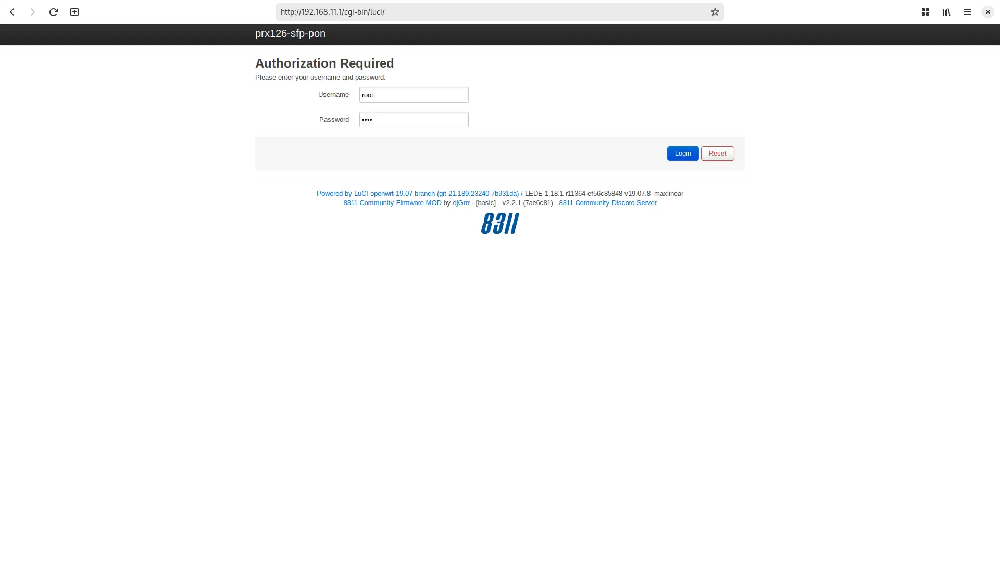
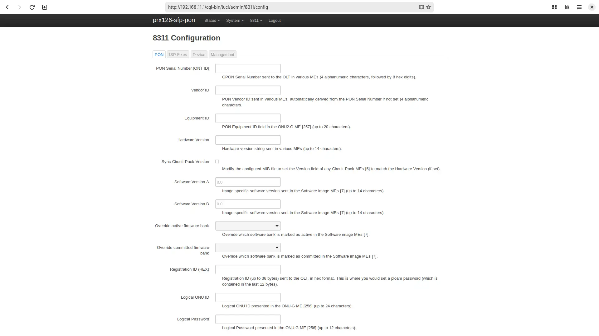
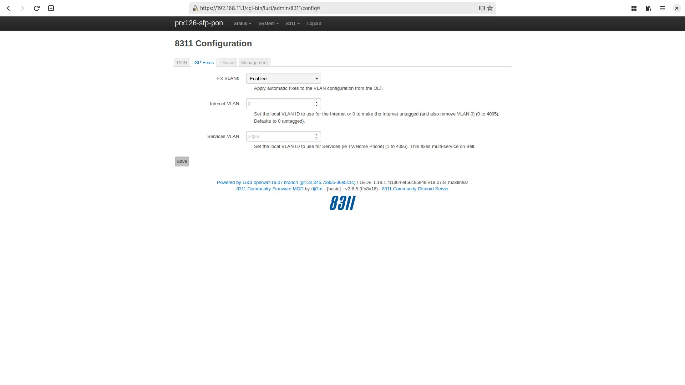
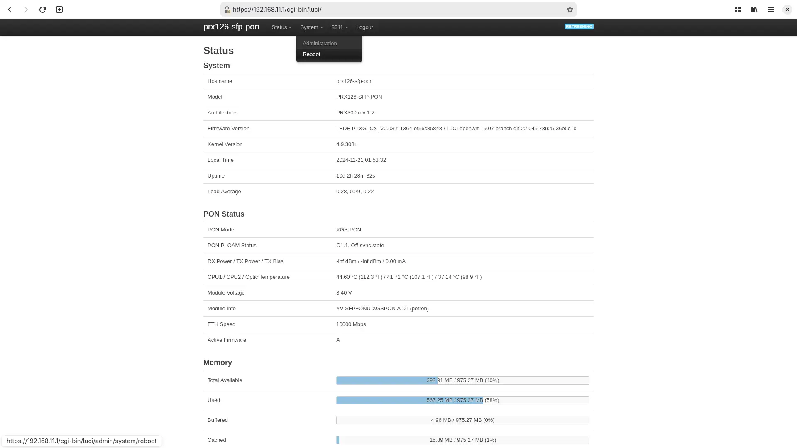

# Masquerade as the NOS Fast 5684 from Sagemcom with the X-ONU-SFPP

{ class="nolightbox" }

<!-- more -->
<!-- nocont -->









!!! danger "PLOAM Password" 
    Before proceeding please make sure you have your PLOAM Password from your Fast 5684 Sagemcom.

## Configure ONT settings

To masquerade, you will need the original ONT serial number and the PLOAM password.
The ONT serial number and other identifiers (e.g., hardware version, software version) from your
{{ page.meta.ont }}'s can be found in the router's stats page or using the ISP's App, NOSNET.

Alternatively, for the ONT serial number, it can be found on the label of the {{ page.meta.ont }} or from the box it came in.

&nbsp;

=== "X-ONU-SFPP"

    Use your preferred setup method and carefully follow the steps to avoid unnecessary downtime and troubleshooting:

    * [Web (luci)](#config-via-web)
    <!-- * [Shell (linux)](#config-via-shell) -->

    <h3 id="config-via-web">Via web <small>recommended</small></h3>

    

    

    { loading=lazy }

    

    

    { loading=lazy }

    

    

    { loading=lazy }

    

    

    { loading=lazy }

    

    

    1. Within a web browser, navigate to
       <https://192.168.11.1>
        and, if asked, input the default credentials (root 	Aa123456) .

    2. From the __8311 Configuration__ page, on the __PON__ tab, fill in the configuration with the following values:

        !!! info "All attributes below are for the Fast 5684."
            Replace the :blue_circle: ONT ID with the one found on the {{ page.meta.ont }}'s label and :red_circle: ONT PWD with the value provided by the technician.

        === "<ins>Mandatory</ins>"

            | Attribute                  | Value                   | Remarks                 |
            | -------------------------- | -----------------       | ----------------------- |
            | PON Serial Number (ONT ID) | SMBSXXXXXXX;            | :blue_circle: ONT ID    |
            | Logical Password (ONT PWD) | 0NTp4s5w0rd;            | :red_circle:  ONT PWD   |
            | MIB File                   | prx300_1V_bell.ini      | default .ini file       |
            | Fix VLANs                  | Enabled                 | Found in ISP Fixes Tab  |

        === "Optional"

            | Attribute                  | Value                   | Remarks                 |
            | -------------------------- | -----------------       | ----------------------- |
            | Hardware Version           | 000000                  |                         |
            | Software Version A         | P-00                    |                         |
            | Software Version B         | P-00                    |                         |

    3. __Save__ changes and *reboot* from the __System__ menu.

  [password]: ../xgs-pon/ont/bfw-solutions/was-110.md#web-credentials

  [web credentials]: ../xgs-pon/ont/calix/100-05610.md#web-credentials
  [Version listing]: #software-versions



!!! success "Congratulations"
    If you made it this far and your PON Status shows an O5.1, you can now store the ISP's modem in a safe place until your lease ends.

[^1]: <https://github.com/djGrrr/8311-was-110-firmware-builder>
