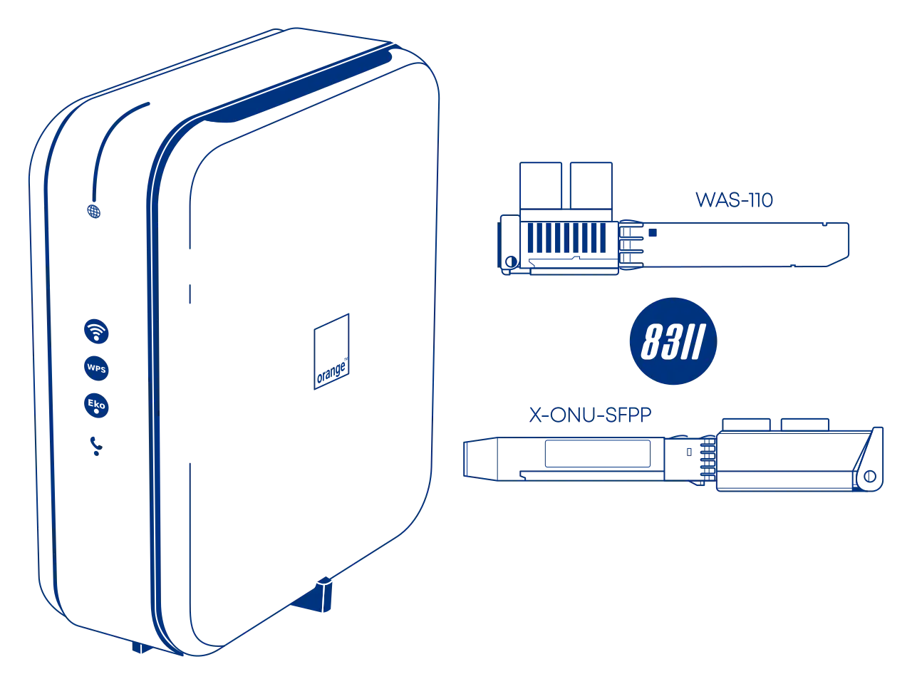

# Masquerade as the Orange Polska S.A. Funbox 10 with the WAS-110 or X-ONU-SFPP

{ class="nolightbox" }

<!-- more -->
<!-- nocont -->

## Determine if you're an XGS-PON subscriber

<div class="swiper" markdown>

<div class="swiper-slide" markdown>

{ loading=lazy }

</div>

<div class="swiper-slide" step="3" markdown>

{ loading=lazy }

</div>

<div class="swiper-slide" step="5" markdown>

{ loading=lazy }

</div>

</div>

1. Within a web browser, navigate to
   <https://funbox/> or <https://192.168.1.1/>
   and, if asked, input your Administrator password and click the __Connect__ button.

2. From the configuration interface, click the cog (:material-cog:) icon at the bottom of the page for
   __Advanced Parameters__ or move forward twice using the right arrow.

3. From the __Advanced Parameters__ page, click the __System Information__ card.

4. From the __System Information__ page, click the __ONT__ tab.

6. From the __ONT__ tab, verify the __Max Bit Rate Supported__ is ***10000Mbps*** for XGS-PON.

    !!! tip "Take note of the Serial Number, Hardware Version, and ONT Software Versions for the WAS-110 configuration"

--8<-- "docs/posts/shared-assets/template.md:purchase-ont"

--8<-- "docs/posts/shared-assets/template.md:install-8311"

## Masquerade setup

To successfully masquerade on XGS-PON, the original ONT serial number is mandatory. It, along with other key
identifiers are available from the web UI or the bottom label of the Livebox 7.

### from the web UI <small>recommended</small> { #from-the-web-ui data-toc-label="from the web UI"}

??? info "As of version 2.4.0 `https://` is supported and enabled by default"
    All `http://` URLs will redirect to `https://` unless the `8311_https_redirect` environment variable is set to
    0 or false.

<div class="swiper" markdown>

<div class="swiper-slide" markdown>

{ loading=lazy }

</div>

<div class="swiper-slide" markdown>

{ loading=lazy }

</div>

<div class="swiper-slide" markdown>

{ loading=lazy }

</div>

<div class="swiper-slide" markdown>

{ loading=lazy }

</div>

</div>

1. Within a web browser, navigate to
   <https://192.168.11.1/cgi-bin/luci/admin/8311/config>
   and, if asked, input your <em>root</em> password.

2. From the __8311 Configuration__ page, on the __PON__ tab, fill in the configuration with the following values:

    !!! reminder
        ^^Replace^^ the mandatory __PON serial number__ and optional __Software Versions__ with the providioned values
        from the Livebox 7 web UI.

    | Attribute                  | Value                        | Mandatory    | Remarks                         |
    | -------------------------- | ---------------------------- | ------------ |-------------------------------- |
    | PON Serial Number (ONT ID) | SMBS0...                     | :check_mark: |                                 |
    | Equipment ID               | SagemcomFast5698OPL          |              |                                 |
    | Hardware Version           | SGFunbox10201                | :check_mark: |                                 |
    | Sync Circuit Pack Version  | :check_mark:                 | :check_mark: |                                 |
    | Software Version A         | SAHEOPL020105                |              | [Version listing]               |
    | Software Version B         | SAHEOPL020105                |              | [Version listing]               |
    | MIB File                   | /etc/mibs/prx300_1U.ini      | :check_mark: | PPTP i.e. default value         |

3. From the __8311 Configuration__ page, on the __ISP Fixes__ tab, disable __Fix VLANs__ from the drop-down.

4. __Save__ changes and *reboot* from the __System__ menu.

### from the shell

1. Login over secure shell (SSH).

    ``` sh
    ssh root@192.168.11.1
    ```

2. Configure the 8311 U-Boot environment.

    !!! reminder "Highlighted lines are <ins>mandatory</ins>"
        ^^Replace^^ the mandatory __PON serial number__ and optional __Software Versions__ with the providioned values
        from the Livebox 7 web UI.

    ``` sh hl_lines="1"
    fwenv_set -8 gpon_sn SMBS...
    fwenv_set -8 equipment_id SagemcomFast5698OPL
    fwenv_set -8 hw_ver SGFunbox10201
    fwenv_set -8 cp_hw_ver_sync 1
    fwenv_set -8 sw_verA SAHEOPL020105 # (1)!
    fwenv_set -8 sw_verB SAHEOPL020105
    fwenv_set -8 fix_vlans 0
    ```

    1. [Version listing]

    !!! info "Additional details and variables are described at the original repository [^1]"
        `/usr/sbin/fwenv_set` is a helper script that executes `/usr/sbin/fw_setenv` twice consecutively.

        The WAS-110 functions as an A/B system, requiring the U-Boot environment variables to be set twice, once for each
        environment.

        The `-8` option prefixes the U-Boot environment variable with `8311_`.

3. Verify the 8311 U-boot environment and reboot.

    ``` sh
    fw_printenv | grep ^8311
    reboot
    ```

After rebooting the WAS-110, safely remove the SC/APC cable from the Funbox 10 and connect it to the
WAS-110. If all previous steps were followed correctly, the WAS-110 should operate with O5.1 [PLOAM status].
For troubleshooting, please read the [Troubleshoot connectivity issues with the WAS-110] guide before seeking help on
the [8311 Discord community server].

  [PLOAM status]: troubleshoot-connectivity-issues-with-the-was-110.md#ploam-status
  [Troubleshoot connectivity issues with the WAS-110]: troubleshoot-connectivity-issues-with-the-was-110.md

Finally, continue with your bypass by consulting the [routing tips](#routing-tips) below.

## Funbox 10 software versions

The software version ^^can^^ be utilized as a provisioning attribute by the OLT, but this is not the case for
the Funbox 10, which uses CWMP[^2]. However, it is recommended to keep somewhat up-to-date with the following listing.

| Software Version |
| ---------------- |
| SAHEOPL010103    |
| SAHEOPL010106    |
| SAHEOPL020105    |

Please help us by contributing new versions via the [8311 Discord community server] or submitting a
[Pull Request](https://github.com/up-n-atom/8311/pulls) on GitHub.

## Routing tips

### PPPoE Credentials

<div class="swiper" markdown>

<div class="swiper-slide" markdown>

{ loading=lazy }

</div>

<div class="swiper-slide" step="3" markdown>

{ loading=lazy }

</div>

<div class="swiper-slide" step="4" markdown>

{ loading=lazy }

</div>

</div>

1. Within a web browser, navigate to
   <https://funbox/> or <https://192.168.1.1/>
   and, if asked, input your Administrator password and click the __Connect__ button.

2. From the configuration interface, click the cog (:material-cog:) icon at the bottom of the page for
   __Advanced Parameters__ or move forward twice using the right arrow.

3. From the __Advanced Parameters__ page, click the __Internet Connection__ card.

4. From the __Internet Connection__ page, click on the __Settings__ tab.

5. From the __Settings__ tab, copy the __Username__ and click on __Change Password__ in the __Password__ section.

  [Purchase a WAS-110]: #purchase-a-was-110
  [WAS-110]: ../xgs-pon/ont/bfw-solutions/was-110.md
  [X-ONU-SFPP]: ../xgs-pon/ont/potron-technology/x-onu-sfpp.md
  [8311 Discord community server]: https://discord.com/servers/8311-886329492438671420

[^1]: <https://github.com/djGrrr/8311-was-110-firmware-builder>
[^2]: <https://en.wikipedia.org/wiki/TR-069>
