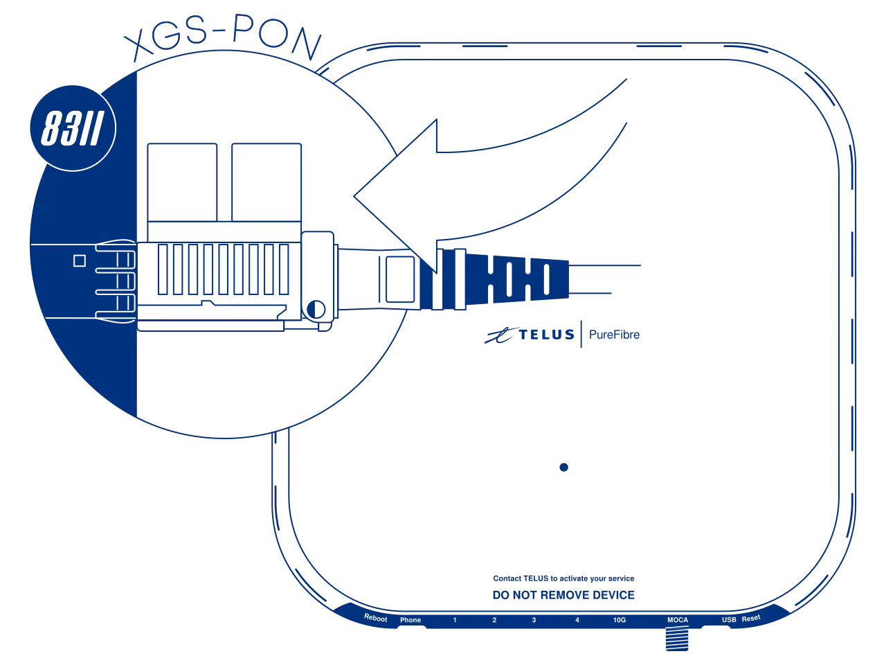
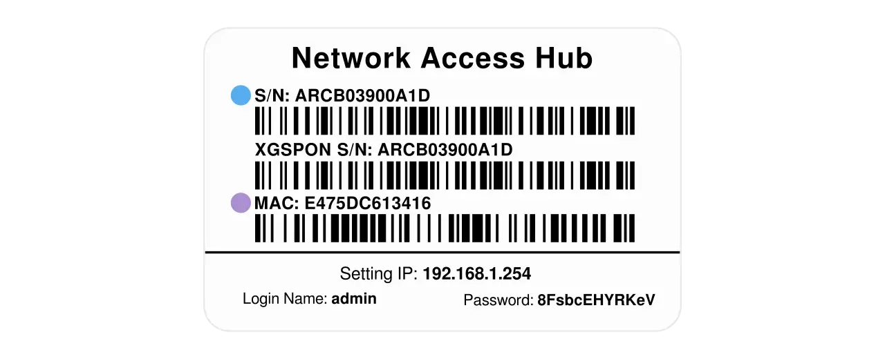

# Masquerade as the Telus Communications Inc. NH20A or NH20T with the WAS-110 or X-ONU-SFPP

{ class="nolightbox" }

<!-- more -->
<!-- nocont -->

## Determine if you're an XGS-PON subscriber

### with the web UI

<div class="swiper" markdown>

<div class="swiper-slide" markdown>

{ loading=lazy }

</div>

<div class="swiper-slide" markdown>

{ loading=lazy }

</div>

</div>

1. Within a web browser, navigate to <https://192.168.1.254> and, if asked, input the *admin* password. (1)
   { .annotate }

    1. The default admin password is located on the front [label] of the NH20A/T, under the cover.

2. From the index page, verify the broadband bandwidth and wavelength.

If the bandwidth is `10000/10000` and/or wavelength is `1270/1577`, you're subscribed on XGS-PON.

## Purchase a WAS-110 or X-ONU-SFPP

The [WAS-110] and [X-ONU-SFPP] are available from select resellers worldwide. To streamline the process, some resellers
are pre-flashing the 8311 community firmware and highly recommended for the [X-ONU-SFPP]. Purchase at your discretion;
we take no responsibility or liability for the listed resellers.

[WAS-110 Value-Added Resellers](../xgs-pon/ont/bfw-solutions/was-110.md#value-added-resellers)

[X-ONU-SFPP Value-Added Resellers](../xgs-pon/ont/potron-technology/x-onu-sfpp.md#value-added-resellers)

!!! question "Is the WAS-110 or X-ONU-SFPP a router?"
    The [WAS-110] and [X-ONU-SFPP] are __NOT__ a substitute for a layer 7 router; They are an *ONT*, and their __ONLY__
    function is to convert *Ethernet* to *PON* over fiber medium. Additional hardware and software are required to access
    the Internet.

## Install the 8311 community firmware

As a prerequisite to masquerading as the NH20A or NH20T, the 8311 community firmware is recommended and required for the
remainder of this guide.

=== "WAS-110"

    There are two methods to install the 8311 community firmware onto the [WAS-110], outlined in the following guides:

    __Method 1: <small>recommended</small></h4>__

    :    [Install the 8311 community firmware on the WAS-110](install-the-8311-community-firmware-on-the-was-110.md)

    __Method 2:__

    :    [WAS-110 multicast upgrade and community firmware recovery](was-110-mulicast-upgrade-and-community-firmware-recovery.md)

=== "X-ONU-SFPP"

    The [X-ONU-SFPP] 8311 community firmware installation requires a two-step process and is more prone to failure and
    bricking.

    !!! warning "This process is not thoroughly documented and can lead to a bricked device"

    __Step 1: Install the Azores bootloader__

    :    Skip past to the solution in the following [issue tracker](../xgs-pon/ont/potron-technology/8311-uboot.md#solution)
         on how to install the Azores bootloader.

    __Step 2: Multicast upgrade__

    :    Follow through the [WAS-110 multicast upgrade and community firmware recovery](was-110-mulicast-upgrade-and-community-firmware-recovery.md)

## Masquerade setup

To successfully masquerade on XGS-PON, the original XGSPON serial number is mandatory. It, along with other key
identifiers are available on the front label of the NH20A or NH20T, under the cover, color-coordinated in the following
depiction:

<div id="nh20a-nh20t-label"></div>

{ class="nolightbox" }

### from the web UI <small>recommended</small> { #from-the-web-ui data-toc-label="from the web UI"}

??? info "As of version 2.4.0 `https://` is supported and enabled by default"
    All `http://` URLs will redirect to `https://` unless the `8311_https_redirect` environment variable is set to
    0 or false.

<div class="swiper" markdown>

<div class="swiper-slide" markdown>

{ loading=lazy }

</div>

<div class="swiper-slide" markdown>

{ loading=lazy }

</div>

</div>

1. Within a web browser, navigate to
   <https://192.168.11.1/cgi-bin/luci/admin/8311/config>
   and, if asked, input your <em>root</em> password.

2. From the __8311 Configuration__ page, on the __PON__ tab, fill in the configuration with the following values:

    !!! reminder
        <ins>Replace</ins> the :blue_circle: __PON Serial Number__ with the provisioned value on the bottom [label] of
        the NH20A or NH20T.

    !!! info "All attributes below are <ins>mandatory</ins> to achieve O5 operation state"

    === "NH20A"

        | Attribute                  | Value                         | Remarks                  |
        | -------------------------- | ----------------------------- | ------------------------ |
        | PON Serial Number (ONT ID) | ARCB&hellip;                  | :blue_circle: XGSPON S/N |
        | Equipment ID               | NH20A                         |                          |
        | Hardware Version           | PRV650AB-S-TS                 |                          |
        | Sync Circuit Pack Version  | :check_mark:                  |                          |
        | Software Version A         | 3FEARCB1001505                | [Version listing]        |
        | Software Version B         | 3FEARCB1001505                | [Version listing]        |
        | MIB File                   | /etc/mibs/prx300_1U_telus.ini | PPTP                     |

    === "NH20T"

        | Attribute                  | Value                         | Remarks                  |
        | -------------------------- | ----------------------------- | ------------------------ |
        | PON Serial Number (ONT ID) | TMBB&hellip;                  | :blue_circle: XGSPON S/N |
        | Equipment ID               | NH20T                         |                          |
        | Hardware Version           | GCNT-K                        |                          |
        | Sync Circuit Pack Version  | :check_mark:                  |                          |
        | Software Version A         | 3FEARCB1001505                | [Version listing]        |
        | Software Version B         | 3FEARCB1001505                | [Version listing]        |
        | MIB File                   | /etc/mibs/prx300_1U_telus.ini | PPTP                     |

3. __Save__ changes and reboot from the __System__ menu.

### from the shell

1. Login over secure shell (SSH).

    ``` sh
    ssh root@192.168.11.1
    ```

2. Configure the 8311 U-Boot environment.

    !!! reminder
        <ins>Replace</ins> the :blue_circle: __8311_gpon_sn__ with the provisioned value on the bottom [label] of the
        NH20A or NH20T.

    !!! info "All attributes below are <ins>mandatory</ins> to achieve O5 operation state"

    === "NH20A"

        ``` sh
        fwenv_set mib_file
        fwenv_set -8 gpon_sn ARCB... # (1)!
        fwenv_set -8 equipment_id NH20A
        fwenv_set -8 hw_ver PRV650AB-S-TS
        fwenv_set -8 cp_hw_ver_sync 1
        fwenv_set -8 sw_verA 3FEARCB1001505 # (2)!
        fwenv_set -8 sw_verB 3FEARCB1001505
        fwenv_set -8 mib_file /etc/mibs/prx300_1U_telus.ini
        ```

        1. :blue_circle: XGSPON S/N
        2. [Version listing]

    === "NH20T"

        ``` sh
        fwenv_set mib_file
        fwenv_set -8 gpon_sn TMBB... # (1)!
        fwenv_set -8 equipment_id NH20T
        fwenv_set -8 hw_ver GCNT-K
        fwenv_set -8 cp_hw_ver_sync 1
        fwenv_set -8 sw_verA 3FEARCB1001505 # (2)!
        fwenv_set -8 sw_verB 3FEARCB1001505
        fwenv_set -8 mib_file /etc/mibs/prx300_1U_telus.ini
        ```

        1. :blue_circle: XGSPON S/N
        2. [Version listing]

    !!! info "Additional details and variables are described at the original repository [^1]"
        `/usr/sbin/fwenv_set` is a helper script that executes `/usr/sbin/fw_setenv` twice consecutively.

        The WAS-110 functions as an A/B system, requiring the U-Boot environment variables to be set twice, once for each
        environment.

        The `-8` option prefixes the U-Boot environment variable with `8311_`.

3. Verify the 8311 U-boot environment and reboot.

    ``` sh
    fw_printenv | grep ^8311
    reboot
    ```

After rebooting the WAS-110, safely remove the SC/APC cable from either the NH20A or NH20T and connect it to the
WAS-110. If all previous steps were followed correctly, the WAS-110 should operate with O5.1 [PLOAM status].
For troubleshooting, please read the [Troubleshoot connectivity issues with the WAS-110] guide before seeking help on
the [8311 Discord community server].

  [PLOAM status]: troubleshoot-connectivity-issues-with-the-was-110.md#ploam-status
  [Troubleshoot connectivity issues with the WAS-110]: troubleshoot-connectivity-issues-with-the-was-110.md
  [8311 Discord community server]: https://discord.com/servers/8311-886329492438671420

## Software versions

The software version is used as a provisioning attribute by the OLT and must be kept up-to-date with the latest
version. Otherwise, upon a reboot, the WAS-110 will operate in a fake O5 state until corrected.

| Software Version |
| ---------------- |
| 3FEARCB1001505   |
| 3FEARCB1001307   |

Please help us by contributing new versions via the
[8311 Discord community server](https://discord.com/servers/8311-886329492438671420)
or submitting a
[Pull Request](https://github.com/up-n-atom/8311/pulls) on GitHub.

  [WAS-110]: ../xgs-pon/ont/bfw-solutions/was-110.md
  [X-ONU-SFPP]: ../xgs-pon/ont/potron-technology/x-onu-sfpp.md
  [label]: #nh20a-nh20t-label
  [Version listing]: #software-versions

[^1]: <https://github.com/djGrrr/8311-was-110-firmware-builder>
