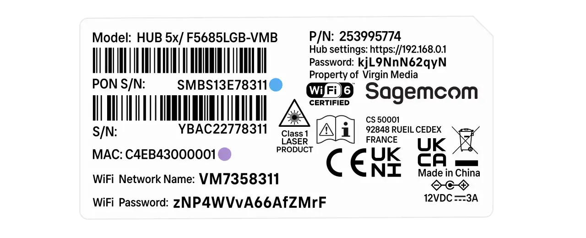

# Masquerade as the Virgin Media O2 Hub 5x with the BFW Solutions WAS-110

<!-- more -->
<!-- nocont -->

## Purchase a WAS-110 and LC/APC to SC/APC adapter or cable

The [WAS-110] is available from select distributors and at a discounted rate with group buys on the
[8311 Discord community server](https://discord.com/servers/8311-886329492438671420).

A Female LC/APC to Male SC/APC adapter is necessary for connecting to the [WAS-110] with the provisioned LC/APC
cable, or a Male LC/APC to Male SC/APC patch cable, both of which can be purchased at <https://www.amazon.co.uk/>.

!!! warning "APC and UPC connectors are not equal nor compatible[^1]"

## Install community firmware

As a prerequisite to masquerading with the WAS-110, the community firmware is necessary; follow the steps
outlined in the community firmware installation guide:

[Install 8311 community firmware on the BFW Solutions WAS-110](install-8311-community-firmware-on-the-bfw-solutions-was-110.md)

## WAS-110 masquerade setup

To successfully masquerade on XGS-PON, the original ONT serial number is mandatory. It, along with other key
identifiers are available on the bottom label of the Hub 5x, color-coordinated in the following depiction:

<div id="hub-5x-label"></div>

{ class="nolightbox" id="hub-5x-label" }

### from the web UI <small>recommended</small> { #from-the-web-ui data-toc-label="from the web UI"}


1. Within a web browser, navigate to
   <https://192.168.11.1/cgi-bin/luci/admin/8311/config>
   and, if asked, input your <em>root</em> password.

    ??? info "As of version 2.4.0 `https://` is supported and enabled by default"
        All `http://` URLs will redirect to `https://` unless the `8311_https_redirect` environment variable is set to
        0 or false.


2. From the __8311 Configuration__ page, on the __PON__ tab, fill in the configuration with the following values:

    !!! reminder "Highlighted lines are <ins>mandatory</ins>"
        <ins>Replace</ins> the :blue_circle: __PON serial number__ and :purple_circle: __MAC address__ with the 
        provisioned values on the bottom [label] of the Hub 5x.

    | Attribute                  | Value                         | Mandatory    | Remarks                 |
    | -------------------------- | ----------------------------- | ------------ | ----------------------- |
    | PON Serial Number (ONT ID) | SMBS13E78311                  | :check_mark: | :blue_circle:           |
    | Equipment ID               | F5685LGB                      |              |                         |
    | Hardware Version           | 1.2.1b                        |              |                         |
    | Sync Circuit Pack Version  | :check_mark:                  |              |                         |
    | Software Version A         | 3.7.4-2306.5                  |              | [Version listing]       |
    | Software Version B         | 3.7.4-2306.5                  |              | [Version listing]       |
    | MIB File                   | /etc/mibs/prx300_1V_bell.ini  | :check_mark: | VEIP and more           |
    | IP Host MAC Address        | C4:EB:43:00:00:01             |              | :purple_circle:         |

3. __Save__ changes and reboot from the __System__ menu.

Once rebooted, the SC/APC cable can safely be plugged into the WAS-110 and immediately receive O5 operational status.

### from the shell

<h4>Login over SSH</h4>

```sh
ssh root@192.168.11.1
```

<h4>Configure 8311 U-Boot environment</h4>

!!! reminder "Highlighted lines are <ins>mandatory</ins>"
    <ins>Replace</ins> the :blue_circle: __PON serial number__ and :purple_circle: __MAC address__ with the 
    provisioned values on the bottom [label] of the Hub 5x.

``` sh hl_lines="1 3 9"
fwenv_set mib_file
fwenv_set 8311_iphost_mac C4:EB:43:00:00:01
fwenv_set 8311_gpon_sn SMBS13E78311
fwenv_set 8311_equipment_id F5685LGB
fwenv_set 8311_hw_ver 1.2.1b
fwenv_set 8311_cp_hw_ver_sync 1
fwenv_set 8311_sw_verA 3.7.4-2306.5 # (1)!
fwenv_set 8311_sw_verB 3.7.4-2306.5
fwenv_set 8311_mib_file /etc/mibs/prx300_1V_bell.ini
```

1. [Version listing]

!!! info "Additional details and variables are described at the original repository [^2]"
    `/usr/sbin/fwenv_set` is a helper script that executes `/usr/sbin/fw_setenv` twice consecutively.

    The WAS-110 functions as an A/B system, requiring the U-Boot environment variables to be set twice, once for each
    environment.

<h4>Verify and reboot</h4>

Prior to rebooting, verify that the 8311 environment variables are set correctly. If not, proceed to correct them with
the `fwenv_set` command as before.

```sh
fw_printenv | grep ^8311
reboot
```

Once rebooted, the SC/APC cable can safely be plugged into the WAS-110 and immediately receive O5 operational status.

## Hub 5x software versions

The software version <ins>can</ins> be utilized as a provisioning attribute by the OLT, but this is not the case for
the Hub 5x, which uses CWMP[^3]. However, it is recommended to keep somewhat up-to-date with the following listing, but
it is not strictly necessary.

| Software Version |
| ---------------- |
| 3.7.4-2306.5     |

Please help us by contributing new versions via the
[8311 Discord community server](https://discord.com/servers/8311-886329492438671420)
or submitting a
[Pull Request](https://github.com/up-n-atom/8311/pulls) on GitHub.

  [WAS-110]: ../xgs-pon/ont/bfw-solutions/was-110.md#value-added-resellers
  [label]: #hub-5x-label
  [Version listing]: #hub-5x-software-versions

[^1]: <https://www.servethehome.com/apc-and-upc-in-fiber-connectors-and-why-this-matters/>
[^2]: <https://github.com/djGrrr/8311-was-110-firmware-builder>
[^3]: <https://en.wikipedia.org/wiki/TR-069>
