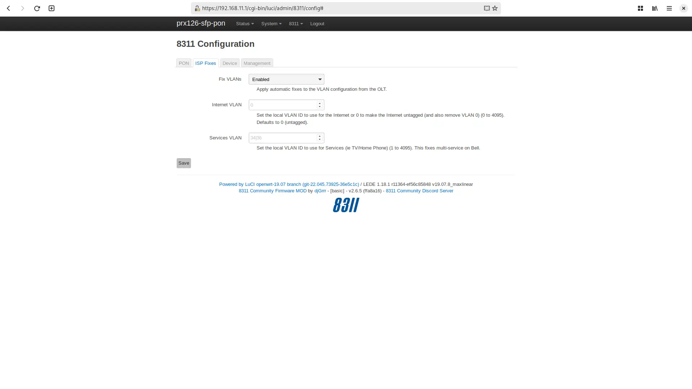
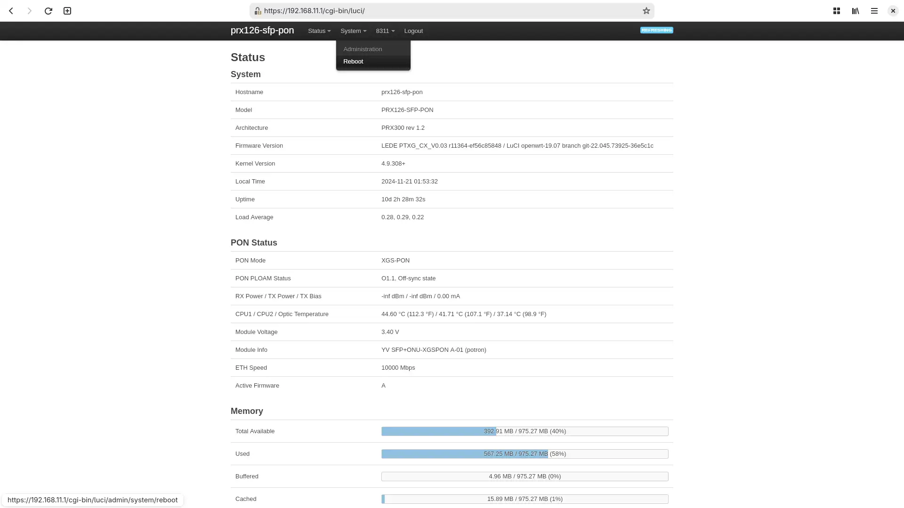

# Masquerade as the Virgin Media O2 Hub 5x with the WAS-110 or X-ONU-SFPP

{ class="nolightbox" }

<!-- more -->
<!-- nocont -->

!!! warning "New subscriber installations"
    Keep the {{ page.meta.ont }} in active service for roughly a week until fully provisioned and the installation
    ticket has been closed.

???+ question "Common misconceptions and answers"

    __Is the WAS-110 or X-ONU-SFPP a router?__

    :   No, the [WAS-110] and [X-ONU-SFPP] are __NOT__ substitutes for a Layer 7 router. They are SFU ONTs, as opposed to
        HGU, and their sole function is to convert Ethernet to PON over fiber. Additional hardware and software are
        required for internet access.

    __Are the gateway MAC and IP Host MAC attribute the same?__

    :   No, they are different. The __IP Host MAC__ is hardcoded as `C4:EB:43:00:00:01`, while the gateway MAC is the
        value found on the the [label] located at the bottom of the {{ page.meta.ont }}.







## Configure ONT settings

To masquerade as the {{ page.meta.ont }}, you will need its ONT serial number, which is located on the bottom label as
depicted below.

 }}_label.webp){ class="nolightbox" id="{{ page.meta.ont | lower | replace(" ", "-") }}-label" }

Use your preferred setup method and carefully follow the steps to avoid unnecessary downtime and troubleshooting:

* [Web (luci)](#config-via-web)
* [Shell (linux)](#config-via-shell)

### Via web <small>recommended</small> { #config-via-web data-toc-label="Via web"}

<div class="swiper" markdown>

<div class="swiper-slide" markdown>

{ loading=lazy }

</div>

<div class="swiper-slide" markdown>

{ loading=lazy }

</div>

<div class="swiper-slide" markdown>

{ loading=lazy }

</div>

<div class="swiper-slide" markdown>

{ loading=lazy }

</div>

</div>

1. Within a web browser, navigate to
   <https://192.168.11.1/cgi-bin/luci/admin/8311/config>
   and, if asked, input your *root* [password]{ data-preview target="_blank" }.

2. From the __8311 Configuration__ page, on the __PON__ tab, fill in the configuration with the following values:

    !!! reminder
        <ins>Replace</ins> the :blue_circle: __PON Serial Number__ with the one found on the { page.meta.ont }} label.


    | Attribute                  | Value                         | Mandatory    | Remarks                 |
    | -------------------------- | ----------------------------- | ------------ | ----------------------- |
    | PON Serial Number (ONT ID) | SMBS&hellip;                  | :check_mark: | :blue_circle: PON S/N   |
    | Equipment ID               | MERCV3                        |              |                         |
    | Hardware Version           | 1.0                           |              |                         |
    | Sync Circuit Pack Version  | :check_mark:                  |              |                         |
    | Software Version A         | 3.7.4-2306.5                  |              | [Version listing]       |
    | Software Version B         | 3.7.4-2306.5                  |              | [Version listing]       |
    | MIB File                   | /etc/mibs/prx300_1V_bell.ini  | :check_mark: | VEIP and more           |
    | IP Host MAC Address        | C4:EB:43:00:00:01             |              | Shared hardcoded MAC    |

3. From the __8311 Configuration__ page, on the __ISP Fixes__ tab, disable __Fix VLANs__ from the drop-down.

    ??? tip "Identify VLANs (Optional: Virgin uses VLAN 100 across its subscriber network)"
        Once configuration is complete and the fiber is connected, wait for successful authentication (__O5 state__).
        You can then use the [VLAN Table Analyser](../tools/vlan.md) to identify service VLANs by copying the table
        from the VLANs page (<https://192.168.11.1/cgi-bin/luci/admin/8311/vlans>) and pasting it into the tool.

4. __Save__ changes and *reboot* from the __System__ menu.

### Via shell { #config-via-shell }

1. Login over secure shell (SSH).

    ``` sh
    ssh root@192.168.11.1
    ```

2. Configure the 8311 U-Boot environment.

    !!! reminder "Highlighted lines are <ins>mandatory</ins>"
        <ins>Replace</ins> the mandatory :blue_circle: __8311_gpon_sn__ and optional :purple_circle:
        __8311_iphost_mac__ with the provisioned values on the back [label] of the {{ page.meta.ont }}.

    ``` sh hl_lines="1 3 9 10"
    fwenv_set mib_file
    fwenv_set -8 iphost_mac !C4:EB:43:00:00:01 #(1)!
    fwenv_set -8 gpon_sn SMBS... # (2)!
    fwenv_set -8 equipment_id MERCV3
    fwenv_set -8 hw_ver 1.0
    fwenv_set -8 cp_hw_ver_sync 1
    fwenv_set -8 sw_verA 3.7.4-2306.5 # (3)!
    fwenv_set -8 sw_verB 3.7.4-2306.5
    fwenv_set -8 mib_file /etc/mibs/prx300_1V_bell.ini
    fwenv_set -8 fix_vlans 0
    ```

    1. Hardcoded MAC address used by all subscribers
    2. :blue_circle: PON S/N
    3. [Version listing]

3. Verify the 8311 U-boot environment and reboot.

    ``` sh
    fw_printenv | grep ^8311
    reboot
    ```

  [Version listing]: #software-versions
  [password]: ../xgs-pon/ont/bfw-solutions/was-110.md#web-credentials
  [label]: #{{ page.meta.ont | lower | replace(" ", "-") }}-label




## Router tips

!!! Note "Detailed router setup falls outside the scope of the documentation due to the multitude of available solutions."

* Apply the [pre-configuration](#pre-configuration) requirements.
* Configure the WAN VLAN to `100`.
* Configure the WAN for DHCP mode.



## Software versions

The {{ page.meta.ont }} uses CWMP instead of OMCI for firmware updates. While the OLT rarely requires approval for
specific software versions, keeping the [WAS-110] or [X-ONU-SFPP] up-to-date is beneficial but not strictly necessary.

If you would like to help us maintain the software listing, you can contribute new versions via the
[8311 Discord community server] or by submitting a [Pull Request](https://github.com/up-n-atom/8311/pulls) on GitHub.

| Software Version |
| ---------------- |
| 3.7.4-2306.5     |

  [WAS-110]: ../xgs-pon/ont/bfw-solutions/was-110.md
  [X-ONU-SFPP]: ../xgs-pon/ont/potron-technology/x-onu-sfpp.md
  [label]: #hub-5x-label
  [Version listing]: #hub-5x-software-versions
