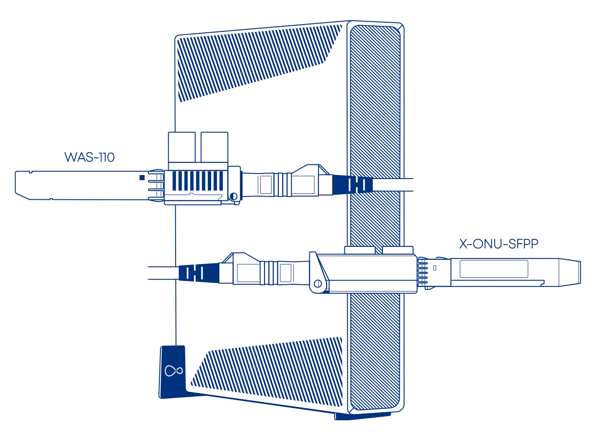

# Masquerade as the Virgin Media O2 Hub 5x with the WAS-110 or X-ONU-SFPP

{ class="nolightbox" }

<!-- more -->
<!-- nocont -->

## Purchase a WAS-110 or X-ONU-SFPP and LC/APC to SC/APC adapter or cable

The [WAS-110] and [X-ONU-SFPP] are available from select resellers worldwide. To streamline the process, some resellers
are pre-flashing the 8311 community firmware and highly recommended for the [X-ONU-SFPP]. Purchase at your discretion;
we take no responsibility or liability for the listed resellers.

[WAS-110 Value-Added Resellers](../xgs-pon/ont/bfw-solutions/was-110.md#value-added-resellers)

[X-ONU-SFPP Value-Added Resellers](../xgs-pon/ont/potron-technology/x-onu-sfpp.md#value-added-resellers)

!!! question "Is the WAS-110 or X-ONU-SFPP a router?"
    The [WAS-110] and [X-ONU-SFPP] are __NOT__ a substitute for a layer 7 router; They are an *ONT*, and their __ONLY__
    function is to convert *Ethernet* to *PON* over fiber medium. Additional hardware and software are required to access
    the Internet.

!!! warning "APC and UPC connectors are not equal nor compatible[^1]"

A Female LC/APC to Male SC/APC adapter is necessary for connecting to the [WAS-110] or [X-ONU-SFPP] with the
provisioned LC/APC cable, or a Male LC/APC to Male SC/APC patch cable, both of which can be purchased at
<https://www.amazon.co.uk/>.

## Install the 8311 community firmware

As a prerequisite to masquerading as the Hub 5x, the 8311 community firmware is necessary because of the VEIP
requirement. If you purchased a pre-flashed [WAS-110] or [X-ONU-SFPP], skip past to the [masquerade setup](#masquerade-setup).

=== "WAS-110"

    There are two methods to install the 8311 community firmware onto the [WAS-110], outlined in the following guides:

    __Method 1: <small>recommended</small></h4>__

    :    [Install the 8311 community firmware on the WAS-110](install-the-8311-community-firmware-on-the-was-110.md)

    __Method 2:__

    :    [WAS-110 multicast upgrade and community firmware recovery](was-110-mulicast-upgrade-and-community-firmware-recovery.md)

=== "X-ONU-SFPP"

    The [X-ONU-SFPP] 8311 community firmware installation requires a two-step process and is more prone to failure and
    bricking.

    !!! warning "This process is not thoroughly documented and can lead to a bricked device"

    __Step 1: Install the Azores bootloader__

    :    Skip past to the solution in the following [issue tracker](../xgs-pon/ont/potron-technology/8311-uboot.md#solution)
         on how to install the Azores bootloader.

    __Step 2: Multicast upgrade__

    :    Follow through the [WAS-110 multicast upgrade and community firmware recovery](was-110-mulicast-upgrade-and-community-firmware-recovery.md)

## Masquerade setup

To successfully masquerade on XGS-PON, the original ONT serial number is mandatory. It, along with other key
identifiers are available on the bottom label of the Hub 5x, color-coordinated in the following depiction:

<div id="hub-5x-label"></div>

{ class="nolightbox" id="hub-5x-label" }

### from the web UI <small>recommended</small> { #from-the-web-ui data-toc-label="from the web UI"}

??? info "As of version 2.4.0 `https://` is supported and enabled by default"
    All `http://` URLs will redirect to `https://` unless the `8311_https_redirect` environment variable is set to
    0 or false.

<div class="swiper" markdown>

<div class="swiper-slide" markdown>

{ loading=lazy }

</div>

<div class="swiper-slide" markdown>

{ loading=lazy }

</div>

<div class="swiper-slide" markdown>

{ loading=lazy }

</div>

<div class="swiper-slide" markdown>

{ loading=lazy }

</div>

</div>

1. Within a web browser, navigate to
   <https://192.168.11.1/cgi-bin/luci/admin/8311/config>
   and, if asked, input your <em>root</em> password.

2. From the __8311 Configuration__ page, on the __PON__ tab, fill in the configuration with the following values:

    !!! reminder "Reminder"
        <ins>Replace</ins> the mandatory :blue_circle: __PON Serial Number__ with the provisioned value on the bottom
        [label] of the Hub 5x.

    | Attribute                  | Value                         | Mandatory    | Remarks                 |
    | -------------------------- | ----------------------------- | ------------ | ----------------------- |
    | PON Serial Number (ONT ID) | SMBS&hellip;                  | :check_mark: | :blue_circle: PON S/N   |
    | Equipment ID               | F5685LGB                      |              |                         |
    | Hardware Version           | 1.2.1b                        |              |                         |
    | Sync Circuit Pack Version  | :check_mark:                  |              |                         |
    | Software Version A         | 3.7.4-2306.5                  |              | [Version listing]       |
    | Software Version B         | 3.7.4-2306.5                  |              | [Version listing]       |
    | MIB File                   | /etc/mibs/prx300_1V_bell.ini  | :check_mark: | VEIP and more           |

3. From the __8311 Configuration__ page, on the __ISP Fixes__ tab, disable __Fix VLANs__ from the drop-down.

4. __Save__ changes and *reboot* from the __System__ menu.

### from the shell

1. Login over secure shell (SSH).

    ``` sh
    ssh root@192.168.11.1
    ```

2. Configure the 8311 U-Boot environment.

    !!! reminder "Highlighted lines are <ins>mandatory</ins>"
        <ins>Replace</ins> the mandatory :blue_circle: __8311_gpon_sn__ with the provisioned value on the bottom
        [label] of the Hub 5x.

    ``` sh hl_lines="1 2 8 9"
    fwenv_set mib_file
    fwenv_set -8 gpon_sn SMBS... # (1)!
    fwenv_set -8 equipment_id F5685LGB
    fwenv_set -8 hw_ver 1.2.1b
    fwenv_set -8 cp_hw_ver_sync 1
    fwenv_set -8 sw_verA 3.7.4-2306.5 # (2)!
    fwenv_set -8 sw_verB 3.7.4-2306.5
    fwenv_set -8 mib_file /etc/mibs/prx300_1V_bell.ini
    fwenv_set -8 fix_vlans 0
    ```

    1. :blue_circle: PON S/N
    2. [Version listing]

    !!! info "Additional details and variables are described at the original repository [^2]"
        `/usr/sbin/fwenv_set` is a helper script that executes `/usr/sbin/fw_setenv` twice consecutively.

        The WAS-110 functions as an A/B system, requiring the U-Boot environment variables to be set twice, once for each
        environment.

        The `-8` option prefixes the U-Boot environment variable with `8311_`.

3. Verify the 8311 U-boot environment and reboot.

    ``` sh
    fw_printenv | grep ^8311
    reboot
    ```

After rebooting the WAS-110, safely remove the SC/APC cable from the Hub 5x and connect it to the
WAS-110. If all previous steps were followed correctly, the WAS-110 should operate with O5.1 [PLOAM status].
For troubleshooting, please read the [Troubleshoot connectivity issues with the WAS-110] guide before seeking help on
the [8311 Discord community server].

  [PLOAM status]: troubleshoot-connectivity-issues-with-the-was-110.md#ploam-status
  [Troubleshoot connectivity issues with the WAS-110]: troubleshoot-connectivity-issues-with-the-was-110.md

!!! note "Clone the Hub 5x :purple_circle: MAC address on the router's DHCP WAN interface and tag it and anything in-between the WAS-110 with VLAN 100"

## Hub 5x software versions

The software version <ins>can</ins> be utilized as a provisioning attribute by the OLT, but this is not the case for
the Hub 5x, which uses CWMP[^3]. However, it is recommended to keep somewhat up-to-date with the following listing, but
it is not strictly necessary.

| Software Version |
| ---------------- |
| 3.7.4-2306.5     |

Please help us by contributing new versions via the [8311 Discord community server] or submitting a
[Pull Request](https://github.com/up-n-atom/8311/pulls) on GitHub.

  [WAS-110]: ../xgs-pon/ont/bfw-solutions/was-110.md
  [X-ONU-SFPP]: ../xgs-pon/ont/potron-technology/x-onu-sfpp.md
  [label]: #hub-5x-label
  [Version listing]: #hub-5x-software-versions
  [8311 Discord community server]: https://discord.com/servers/8311-886329492438671420

[^1]: <https://www.servethehome.com/apc-and-upc-in-fiber-connectors-and-why-this-matters/>
[^2]: <https://github.com/djGrrr/8311-was-110-firmware-builder>
[^3]: <https://en.wikipedia.org/wiki/TR-069>
