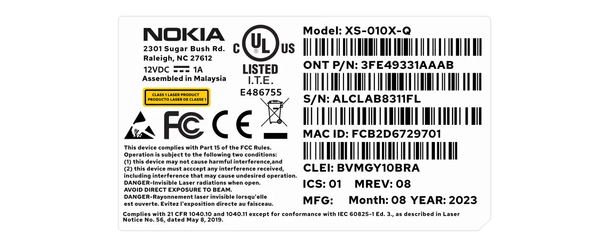

# Swap out the Nokia XS-010X-Q for a Small Form-factor Pluggable WAS-110 or X-ONU-SFPP

!!! abstract "This is strictly for the form-factor as they're both SFU ONTs"

{ class="nolightbox" }

<!-- more -->
<!-- nocont -->

## Purchase a WAS-110 or X-ONU-SFPP

The [WAS-110] and [X-ONU-SFPP] are available from select resellers worldwide. To streamline the process, some resellers
are pre-flashing the 8311 community firmware and highly recommended for the [X-ONU-SFPP]. Purchase at your discretion;
we take no responsibility or liability for the listed resellers.

[WAS-110 Value-Added Resellers](../xgs-pon/ont/bfw-solutions/was-110.md#value-added-resellers)

[X-ONU-SFPP Value-Added Resellers](../xgs-pon/ont/potron-technology/x-onu-sfpp.md#value-added-resellers)

!!! question "Is the WAS-110 or X-ONU-SFPP a router?"
    The [WAS-110] and [X-ONU-SFPP] are __NOT__ a substitute for a layer 7 router; They are an *ONT*, and their __ONLY__
    function is to convert *Ethernet* to *PON* over fiber medium. Additional hardware and software are required to access
    the Internet.

## Install the 8311 community firmware

As a prerequisite to masquerading as the [XS-010X-Q], the 8311 community firmware is recommended and required for the
remainder of this guide. If you purchased a pre-flashed [WAS-110] or [X-ONU-SFPP], skip past to the [masquerade setup](#masquerade-setup).

=== "WAS-110"

    There are two methods to install the 8311 community firmware onto the [WAS-110], outlined in the following guides:

    __Method 1: <small>recommended</small></h4>__

    :    [Install the 8311 community firmware on the WAS-110](install-the-8311-community-firmware-on-the-was-110.md)

    __Method 2:__

    :    [WAS-110 multicast upgrade and community firmware recovery](was-110-mulicast-upgrade-and-community-firmware-recovery.md)

=== "X-ONU-SFPP"

    The [X-ONU-SFPP] 8311 community firmware installation requires a two-step process and is more prone to failure and
    bricking.

    !!! warning "This process is not thoroughly documented and can lead to a bricked device"

    __Step 1: Install the Azores bootloader__

    :    Skip past to the solution in the following [issue tracker](../xgs-pon/ont/potron-technology/8311-uboot.md#solution)
         on how to install the Azores bootloader.

    __Step 2: Multicast upgrade__

    :    Follow through the [WAS-110 multicast upgrade and community firmware recovery](was-110-mulicast-upgrade-and-community-firmware-recovery.md)

## Extract attributes from the XS-010X-Q

<div class="swiper" markdown>

<div class="swiper-slide" markdown>

{ loading=lazy }

</div>

<div class="swiper-slide" step="5" markdown>

{ loading=lazy }

</div>

</div>

!!! warning "Power off and remove fiber before continuing"

1. Power on the [XS-010X-Q] with an Ethernet cable plugged between the host PC.

2. Setup a static **IP address** `192.168.100.2` and **Netmask** `255.255.255.0` on the host PC.

3. Within a web browser, navigate to <https://192.168.100.1> and, if asked, input the *admin* password `1234`.

4. From the __ONT install__ page, click on __More info__ button.

5. Copy all the attributes for entry later in the guide.

## Masquerade setup

Additionally, mandatory identifiers are available on the back label of the [XS-010X-Q], such as ONT P/N, ICS, and CLEI if
present.

<div id="xs-010x-q-label"></div>

=== "Without CLEI"

    { class="nolightbox" }

=== "With CLEI"

    { class="nolightbox" }

### from the web UI <small>recommended</small> { #from-the-web-ui data-toc-label="from the web UI"}

??? info "As of version 2.4.0 `https://` is supported and enabled by default"
    All `http://` URLs will redirect to `https://` unless the `8311_https_redirect` environment variable is set to
    0 or false.

<div class="swiper" markdown>

<div class="swiper-slide" markdown>

{ loading=lazy }

</div>

<div class="swiper-slide" markdown>

{ loading=lazy }

</div>

<div class="swiper-slide" markdown>

{ loading=lazy }

</div>

<div class="swiper-slide" markdown>

{ loading=lazy }

</div>

</div>

1. Within a web browser, navigate to
   <https://192.168.11.1/cgi-bin/luci/admin/8311/config>
   and, if asked, input your <em>root</em> password.

2. From the __8311 Configuration__ page, on the __PON__ tab, fill in the configuration with the following values:

    !!! reminder "All attributes below are <ins>mandatory</ins> to achieve O5 operation state"
        <ins>Replace</ins> the __PON Serial Number__, __IP Host MAC address__, __Registration ID__, and
        __Software Version A/B__ with the provisioned values.

    === "Without CLEI"

        | Attribute                  | Value                         | Remarks                                    |
        | -------------------------- | ----------------------------- | ------------------------------------------ |
        | PON Serial Number (ONT ID) | ALCL&hellip;                  | Serial number                              |
        | Equipment ID               | \_\_\_\_\_\_\_\_\_XS-010X-Q\__| Model                                      |
        | Hardware Version           | 3FE49331BDAA01                | ONT P/N. + ICS                             |
        | Sync Circuit Pack Version  | :check_mark:                  |                                            |
        | Software Version A         | 3FE49337BOCK17                | Active software version                    |
        | Software Version B         | 3FE49337AOCK80                | Standby software version                   |
        | Firmware Version Match     | ^(3FE4933\d[A-Z]OCK\d{2})$    |                                            |
        | Registration ID            |                               | Input if __ONT ID__ is not null (all 00's) |
        | MIB File                   | /etc/mibs/prx300_1U.ini       | PPTP i.e. default value                    |
        | PON Slot                   | 10                            |                                            |
        | IP Host MAC Address        | 7C:9f:07:4F:98:08             | MAC ID                                     |

    === "With CLEI"

        | Attribute                  | Value                         | Remarks                                    |
        | -------------------------- | ----------------------------- | ------------------------------------------ |
        | PON Serial Number (ONT ID) | ALCL&hellip;                  | Serial number                              |
        | Equipment ID               | BVMGY10BRAXS010XQ             | CLEI + Mnemonic                            |
        | Hardware Version           | 3FE49331AAAB01                | ONT P/N. + ICS                             |
        | Sync Circuit Pack Version  | :check_mark:                  |                                            |
        | Software Version A         | 3FE49337AOCK10                | Active software version                    |
        | Software Version B         | 3FE49337AOCK80                | Standby software version                   |
        | Firmware Version Match     | ^(3FE4933\d[A-Z]OCK\d{2})$    |                                            |
        | Registration ID            |                               | Input if __ONT ID__ is not null (all 00's) |
        | MIB File                   | /etc/mibs/prx300_1U.ini       | PPTP i.e. default value                    |
        | PON Slot                   | 10                            |                                            |
        | IP Host MAC Address        | FC:B2:D6:18:47:40             | MAC ID                                     |

3. From the __8311 Configuration__ page, on the __ISP Fixes__ tab, disable __Fix VLANs__ from the drop-down.

4. __Save__ changes and *reboot* from the __System__ menu.

### from the shell

### from the shell

1. Login over secure shell (SSH).

    ``` sh
    ssh root@192.168.11.1
    ```

2. Configure the 8311 U-Boot environment.

    !!! reminder "All attributes below are <ins>mandatory</ins> to achieve O5 operation state"
        <ins>Replace</ins> the __8311_gpon_sn__, __8311_iphost_mac__, and __8311_sw_verA/B__ with
        the provisioned values.

    === "Without CLEI"

        ``` sh
        fwenv_set -8 iphost_mac 7C:9f:07:4F:98:08 # (1)!
        fwenv_set -8 gpon_sn ALCL... # (2)!
        fwenv_set -8 equipment_id _________XS-010X-Q__ # (3)!
        fwenv_set -8 hw_ver 3FE49331BDAA01 # (4)!
        fwenv_set -8 cp_hw_ver_sync 1
        fwenv_set -8 sw_verA 3FE49337BOCK17
        fwenv_set -8 sw_verB 3FE49337AOCK80
        fwenv_set -8 -b fw_match '^(3FE4933\d[A-Z]OCK\d{2})$'
        fwenv_set -8 pon_slot 10
        fwenv_set -8 fix_vlans 0
        ```

        1. MAC ID
        2. Serial number or S/N
        3. Model
        4. ONT P/N + ICS

    === "With CLEI"

        ``` sh
        fwenv_set -8 iphost_mac FC:B2:D6:18:47:40 # (1)!
        fwenv_set -8 gpon_sn ALCL... # (2)!
        fwenv_set -8 equipment_id BVMGY10BRAXS010XQ # (3)!
        fwenv_set -8 hw_ver 3FE49331AAAB01 # (4)!
        fwenv_set -8 cp_hw_ver_sync 1
        fwenv_set -8 sw_verA 3FE49337AOCK10
        fwenv_set -8 sw_verB 3FE49337AOCK80
        fwenv_set -8 -b fw_match '^(3FE4933\d[A-Z]OCK\d{2})$'
        fwenv_set -8 pon_slot 10
        fwenv_set -8 fix_vlans 0
        ```

        . MAC ID
        2. Serial number or S/N
        3. CLEI + Mnemonic
        4. ONT P/N + ICS

    !!! info "Additional details and variables are described at the original repository [^1]"
        `/usr/sbin/fwenv_set` is a helper script that executes `/usr/sbin/fw_setenv` twice consecutively.

        The WAS-110 functions as an A/B system, requiring the U-Boot environment variables to be set twice, once for each
        environment.

        The `-8` option prefixes the U-Boot environment variable with `8311_`.

3. Verify the 8311 U-boot environment and reboot.

    ``` sh
    fw_printenv | grep ^8311
    reboot
    ```

After rebooting the WAS-110, safely remove the SC/APC cable from the [XS-010X-Q] and connect it to the
WAS-110. If all previous steps were followed correctly, the WAS-110 should operate with O5.1 [PLOAM status].
For troubleshooting, please read the [Troubleshoot connectivity issues with the WAS-110] guide before seeking help on
the [8311 Discord community server].

  [PLOAM status]: troubleshoot-connectivity-issues-with-the-was-110.md#ploam-status
  [Troubleshoot connectivity issues with the WAS-110]: troubleshoot-connectivity-issues-with-the-was-110.md
  [8311 Discord community server]: https://discord.com/servers/8311-886329492438671420
  [WAS-110]: ../xgs-pon/ont/bfw-solutions/was-110.md
  [X-ONU-SFPP]: ../xgs-pon/ont/potron-technology/x-onu-sfpp.md
  [XS-010X-Q]: ../xgs-pon/ont/nokia/xs-010x-q.md

[^1]: <https://github.com/djGrrr/8311-was-110-firmware-builder>
