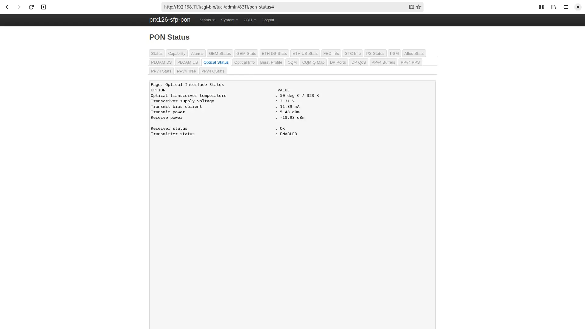
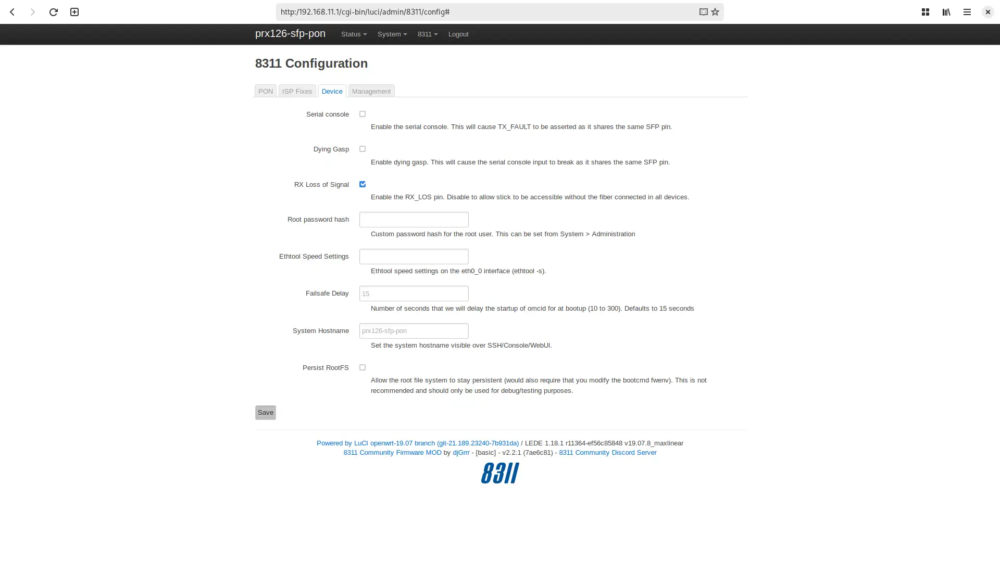

# Troubleshoot connectivity issues with the BFW Solutions WAS-110

{ class="nolightbox" }

<!-- more -->
<!-- nocont -->

The MaxLinear SDK includes an extensive suite of debugging tools that come pre-bundled with the [WAS-110] firmware(s).
These tools can be run either from the shell console or have been tied into the web UI.

## PON troubleshooting

### Digital Diagnostic Monitor Interface

The [WAS-110] supports the Digital Diagnostic Monitor Interface (DDMI)[^1] to provide pseudo-real-time access to its
operating parameters via a host interface. Although simplistic, this interface is suitable for monitoring power and
temperature behaviours, which are the first tells of troubles.

For more details on accessing this interface, please search your hosts' documentation for 
*Digital Diagnostic Monitoring (DDM)* or *Digital Optical Monitoring (DOM)*.

#### Host access

##### :simple-linux: Linux { #linux-ddmi data-toc-label="Linux" }

``` sh
ethtool -m <interface>
```

##### :simple-mikrotik: MikroTik RouterOS { #mikrotik-routeros-ddmi data-toc-label="MikroTik RouterOS" }

``` sh
/interface ethernet monitor sfpX #(1)!
```

1. Replace sfp`X` with the port name/number.

### Optical Power

#### Optical specifications

|          | Min. | Max. | Unit |
| -------- | ---- | ---- | ---- |
| Tx Power | 4    | 9    | dBm  |
| Rx Power | -29  | -8   | dBm  |

#### Optical status

To determine if the [WAS-110] optics are operating within specification, execute one of the following procedures:

=== "8311 firmware"

    <h5>from the Web UI</h5>
    
    

    1. Navigate to <https://192.168.11.1/cgi-bin/luci/admin/8311/pon_status> and, if asked, input your *root* password.
    2. From the __PON Status__ page, select the __Optical Status__ tab.
    3. Evaluate __Transmit power__ and __Receive power__ are within [spec](#optical-specification).

    <h5>from the Linux shell</h5>

    ``` sh
    pontop -b -g 'Optical Interface Status'
    ```

=== "Azores firmware"

    <h5>from the Web UI</h5>

    

    1. Navigate to <https://192.168.11.1/html/main.html#status/pon> and, if asked, input your *admin* password.
    2. From the __Status__ tab, select the __PON__ page.
    3. Evaluate __Tx Power(dBm)__ and __Rx Power(dBm)__ are within [spec](#optical-specification).

    <h5>from the Linux shell</h5>

    ``` sh
    i2c_cmd show optical
    ```

    <!--
    root@prx126-sfp-pon:~# i2c_cmd show optical
    Rx Power:	-40.00 dBm
    Tx Power:	-40.00 dBm
    Voltage:	3211 mV
    Bias Current:	0 uA
    Temperature:	40.50 C
    SFP Vendor NAME:	E.C.I. NETWORKS
    SFP Vendor REV:	V1.0
    SFP SN:	AZRS6F595EBC
    SFP VENDOR PN:	ENXGSFPPOMACV2
    -->

And as with a Linux host, the DDMI[^1] is available locally,
where both __Laser output power__ and __Receiver signal average optical power__ can be evaluated.

``` sh
ethtool -m pon0
```

### Fake O5

#### Activation states

- O1 Initial state
- O2 Stand-by state
- O3 Serial number state
- O4 Ranging state
- O5 Operation state
- O6 POPUP state
- O7 Emergancy stop state

A common term tossed around is <q>fake</q> O5, which is a misnomer that occurs when PLOAM message activation succeeds,
including Serial Number and/or Registration ID authentication. However, the failure is further along in the
registration chain, such as OMCI. It pertains to invalid managed entity attributes with common associations to device
integrity, such as hardware and/or software versioning.

#### PLOAM status

To view the current PLOAM status, execute one of the following procedures:

=== "8311 firmware"

    <h5>from the Web UI</h5>
    
    

    1. Navigate to <https://192.168.11.1/cgi-bin/luci/admin/8311/pon_status> and, if asked, input your *root* password.
    2. From the __PON Status__ page, select the __Status__ tab.

    <h5>from the Linux shell</h5>

    ``` sh
    pontop -b -g s
    ```

=== "Azores firmware"

    <h5>from the Web UI</h5>

    

    1. Navigate to <https://192.168.11.1/html/main.html#status/pon> and, if asked, input your *admin* password.
    2. From the __Status__ tab, select the __PON__ page.

    <h5>from the Linux shell</h5>

    ``` sh
    pontop -b -g s
    ```

#### OMCI clarification

To help identify fake O5, execute the following command and if the response is empty, the operational state is 
<em>"fake"</em> as the OLT did not respond with the dot1q[^6] configuration.


``` sh
omci_pipe.sh md | grep -E '^\|\s+(84|171)\s\|'
```

Additionally, it is possible to identify the connected OLT by executing the following command:

``` sh
omci_pipe.sh meg 131 0
```

Typically, OLT operators enforce versioning compliance when software management is not handled over CWMP[^2].

## LAN troubleshooting

### Link Speed

The [WAS-110] will attempt to auto-negotiate with the host controller and, more often than not, fallback to 1 Gbps. 
To prevent this behaviour, forcefully set the speed of the host interface to 10 Gbps.

Furthermore, to force the link speed on the [WAS-110] itself, execute the following `ethtool`[^3] procedures.

=== "8311 firmware"

    <h5>from the Web UI <small>permanent</small></h5>

    

    1. Navigate to <https://192.168.11.1/cgi-bin/luci/admin/8311/config> and, if asked, input your *root* password.
    2. From the __8311 Configuration__ page, select the __Device__ tab.
    3. From the __Device__ tab, set the __Ethtool Speed Settings__ input to one of the following:

           | Parameters  |
           | ----------- |
           | speed 1000  |
           | speed 2500  |
           | speed 10000 |

    <h5>from the Linux shell <small>temporary</small></h5>

    !!! warning "The following command sets the link speed <ins>temporarily</ins> until the next power cycle"
    
    ``` sh
    ethtool -s eth0_0 speed <speed> #(1)!
    ```

    1. <ins>Replace</ins> the &lt;speed&gt; parameter to either 1000, 2500, or 10000

=== "Azores firmware"

    <h5>from the Web UI <small>permanent</small></h5>

    

    1. Navigate to <https://192.168.11.1/html/main.html#service/setlanfixspeed>, and, if asked, input your *admin*
       password.
    2. From the __Negotiation Speed__ page, select __OnDemand__ and __10G__ link speed, and click __Save__.

    <h5>from the Linux shell <small>temporary</small></h5>

    !!! warning "The following command sets the link speed <ins>temporarily</ins> until the next power cycle"
    
    ``` sh
    ethtool -s eth0_0 speed <speed> #(1)!
    ```

    1. <ins>Replace</ins> the &lt;speed&gt; parameter to either 1000, 2500, or 10000

### Tx fault

The SFP tx fault pin[^4] (2) is multiplexed with UART tx. If the serial UART is enabled, tx fault may be asserted by the 
host hardware and cause the link state to flap continuously.

#### Serial console

!!! note "By default, serial UART is enabled during boot-up until Linux init, where it is disabled"

=== "8311 firmware"
    
    <h5>from the Web UI</h5>

    

    1. Navigate to <https://192.168.11.1/cgi-bin/luci/admin/8311/config> and, if asked, input your *root* password.
    2. From the __8311 Configuration__ page, select the __Device__ tab.
    3. From the __Device__ tab, uncheck the __Serial console__ checkbox.

    <h5>from the Linux shell</h5>

    To disable the serial console from the Linux shell, execute the following commands:

    ``` sh
    fwenv_set 8311_console_en
    ```

    <h5>from the U-Boot shell</h5>

    To disable the serial console from the U-Boot shell, execute the following commands:

    ``` sh
    env delete 8311_console_en
    env save
    env save
    ```

=== "Azores firmware"

    !!! info "Serial console is disabled by default, except in version 1.0.11"

    To disable the serial console from the Linux shell, execute the following commands:

    ```
    uci -c /ptconf set usrconfig_conf.InternetGatewayDevice__X_PT_CONSOLE_CFG__=interface
    uci -c /ptconf set usrconfig_conf.InternetGatewayDevice__X_PT_CONSOLE_CFG__.Enable=0
    uci -c /ptconf commit usrconfig_conf
    ```

#### Boot console & early printk { #boot-console data-toc-label="Boot console" }

UART tx can be further controlled by two (2) U-Boot environment variables: `uart_select` and `uart_select_preboot`.

!!! warning "<ins>DO NOT</ins> execute the following commands unless you understand the repercussions"

<h5>from the Linux shell</h5>

``` sh
fwenv_set uart_select off
```

<h5>from the U-Boot shell</h5>

``` sh
setenv uart_select off
env save
env save
```

### Rx loss

The SFP rx loss pin[^5] (8) is asserted when the SC/APC fiber cable isn't plugged in and/or inactive. Depending on the
host controller and implementation, the interface may enter a power saving state, making the [WAS-110] inaccessible.

=== "8311 firmware"

    !!! info "Rx loss is deasserted by default as of version 2.3.0"

    <h5>from the Web UI</h5>

    

    1. Navigate to <https://192.168.11.1/cgi-bin/luci/admin/8311/config> and, if asked, input your *root* password.
    2. From the __8311 Configuration__ page, select the __Device__ tab.
    3. From the __Device__ tab, uncheck the __RX Loss of Signal__ checkbox.

    <h5>from the Linux shell</h5>

    To disable rx loss from the Linux shell, execute the following commands:

    ```
    fwenv_set 8311_rx_los
    ```

    <h5>from the U-Boot shell</h5>

    To disable rx loss from the U-Boot shell, execute the following commands:

    ``` sh
    env delete 8311_rx_los
    env save
    env save
    ```

=== "Azores firmware"

    Unfortunately, rx loss can't be disabled.

#### Host solutions

##### :simple-mikrotik: MikroTik RouterOS { #mikrotik-routeros-rxlos data-toc-label="MikroTik RouterOS" }

!!! info "Requires RouterOS 7.15+"

``` sh
/interface ethernet set sfpX sfp-ignore-rx-los=yes #(1)!
```

1. Replace spf`X` with the port name/number.

  [WAS-110]: /xgs-pon/ont/bfw-solutions/was-110/

[^1]: [SFF-8472](https://members.snia.org/document/dl/25916)
[^2]: <https://en.wikipedia.org/wiki/TR-069>
[^3]: <https://www.linux.org/docs/man8/ethtool.html>
[^4]: <https://en.wikipedia.org/wiki/Small_Form-factor_Pluggable#Signals>
[^5]: [SFF-8419](https://members.snia.org/document/dl/25880)
[^6]: <https://en.wikipedia.org/wiki/IEEE_802.1Q>
