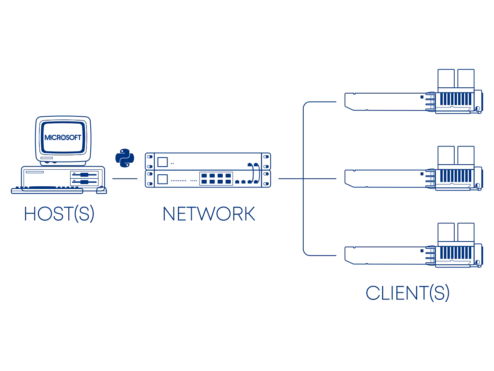
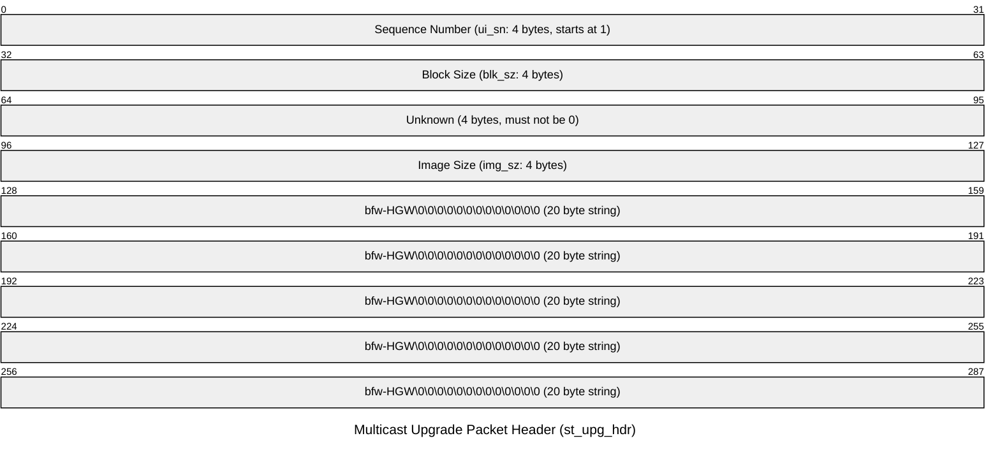

# WAS-110 Multicast Upgrade and Community Firmware Recovery

<!-- !!! question "Forgot your root password?" -->

{ class="nolightbox" }

<!-- more -->
<!-- nocont -->

!!! warning "This guide is rated ^^ADVANCED^^"
    If you're trying to recovery from a forgotten *root* password and lack the required networking skills, please
    consider purchasing a [SFP Media Buddy](https://whinis.com/sfp-buddy/) and deleting the `8311_root_pwhash`
    environment variable over serial USB within the [U-Boot] shell.

!!! tip "Forgot the *root* password to a [WAS-110] running the 8311 community firmware? Follow along with the [reset](#reset) steps..."

The [WAS-110] from the Azores factory includes a handy multicast upgrade utility baked into its U-boot bootloader,
including models from the following resellers:

* Azores Networks XSS
* E.C.I. Networks EN-XGSFPP-OMAC-V2
* FiberMall XGSPON-ONU-STICK

## Upgrade Sequence

The upgrade sequence is tied into the boot delay loop and therefore will not trigger if the [U-Boot] environment variable
`bootdelay` is less than or equal to zero (0); The default value is three (3).

=== "OpenWrt"

    ``` sh
    fw_printenv bootdelay
    ```

=== "U-Boot"

    ``` sh
    env print bootdelay
    ```

The upgrade sequence will wait 5 seconds for the first magic UDP packet on port `13456`. Each packet must include the
following header:



An ordered bit-map of the blocks received is updated from the sequence number along with the image size as the packets
can be sent and received non-sequentially.

Once all the blocks have been received the upgrade will commence from the final image stored at the hardcoded offset
`0x82000000` ([U-Boot] environment variable `loadaddr`) with the following command sequence:

``` sh
nand erase.part system_sw; run ubi_init; run switchbankA && upgrade 0x82000000 0x<size>
run switchbankB && upgrade 0x82000000 0x<size>
ubi remove rootfs_data && ubi create rootfs_data 0x2000000
```

## Image format

!!! note "The 8311 community firmware archives include the multicast images, skip past to [Upgrade Script](#upgrade-script) to get started!"

The multicast image is a concatenated binary blob of the following uImage files: `kernel.bin`, `bootcore.bin`, and
`rootfs.img`.

### Install packages <small>Debian Linux</small> { #install-packages data-toc-label="Install packages" }

``` sh
sudo apt-get -y install u-boot-tools squashfs-tools 7zip
```

### Blobs

The following blobs can be obtained from the 8311 community firmware archive or personal backups after following the
[dump & backup firmware](../install-8311-community-firmware-on-the-bfw-solutions-was-110/#dump-and-backup-firmware)
guide.

**kernel.bin**

:       dumpimage -T kernel kernel.bin -o zImage
        7z e -so zImage > vmlinux
        mkimage -A MIPS -O Linux -T kernel -a 0xa0020000 -C lzma -e 0xa0020000 -n "PON_1.18.1" -d zImage kernel.bin

**bootcore.bin**

:       dumpimage -T kernel bootcore.bin -o u-boot.bin
        mkimage -A MIPS -O Linux -T kernel -a 0x88000000 -C none -e 0x88000000 -n "MIPS 4Kec Bootcore" -d u-boot.bin bootcore.bin

**rootfs.img**

:       unsquashfs -d rootfs rootfs.img
        mksquashfs
        mkimage -A MIPS -O Linux -T filesystem -C none -n "<version>" -d rootfs.squashfs rootfs.bin

``` sh
cat kernel.bin bootcore.bin rootfs.bin > multicast.img
```

## Upgrade Script

<script src="https://gist.github.com/djGrrr/802c5652d3610d3e0a63243fe1119c56.js"></script>

### Host setup

#### Download

!!! info "For use in conjunction with the 8311 community firmware"
    <https://github.com/djGrrr/8311-was-110-firmware-builder/releases/latest>

=== ":simple-linux: Linux"

    ``` sh
    curl https://gist.github.com/djGrrr/802c5652d3610d3e0a63243fe1119c56/raw/3d9feef42107232e0ef7f2a4c469a00e915a16d3/multicast_upgrader.py
    chmod +x multicast_upgrader.py
    ```

=== ":material-microsoft: Windows"

    ```sh
    curl.exe https://gist.github.com/djGrrr/802c5652d3610d3e0a63243fe1119c56/raw/3d9feef42107232e0ef7f2a4c469a00e915a16d3/multicast_upgrader.py
    ```

#### Requirements

**10G SFP+ port**

:    A 10-gigabit compatible SFP+ host interface, such as a NIC, media converter, and/or network switch with its port
     settings forced to 10Gbps. If using a switch, it's important to disable STP on the port(s).

    ??? info
        The ethernet side of the [WAS-110] is forced to **10GBASE-KR**[^1] in [U-Boot] as can be observed from the
        environment variable `lan1-xpcs-mode`; It won't fallback to 1G.

        === "OpenWrt"

            ``` sh
            fw_printenv lan1-xpcs-mode
            ```

        === "U-Boot"

            ``` sh
            env print lan1-xpcs-mode
            ```

**Static IP address `192.168.1.2/24`**

:   === ":simple-linux: Linux"

        ```sh
        ip address add 192.168.1.2/24 dev <interface>
        ```

    === ":material-microsoft: Windows"

        ```sh
        netsh interface ipv4 set address name="<interface name>" static 192.168.1.2 255.255.255.0 192.168.1.1
        ```

    ??? info
        The default [WAS-110] [U-Boot] IP address is `192.168.1.1` and can be retrieved from the environment variable
        `ipaddr`.

        === "OpenWrt"

            ``` sh
            fw_printenv ipaddr

            ```

        === "U-Boot"

            ``` sh
            env print ipaddr
            ```

**Static ARP entry**

:   **Unicast** (1 to 1)

    === ":simple-linux: Linux"

        ```sh
        arp -s 192.168.1.1 00:E0:92:00:01:40
        ```

    === ":material-microsoft: Windows"

        ```sh
        netsh interface ipv4 add neighbors "<interface name>" 192.168.1.1 00:E0:92:00:01:40
        ```

    **Multicast**

    === ":simple-linux: Linux"

        ```sh
        arp -s 192.168.1.1 01:E0:92:00:01:40
        ```

    === ":material-microsoft: Windows"

        ```sh
        netsh interface ipv4 add neighbors "<interface name>" 192.168.1.1 01:E0:92:00:01:40
        ```

    ??? info
        The default [WAS-110] [U-Boot] MAC address is `00:E0:92:00:01:40` and can be retrieved from the environment
        variable `ethaddr`.

        === "OpenWrt"

            ``` sh
            fw_printenv ethaddr
            ```

        === "U-Boot"

            ``` sh
            env print ethaddr
            ```

**Python 3.x**

:   Python installation varies by Operating System and has been outlined by the tutors at
    [Real Python &mdash; Python 3 Installation & Setup Guide](https://realpython.com/installing-python).

### Usage

!!! warning "Without serial access, you'll be running blind"
    It's advisable to increase the wait time

#### Upgrade

1. Remove the [WAS-110]

2. Run the `multicast_upgrader.py` script

    === ":simple-linux: Linux"

        ```
        ./multicast_upgrader.py --path=multicast_upgrade.img
        ```

    === ":material-microsoft: Windows"

        ```
        python3.exe multicast_upgrader.py --path=multicast_upgrade.img
        ```

3. Insert the [WAS-110]

4. Wait several minutes (3-5)

5. Press ++ctrl+x++ to end the `multicast_upgrader.py` script

6. Reseat the [WAS-110]

    ??? tip "Run a continuous ping"
        To recieve an early indication that the [WAS-110] has completed its first boot, run a continuous ping:

        ``` sh
        ping 192.168.11.1
        ```

#### Reset

!!! note "Previous settings will be backed up and stored in `/ptconf`."
    It may be advisable to reflash afterwards with a regular image as your settings may accidentally be restored back
    to their defaults if the backup file isn't present or removed.

1. Remove the [WAS-110]

2. Run the `multicast_upgrader.py` script

    === ":simple-linux: Linux"

        ```
        ./multicast_upgrader.py --path=multicast_reset.img
        ```

    === ":material-microsoft: Windows"

        ```
        python3.exe multicast_upgrader.py --path=multicast_reset.img
        ```

3. Insert the [WAS-110]

4. Wait several minutes (3-5)

5. Press ++ctrl+x++ to end the `multicast_upgrader.py` script

6. Reseat the [WAS-110]

    ??? tip "Run a continuous ping"
        To recieve an early indication that the [WAS-110] has completed its first boot, run a continuous ping:

        ``` sh
        ping 192.168.11.1
        ```

  [WAS-110]: ../xgs-pon/ont/bfw-solutions/was-110.md
  [U-Boot]: https://www.u-boot.org/

[^1]: <https://en.wikipedia.org/wiki/10_Gigabit_Ethernet#10GBASE-KR>
