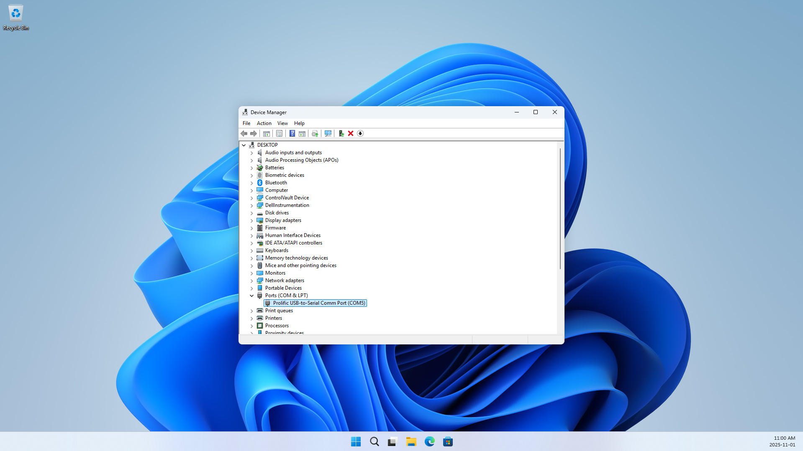
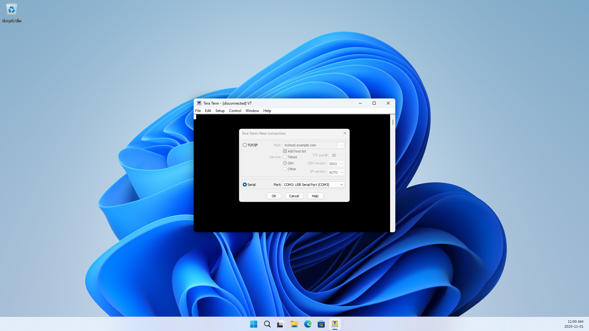
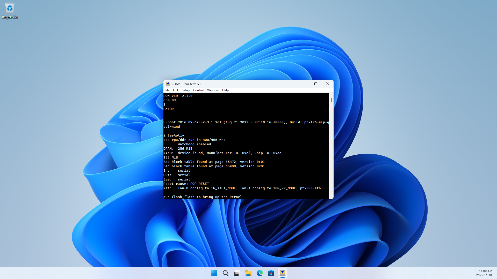

# WAS-110: Debug, Develop, and Recover over Serial UART

{ class="nolightbox" }

<!-- more -->
<!-- nocont -->

The [WAS-110] and [X-ONU-SFPP] utilize a serial UART interface via the [SFP golden fingers], adhering to the pinout
established by the [SPS-34-24T-HP-TDFO] (RX on pin 7, TX on pin 2). This pinout configuration is commonly referred to
as the *"Huawei"* pinout, named for its use in the OEM [MA5671A].

  [WAS-110]: ../xgs-pon/ont/bfw-solutions/was-110.md
  [X-ONU-SFPP]: ../xgs-pon/ont/potron-technology/x-onu-sfpp.md
  [SPS-34-24T-HP-TDFO]: ../gpon/ont/source-photonics/sps-34-24t-hp-tdfo.md
  [MA5671A]: ../gpon/ont/source-photonics/sps-34-24t-hp-tdfo.md#value-added-resellers
  [SFP golden fingers]: https://en.wikipedia.org/wiki/Small_Form-factor_Pluggable#Signals

However, this creates a fundamental compatibility issue with host hardware that conforms to the [SFF-8472] standard, as
pin 2 is officially defined as the TX_FAULT signal, not a UART transmit line.

In practice, vendors often abuse the [SFF-8472] standard for their own proprietary gain and vendor-lock. This
divergence has created loose adherence by competing vendors that allows us to leverage readily available,
host-compatible hardware to our advantage. This is often achieved through vendor-specific hidden commands, such as:

  [SFF-8472]: https://members.snia.org/document/dl/25916

__Intel (ixgbe)__

:    `ixgbe.allow_unsupported_sfp=1`

__Cisco (IOS)__

:    `service unsupported-transceiver`

__MikroTik (RouterOS)__

:    `interface ethernet set sfp sfp-ignore-rx-los=yes`

__Ruckus (FastIron)__

:    `optical-monitor non-ruckus-optic-enable`

!!! note

    While these commands allow the use of unsupported optics, they do not specifically enable UART access. [WAS-110]
    and [X-ONU-SFPP] UART functionality requires host-compatibility with the pinout wired explicitly to a UART TTL
    transceiver.

<!--To prevent signal conflict and potential
interoperability problems, the UART interface is disabled by default in the 8311 community firmware.-->

## Purchase media converter


During the [MA5671A]'s and [G-010S-A]'s peak adoption, three (3) media converters were produced with built-in UART pin
access that remains compatible with the [WAS-110] and [X-ONU-SFPP], supported up to 2.5Gbps throughput. All are built
on the [RTL8221B] chipset. Of these, only two (2) are readily available for purchase today:

  [WAS-110]: ../xgs-pon/ont/bfw-solutions/was-110.md
  [X-ONU-SFPP]: ../xgs-pon/ont/potron-technology/x-onu-sfpp.md
  [MA5671A]: ../gpon/ont/source-photonics/sps-34-24t-hp-tdfo.md#value-added-resellers
  [G-010S-A]: ../gpon/ont/source-photonics/sps-34-24t-hp-tdfo.md#value-added-resellers
  [RTL8221B]: https://www.realtek.com/Product/Index?id=4072&cate_id=786

__SFP Media Buddy__ - [Oops Electronics] <small>***Recommended***</small>

:    * Multi-speed support: 100Mbps/1Gbps/2.5Gbps
     * Built-in USB-C to UART TTL converter
     * Firmware-based pinout selection
     * USB-C Power Delivery

__NF-C2.5G-SFP__ - [NuFiber Systems] / __LL-25SFMC__ - [LuLeey] / __ANT-6025-T/R__ - [SevenLayer] <small>***White label***</small>

!!! tip "Distinguished by a single DIP switch on the front, left to the RJ45 port"

    Used throughout this guide due to its world-wide availability through [Amazon], [AliExpress], and [Taobao World]
    but it remains a second choice (although an economical one outside of the USA).

  [Amazon]: https://amazon.com/
  [AliExpress]: https://www.aliexpress.com/
  [Taobao World]: https://world.taobao.com/

:    * Multi-speed support: 100Mbps/1Gbps/2.5Gbps
     * UART break-out header for Huawei (RX pin 7, TX pin 2) and Nokia (RX pin 6, TX pin 3) pinouts
     * Requires external 3.3V USB-to-TTL serial adapter (not included)
     * Power adapter NOT included (12V DC, minimum 3A, 5.5mm x 2.1mm barrel jack, negative outside/positive inside)

__(Mini) 2.5g Fiber Optic Transceiver__ - [Juplink] <small>***Discontinued***</small>

:    * Multi-speed support: 100Mbps/1Gbps/2.5Gbps
     * Built-in USB-C to UART TTL converter
     * Jumper for Huawei (RX pin 7, TX pin 2) and Nokia (RX pin 6, TX pin 3) pinouts

 [Oops Electronics]: https://oopselectronics.com/product/SFPB
 [NuFiber Systems]: https://www.nufiber-systems.com/sale-40329351-2-5g-sfp-media-converter-100-1000-2500m-rj45-to-1g-2-5g-sfp-fiber-media-converter-dc12v.html
 [LuLeey]: https://www.luleey.com/product/2-5g-media-converter-sfp-to-rj45/
 [iszo]: https://www.iszo.com.cn/
 [Juplink]: https://www.juplink.com/collections/2-5g-network-adapter/products/mini-2-5g-fiber-optic-transceiver
 [SevenLayer]: http://atsoptic.com/

### 3.3V USB-to-TTL serial adapter

!!! warning "Required by the white-label media converter(s) ONLY!"

    The SFP Media Buddy and discontinued Juplink converter have this functionality built-in.

Four (4) semiconductor brands dominate the USB-to-TTL converter market. For basic UART console access, they are
functionally equivalent, so simply purchase the cheapest available option:

| Manufacturer | Chipset  | Vendor ID |
| ------------ | -------- | ----------|
| __FTDI__     | [FT232]  | `0x0403`  |
| __SiLabs__   | [CP2102] | `0x10C4`  |
| __WCH__      | [CH340]  | `0x1A86`  |
| __Prolific__ | [PL2303] | `0x067B`  |

  [FT232]: https://ftdichip.com/drivers/
  [CP2102]: https://www.silabs.com/interface/usb-bridges/classic/device.cp2102?tab=softwareandtools
  [CH340]: https://search.wch-ic.com/?q=USB%20to%20UART&t=all
  [PL2303]: https://www.prolific.com.tw/

<!--
* __FTDI__ - [FT232](https://ftdichip.com/drivers/)
* __SiLabs__ - [CP2102](https://www.silabs.com/interface/usb-bridges/classic/device.cp2102?tab=softwareandtools)
* __WCH__ - [CH340](https://search.wch-ic.com/?q=USB%20to%20UART&t=all)
* __Prolific__ - [PL2303](https://www.prolific.com.tw/)
-->

!!! important "Purchase notes"

    * Ensure you purchase 3.3V variants, __NOT__ 5V
    * __NEVER__ connect the VCC pin! use __ONLY__ TX, RX, and GND
    * Verify pin assignments before connecting, incorrect wiring can damage devices
    * Download and install the VCP (Virtual COM Port) drivers from the links above if your operating system doesn't
      automatically recognize the device

## Install serial terminal software

A wide variety of terminal emulation applications are available for serial communication, and choice often comes down
to personal preference and operating system, but this guide focuses exclusively on options that support scripting and
automation.

<!--While this guide must necessarily show examples using specific software
for consistency, we acknowledge this introduces bias and encourage you to explore alternatives that better fit your
workflow.-->

=== ":material-microsoft: Windows"

    * [__Tera Term__](https://teratermproject.github.io/index-en.html) <small>Recommended</small>
    * [__MobaXterm__](https://mobaxterm.mobatek.net/)

    !!! tip "Alternatively to GUI-based terminal emulators, consider installing the [Windows Subsystem for Linux](https://learn.microsoft.com/en-us/windows/wsl/install)"

=== ":simple-apple: macOS"

    * [__Serial 2__](https://www.decisivetactics.com/products/serial/) <small>Recommended</small>

    !!! tip "For free, open-source alternatives, install [Homebrew](https://brew.sh/)"

=== ":simple-linux: Linux"

    * [__minicom__](https://en.wikipedia.org/wiki/Minicom) <small>Recommended</small>
      ```sh
      sudo apt install minicom
      ```
      ```sh
      sudo dnf install minicom
      ```
      ```sh
      sudo pacman -S minicom
      ```
    * [__tio__](https://tio.github.io/)
      ```sh
      sudo apt install tio
      ```
      ```sh
      sudo dnf install tio
      ```
      ```sh
      sudo pacman -S tio
      ```

### X-ONU-SFPP "Potron" U-Boot script


The [U-Boot] `Hit enter to stop autoboot` prompt is deceptive, as it actually expects the password `admin` to be entered
within the brief window, solved by making use of scripting.

=== ":material-microsoft: Windows"

    * __Tera Term TTL__
      ```
      wait 'Hit enter to stop autoboot'
      sendln 'admin'
      ```
    * __MobaXterm macro__
      ```
      WAIT "Hit enter to stop autoboot"
      SEND "admin\n"
      RETURN
      ```

=== ":simple-linux: Linux"

    * __minicom runscript__ `minicom -S <script> ...`
     ```
     expect 'Hit enter to stop autoboot'
     send 'admin\r'
     ```
    * __tio lua__ `tio --script-file=<script> ...`
      ```lua
      tio.expect("Hit enter to stop autoboot")
      tio.send("admin\r")
      ```

    !!! tip "Alternatively you can use an [`expect`](https://man7.org/linux/man-pages/man1/expect.1.html) script if you would like extended automation"

## Connect media converter

=== "White-label"

    !!! warning "USB-to-TTL serial adapter"

        Always obtain the wiring schematic for your specific 3.3V USB-to-TTL adapter before making connections.
        Pin layouts vary between manufacturers and incorrect wiring can permanently damage devices.

    | Serial Adapter | Media Converter "Hauwei" |
    | -------------- | ------------------------ |
    | TX             | RX                       |
    | RX             | TX                       |
    | GND            | GND                      |

    1. Identify TX, RX, and GND pins on your USB-to-TTL adapter using its documentation
    2. Unscrew the four (4) case screws on the media converter and remove its top half
    3. Locate the *"Huawei"* breakout pins
    3. Connect the wires in the crossed configuration shown above
    4. Double-check all connections before applying power

    ???+ tip "Swap TX/RX if no data is flowing"

        If terminal comms fail, try swapping the TX and RX connections at one end __ONLY__. Serial communication
        requires crossed signals, but adapters and devices may have different labeling conventions.

=== "SFP Media Buddy"

    <https://docs.oopselectronics.com/sfp-media-buddy.html>

### Identify serial connection

After connecting your USB-to-TTL adapter, identify the correct serial port assignment on your operating system.

=== ":material-microsoft: Windows"

    <div class="swiper" markdown>

    <div class="swiper-slide" markdown>

    { loading=lazy }

    </div>

    <div class="swiper-slide" markdown>

    { loading=lazy }

    </div>

    <div class="swiper-slide" markdown>

    { loading=lazy }

    </div>

    </div>

    1. Open Device Manager (++win+x++ or right-click on start :material-microsoft:, then select __Device Manager__)
    2. Expand __Ports (COM & LPT)__
    3. Identify your USB Serial Port adapter
    4. Note the COM port number (e.g., COM3)

    __Powershell / Windows Terminal__

    ```sh
    Get-PnpDevice -Class Ports
    ```

    __Command Prompt__

    ```sh
    wmic path Win32_SerialPort get DeviceID, Name, Description
    ```

=== ":simple-linux: Linux"

    ```sh
    ll /dev/serial/by-id/
    ```

    For additional detailed information

    ```sh
    find /dev/serial/by-id -type l | xargs -I {} udevadm info -q property -n {}
    ```

### Launch terminal emulator

=== ":material-microsoft: Windows"

    <div class="swiper" markdown>

    <div class="swiper-slide" markdown>

    { loading=lazy }

    </div>

    <div class="swiper-slide" markdown>

    { loading=lazy }

    </div>

    <div class="swiper-slide" step="4" markdown>

    { loading=lazy }

    </div>

    </div>

    1. Launch Tera Term and in the __New Connection__ dialog, select the __Serial__ radio
    2. From the __Port__ dropdown, selction the appropriate COM port (e.g., COM3)
    3. Navigate to __Setup > Serial Port...__ to configure the connection parameters:

           | Setting      | Value  |
           | ------------ | ------ |
           | Speed        | 115200 |
           | Data         | 8-bit  |
           | Parity       | None   |
           | Stop Bits    | 1-bit  |
           | Flow Control | None   |

    4. Power on the media converter and/or insert ONT stick to boot the Linux console

=== ":simple-linux: Linux"

    ```sh
    sudo minicom -D /dev/ttyUSB0 -b 115200
    ```

### Break into U-Boot shell

To interrupt the automatic boot process and access the U-Boot shell:

__Manual__


__Automated__

=== ":material-microsoft: Windows"

    1. Follow steps 1 to 3 [above]
    2. Load the [TTL macro](#x-onu-sfpp-potron-u-boot-script)
    2. Continue with the final step [above]

  [above]: #launch-terminal-emulator

=== ":simple-linux: Linux"

### Break into OpenWrt failsafe mode

Unless you enable the persistent filesystem there aren't many reasons to drop into [failsafe mode].

  [failsafe mode]: https://openwrt.org/docs/guide-user/troubleshooting/failsafe_and_factory_reset

## Enable omcid debug logging

### Simulate OMCI

```sh
omci_simulate.sh <file>
```

## Clear 8311 environment

### Clear root password

1. Enter [U-Boot] shell
2. Delete `8311_root_pwhash` environment variable
    ```sh
    env delete 8311_root_pwhash
    env save
    env save
    ```
3. Continue to boot into [OpenWrt]
    ```sh
    run bootcmd
    ```

  [U-Boot]: https://u-boot.readthedocs.io/
  [OpenWrt]: https://openwrt.org/
