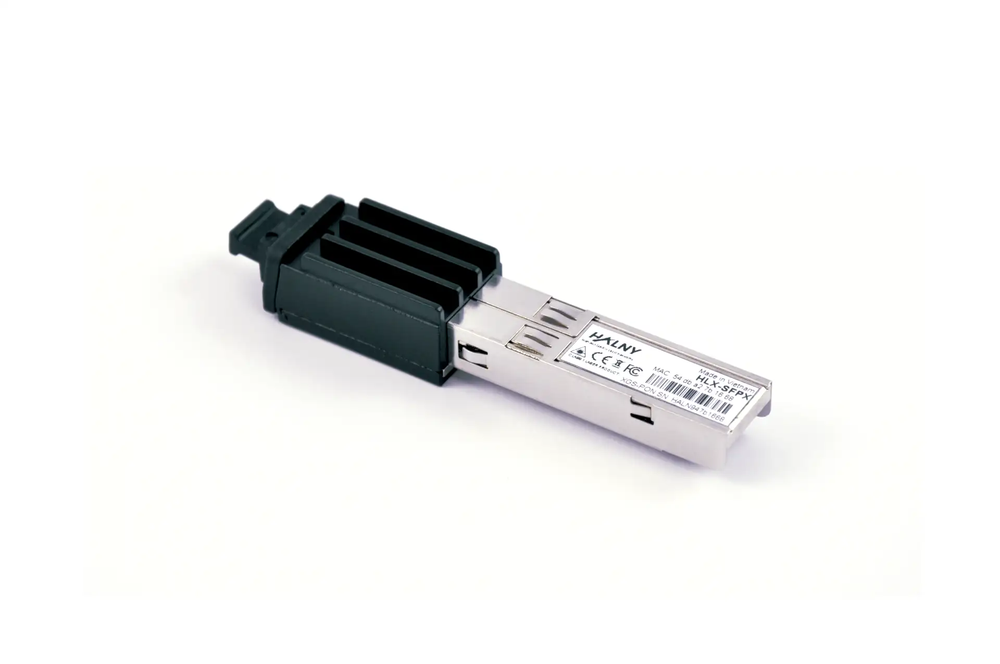

# 100-05610



## Specifications

|             |                                                          |                              |
| ----------: | -------------------------------------------------------- | ---------------------------- |
| __SoC__     | PRX126 @ 400 MHz - MIPS interAptiv 34Kc                  | [Architecture]               |
| __NAND__    | 128 MB *(1 Gbit)*                                        | [W25N01GV]                   |
| __RAM__     | 1 GB                                                     | [NT6CL256M32DM]              |
| __BOSA__    | SC/APC - Tx: 1270 nm / Rx: 1577 nm                       | [GN28L96]                    |
| __EEPROM__  | :check_mark:                                             | [GN28L96]                    |
| __UART__    | 115200-8-1-N                                             |                              |
| __IP__      | 192.168.33.1                                             | HLX-SFPX ONLY                |
| __HTTP(S)__ | :check_mark:                                             | HLX-SFPX ONLY                |
| __SSH__     | :check_mark:                                             | HLX-SFPX ONLY - port `22666` |

 [Architecture]: #architecture
 [W25N01GV]: https://www.winbond.com/hq/product/code-storage-flash-memory/qspinand-flash/?__locale=en&partNo=W25N01GV
 [NT6CL256M32DM]: https://www.nanya.com/en/Product/4324/NT6CL256M32DM-H0
 [GN28L96]: https://www.semtech.com/products/signal-integrity/laser-drivers-transceivers/gn28l96

## Architecture

### MaxLinear PRX126 [^1]

 --8<-- "docs/xgs-pon/ont/bfw-solutions/was-110.md:arch"

## System Information

### Boot log

=== "HLX-SFPX"

    ```
    --8<-- "docs/xgs-pon/ont/calix/100-05610/hlx-sfpx-bootlog"
    ```

## Default Credentials

### Web credentials

=== "HALNy HLX-SFPX"

    | Username  | Password       |
    | --------- | -------------- |
    | useradmin | useradmin123   |

### Shell credentials

=== "HALNy HLX-SFPX"

    !!! note "The administrator password is dynamically generated based on the MAC address"

        The password is the last 3 octets of the MAC address in lowercase hexidecimal format prefixed with `9k0J$5JKJPr(F@aL`.

    | Username  | Password       | &nbsp; |
    | --------- | -------------- | -----  |
    | admin     | <span id="hlxadminpw">9k0J$5JKJPr(F@aLXXXXXX</span> | <div><form onsubmit="document.querySelector('#hlxadminpw').innerHTML = '9k0J$5JKJPr(F@aL' + escapeHTML(event.target.elements['mac'].value).toLowerCase().split(':',6).slice(-3).join(''); event.preventDefault();"><input type="text" id="mac" placeholder="MAC" pattern="^([0-9A-Fa-f]{2}[:]){5}([0-9A-Fa-f]{2})$"/><input type="submit" value="Generate" /></form></div> |

## Value-Added Resellers

!!! warning "As of 2025-08-05 it is NOT recommended to purchase a HLX-SFPX unless otherwise stated"

    The HLX-SFPX firmware suffers from I/O errors that corrupt the overlay filesystem, soft-bricking the module.

| Company                                        | Product Number      | E-commerce                    |
| ---------------------------------------------- | ------------------- | ----------------------------- |
| [HALNy Networks](https://halny.com/)           | [HLX-SFPX]          | [Flytec Computers] :flag_us:  |

* <small>Purchase at your discretion, we take no responsibility or liability for the listed resellers.</small>

  [HLX-SFPX ]: https://halny.com/portfolio/HLX-SFPX/
  [Flytec Computers]: https://flyteccomputers.com/halny-networks-hlx-sfpx

[^1]: <https://www.maxlinear.com/product/access/fiber-access/socs-for-optical-networking-units-onu/prx126>
