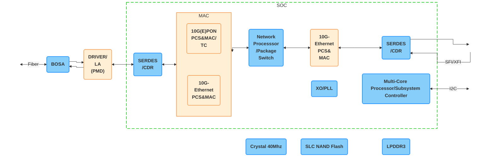

# X-ONU-SFPP (SFP+ XGSPON ONU Stick) [^1]


## Specifications

|             |                                         |                     |
| ----------: | --------------------------------------- | ------------------- |
| __SoC__     | PRX126 @ 400 MHz - MIPS interAptiv 34Kc | [Architecture] [^4] |
| __NAND__    | 128 MB *(1 Gbit)*                       | [WN25N01GV]         |
| __RAM__     | 1 GB                                    |                     |
| __BOSA__    | SC/UPC - Tx: 1270 nm / Rx: 1577 nm      | [M02181]            |
| __EEPROM__  | :check_mark:                            | [M02181]            |
| __IP__      | 192.168.1.1                             |                     |
| __HTTP(S)__ | :x:                                     |                     |
| __SSH__     | :check_mark:                            | [Shell credentials] |

 [Architecture]: #architecture
 [WN25N01GV]: https://www.winbond.com/hq/product/code-storage-flash-memory/qspinand-flash/?__locale=en&partNo=W25N01GV
 [M02181]: https://www.macom.com/products/product-detail/MALD-02181
 [Shell credentials]: #shell-credentials

## Architecture

### MaxLinear PRX126 [^2]



## System Information

### Boot log

```
--8<-- "docs/xgs-pon/ont/potron-technology/x-onu-sfpp/bootlog"
```

### procfs [^3]

=== "/proc/cmdline"


    ```
    --8<-- "docs/xgs-pon/ont/potron-technology/x-onu-sfpp/procfs_cmdline"
    ```

=== "/proc/cpuinfo"


    ```
    --8<-- "docs/xgs-pon/ont/potron-technology/x-onu-sfpp/procfs_cpuinfo"
    ```

=== "/proc/meminfo"


    ```
    --8<-- "docs/xgs-pon/ont/potron-technology/x-onu-sfpp/procfs_meminfo"
    ```

=== "/proc/mtd"


    ```
    --8<-- "docs/xgs-pon/ont/potron-technology/x-onu-sfpp/procfs_mtd"
    ```

## EEPROM

The Digital Diagnostic Monitor Interface (DDMI)[^5] is handled by the MACOM [M02181] laser driver over an I2C bus
`/dev/i2c-0`.

There are several interfaces and utilities that provide read and/or write access to the EEPROM(s).

### Read

#### A0 (0x50)

``` sh
hexdump -Cv /sys/class/pon_mbox/pon_mbox0/device/eeprom50
```

``` sh
ethtool -m pon0 raw on | head -c 256 | hexdump -Cv
```

``` sh
i2cdump -fy 0 0x50
```

``` sh
i2cget -fy 0 0x50 0x0
```

#### A2 (0x51)

``` sh
hexdump -Cv /sys/class/pon_mbox/pon_mbox0/device/eeprom51
```

``` sh
ethtool -m pon0 raw on | tail -c 256 | hexdump -Cv
```

``` sh
i2cdump -fy 0 0x51
```

``` sh
i2cget -fy 0 0x51 0x0
```

### Write

The EEPROM is write protected. The A2 (0x51) User EEPROM section from 128 (0x80) to 247 (0xF7) can be unlocked using
the password `68646762` by writing it to A2 (0x51) at offset `0x7B`.

``` sh
i2cset -fy 0 0x51 0x7B 0x68 0x64 0x67 0x62 i
```

## Default Credentials

### Shell credentials

???- info "OpenSSH/SSL: unsupported algorithms and changes since 8.8 and newer"

    ``` sh
    ssh -V
    openssl version
    ```

    <https://www.openssh.com/releasenotes.html>

    __Red Hat/CentOS/Fedora/Rocky Linux__

    ``` sh
    sudo update-crypto-policies --set LEGACY
    ```

    ``` sh
    ssh -oHostKeyAlgorithms=+ssh-rsa -oPubkeyAcceptedKeyTypes=+ssh-rsa root@192.168.1.1
    ```

| Username | Password |
| -------- | -------- |
| root     |          |

### Bootloader

To access the U-Boot console type `admin` at the prompt: `Hit enter to stop autoboot`

## Value-Added Resellers

| Company                                             | Product Number    | E-commerce            | Firmware      |
| --------------------------------------------------- | ----------------- | --------------------- | ------------- |
| [Full Vision Com-Tech](https://fullvisiontech.com/) | [FV-NS10S]        |                       | PTXG (Potron) |
| [H-COM](https://www.zhaoyongoptics.com/)            | SPP425H-GAB4      | [Alibaba](https://www.alibaba.com/product-detail/XGS-PON-ONU-SFP-Stick-with_1601261149622.html) / [AliExpress](https://www.aliexpress.com/item/1005007856556526.html) | PTXG (Potron) or 8311 |

* <small>Purchase at your discretion, we take no responsibility or liability for the listed resellers.</small>

  [FV-NS10S]: http://fullvisiontech.com/web/index.php?topclassid=16&classid=133&id=141&lanstr=en

[^1]: <https://www.potrontec.com/index/index/list/cat_id/2.html#11-83>
[^2]: <https://www.maxlinear.com/product/access/fiber-access/socs-for-optical-networking-units-onu/prx126>
[^3]: <https://en.wikipedia.org/wiki/Procfs>
[^4]: <https://boxmatrix.info/wiki/Property:Falcon>
[^5]: [SFF-8472](https://members.snia.org/document/dl/25916)
